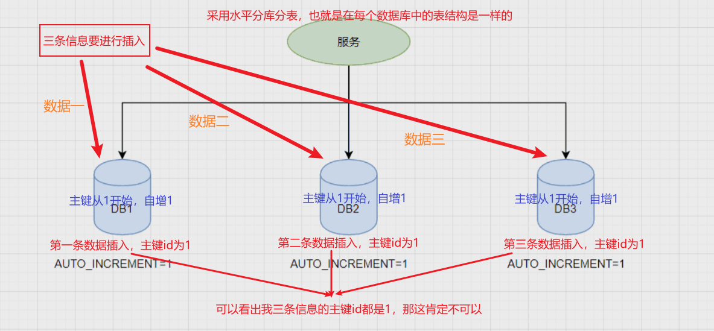
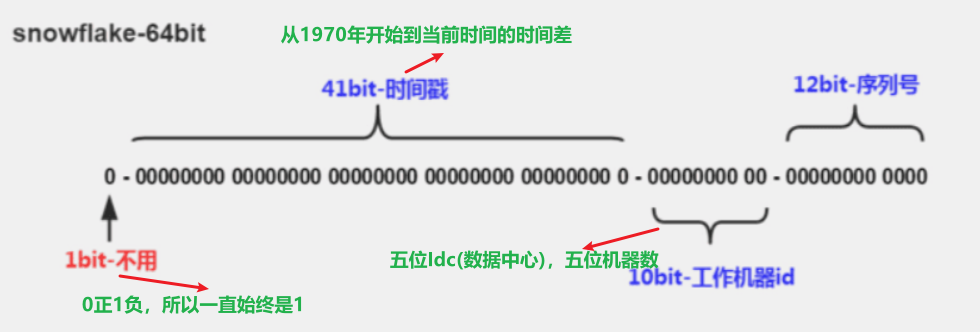

## 1：为什么需要全局唯一ID

传统的单体架构的时候，我们基本是 `单库` 然后 `业务单表` 的结构。每个业务表的 `ID` 一般我们都是从 `1` 增，通过 `INCREMENT=1` 设置 `自增起始值` ，但是在 `分布式服务架构模式` 下 `分库分表` 的设计，使得 `多个库` 或 `多个表` 存储相同的业务数据。这种情况 **根据数据库的自增ID就会产生相同ID的情况，不能保证主键的唯一性**。



如上图，如果 **第一个订单存储在 DB1 上则订单 ID 为1，当一个新订单又入库了存储在 DB2 上订单 ID 也为1** 。我们系统的架构虽然是分布式的，但是在用户层应是无感知的，重复的订单主键显而易见是不被允许的。那么针对分布式系统如何做到 `主键唯一性` 呢？

## 2：UUID

`UUID （Universally Unique Identifier` ，通用唯一识别码的缩写。UUID是由一组 `32位数` 的 `16进制数字` 所构成，所以UUID理论上的总数为 `16^32=2^128`，约等于 `3.4 x 10^38`。也就是说若 `每纳秒` 产生 `1兆个UUID` ，要花 `100亿年` 才会将所有 `UUID` 用完。

生成的 `UUID` 是由 `8-4-4-4-12` 格式的数据组成，其中 `32个字符` 和 `4个连字符' - '` ，一般我们使用的时候会将连字符删除 `uuid.toString().replaceAll("-","")`。


> 目前UUID的产生方式有5种版本，`每个版本的算法不同，应用范围也不同`。

- `基于时间的UUID` - 版本1： 这个一般是通过 `当前时间`，`随机数`，和 `本地Mac地址` 来计算出来，可以通过 `org.apache.logging.log4j.core.util包中的 UuidUtil.getTimeBasedUuid()` 来使用或者其他包中工具。由于使用了 `MAC地址` ，因此能够确保唯一性，**但是同时也暴露了MAC地址，私密性不够好。**
- `DCE安全的UUID` - 版本2 `DCE（Distributed Computing Environment）` 安全的 `UUID` 和基于时间的 `UUID算法` 相同，但会把时间戳的前4位置换为POSIX的UID或GID。这个版本的UUID在实际中较少用到。
- `基于名字的UUID（MD5）`- 版本3 基于名字的 `UUID` 通过计算名字和名字空间的MD5散列值得到。这个版本的UUID保证了：相同名字空间中不同名字生成的 `UUID` 的唯一性；不同名字空间中的UUID的唯一性； **相同名字空间中相同名字的UUID重复生成是相同的**。
- `随机UUID` - 版本4 根据随机数，或者伪随机数生成UUID。这种UUID产生重复的概率是可以计算出来的，但是重复的可能性可以忽略不计，因此该版本也是被经常使用的版本。JDK中使用的就是这个版本。
- `基于名字的UUID（SHA1）` - 版本5 和基于名字的UUID算法类似， **只是散列值计算使用SHA1（Secure Hash Algorithm 1）算法**。


我们 Java中 JDK自带的 `UUID` 产生方式就是版本4根据随机数生成的 `UUID` 和版本3基于名字的 UUID，有兴趣的可以去看看它的源码。

```java
public static void main(String[] args) {

    //获取一个版本4根据随机字节数组的UUID。
    UUID uuid = UUID.randomUUID();
    System.out.println(uuid.toString().replaceAll("-",""));

    //获取一个版本3(基于名称)根据指定的字节数组的UUID。
    byte[] nbyte = {10, 20, 30};
    UUID uuidFromBytes = UUID.nameUUIDFromBytes(nbyte);
    System.out.println(uuidFromBytes.toString().replaceAll("-",""));
}
```

得到的UUID结果，

> 59f51e7ea5ca453bbfaf2c1579f09f1d  
7f49b84d0bbc38e9a493718013baace6

虽然 UUID 生成方便，本地生成没有网络消耗，但是使用起来也有一些缺点，

`不易于存储`：UUID太长，`16字节128位`，通常以36长度的字符串表示，很多场景不适用。
`信息不安全`：基于 `MAC地址` 生成 `UUID` 的算法可能会造成MAC地址泄露，暴露使用者的位置。
`对MySQL索引不利`：如果作为 `数据库主键` ，在InnoDB引擎下，UUID的无序性可能会引起数据位置频繁变动，严重影响性能，可以查阅 Mysql 索引原理 B+树的知识。

## 3：数据库生成

是不是一定要基于外界的条件才能满足分布式唯一ID的需求呢，我们能不能在我们分布式数据库的基础上获取我们需要的ID？

由于分布式数据库的起始自增值一样所以才会有冲突的情况发生，那么我们将分布式系统中数据库的同一个业务表的自增ID设计成不一样的起始值，然后设置固定的步长，步长的值即为分库的数量或分表的数量。

以MySQL举例，利用给字段设置 `auto_increment_increment` 和 `auto_increment_offset` 来保证ID自增。
- `auto_increment_offset` ：表示自增长字段从那个数开始，他的取值范围是1 .. 65535。
- `auto_increment_increment`：表示自增长字段每次递增的量，其默认值是1，取值范围是1 .. 65535。

假设有三台机器，则 `DB1` 中 `order` 表的起始ID值为1，`DB2` 中 `order` 表的起始值为 `2`， `DB3` 中 `order` 表的起始值为 `3` ，它们 `自增的步长都为3` ，则它们的ID生成范围如下图所示：


通过这种方式明显的优势就是 **依赖于数据库自身不需要其他资源，并且ID号单调自增，可以实现一些对ID有特殊要求的业务。**

但是缺点也很明显，首先它强依赖DB，当DB异常时整个系统不可用。虽然配置主从复制可以尽可能的增加可用性，但是数据一致性在特殊情况下难以保证。**主从切换时的不一致可能会导致重复发号**。还有就是ID发号性能瓶颈限制在单台MySQL的读写性能

## 4：使用redis实现

`Redis` 实现分布式 `唯一ID` 主要是通过提供像 `INCR` 和 `INCRBY` 这样的 `自增原子` 命令，由于Redis自身的 `单线程` 的特点所以能保证生成的 ID 肯定是 `唯一有序` 的。

但是单机存在 `性能瓶颈` ，无法满足高并发的业务需求，所以可以采用  `集群` 的方式来实现。集群的方式又会涉及到和数据库集群同样的问题，所以也需要设置 `分段` 和 `步长` 来实现。

为了避免长期自增后数字过大可以通过与当前时间戳组合起来使用，另外为了保证并发和业务多线程的问题可以采用 `Redis + Lua` 的方式进行编码，保证安全。

`Redis` 实现 `分布式全局唯一ID` ，它的性能比较高，生成的数据是有序的，对排序业务有利，但是同样它依赖于 `redis` ，需要系统引进 `redis` 组件，增加了系统的配置复杂性。

当然现在 `Redis` 的使用性很普遍，所以如果其他业务已经引进了 `Redis集群` ，则可以资源利用考虑使用 `Redis` 来实现。


## 5：雪花算法-Snowflake

`Snowflake`，雪花算法是由 `Twitter` 开源的分布式ID生成算法，以划分命名空间的方式将 `64-bit位` 分割成多个部分，每个部分代表不同的含义。而 Java中 `64bit` 的整数是 `Long` 类型，所以在 `Java` 中 `SnowFlake` 算法生成的 `ID` 就是 `long` 来存储的。

- `第1位` 占用 `1bit` ，其值 `始终是0` ，可看做是符号位不使用。
- `第2位` 开始的 `41位是时间戳` ， `41-bit位` 可表示 `2^41` 个数，每个数代表 `毫秒` ，那么雪花算法可用的时间年限是 `(1L<<41)/(1000L360024*365)=69` 年的时间。
- `中间的10-bit位` 可表示 `机器数`，即 `2^10 = 1024` 台机器，但是一般情况下我们不会部署这么台机器。如果我们对 `IDC（互联网数据中心）` 有需求，还可以将 `10-bit` 分 `5-bit` 给 `IDC`，分 `5-bit` 给 `工作机器`。这样就可以表示 `32个IDC`，每个 `IDC` 下可以有 `32` 台机器，具体的划分可以根据自身需求定义。
- `最后12-bit位` 是 `自增序列`，可表示 `2^12 = 4096` 个数。

这样的划分之后相当于在一毫秒一个 `数据中心` 的一台机器上可产生 `4096个有序的不重复的ID` 。但是我们 `IDC` 和 `机器数`肯定不止一个，所以毫秒内能生成的有序ID数是翻倍的。



`Snowflake` 的 `Twitter` 官方原版是用 `Scala` 写的，对 `Scala` 语言有研究的同学可以去阅读下，以下是 `Java` 版本的写法。
```java
package com.jajian.demo.distribute;

/**
 * Twitter_Snowflake<br>
 * SnowFlake的结构如下(每部分用-分开):<br>
 * 0 - 0000000000 0000000000 0000000000 0000000000 0 - 00000 - 00000 - 000000000000 <br>
 * 1位标识，由于long基本类型在Java中是带符号的，最高位是符号位，正数是0，负数是1，所以id一般是正数，最高位是0<br>
 * 41位时间截(毫秒级)，注意，41位时间截不是存储当前时间的时间截，而是存储时间截的差值（当前时间截 - 开始时间截)
 * 得到的值），这里的的开始时间截，一般是我们的id生成器开始使用的时间，由我们程序来指定的（如下下面程序IdWorker类的startTime属性）。41位的时间截，可以使用69年，年T = (1L << 41) / (1000L * 60 * 60 * 24 * 365) = 69<br>
 * 10位的数据机器位，可以部署在1024个节点，包括5位datacenterId和5位workerId<br>
 * 12位序列，毫秒内的计数，12位的计数顺序号支持每个节点每毫秒(同一机器，同一时间截)产生4096个ID序号<br>
 * 加起来刚好64位，为一个Long型。<br>
 * SnowFlake的优点是，整体上按照时间自增排序，并且整个分布式系统内不会产生ID碰撞(由数据中心ID和机器ID作区分)，并且效率较高，经测试，SnowFlake每秒能够产生26万ID左右。
 */
public class SnowflakeDistributeId {


    // ==============================Fields===========================================
    /**
     * 开始时间截 (2015-01-01)
     */
    private final long twepoch = 1420041600000L;

    /**
     * 机器id所占的位数
     */
    private final long workerIdBits = 5L;

    /**
     * 数据标识id所占的位数
     */
    private final long datacenterIdBits = 5L;

    /**
     * 支持的最大机器id，结果是31 (这个移位算法可以很快的计算出几位二进制数所能表示的最大十进制数)
     */
    private final long maxWorkerId = -1L ^ (-1L << workerIdBits);

    /**
     * 支持的最大数据标识id，结果是31
     */
    private final long maxDatacenterId = -1L ^ (-1L << datacenterIdBits);

    /**
     * 序列在id中占的位数
     */
    private final long sequenceBits = 12L;

    /**
     * 机器ID向左移12位
     */
    private final long workerIdShift = sequenceBits;

    /**
     * 数据标识id向左移17位(12+5)
     */
    private final long datacenterIdShift = sequenceBits + workerIdBits;

    /**
     * 时间截向左移22位(5+5+12)
     */
    private final long timestampLeftShift = sequenceBits + workerIdBits + datacenterIdBits;

    /**
     * 生成序列的掩码，这里为4095 (0b111111111111=0xfff=4095)
     */
    private final long sequenceMask = -1L ^ (-1L << sequenceBits);

    /**
     * 工作机器ID(0~31)
     */
    private long workerId;

    /**
     * 数据中心ID(0~31)
     */
    private long datacenterId;

    /**
     * 毫秒内序列(0~4095)
     */
    private long sequence = 0L;

    /**
     * 上次生成ID的时间截
     */
    private long lastTimestamp = -1L;

    //==============================Constructors=====================================

    /**
     * 构造函数
     *
     * @param workerId     工作ID (0~31)
     * @param datacenterId 数据中心ID (0~31)
     */
    public SnowflakeDistributeId(long workerId, long datacenterId) {
        if (workerId > maxWorkerId || workerId < 0) {
            throw new IllegalArgumentException(String.format("worker Id can't be greater than %d or less than 0", maxWorkerId));
        }
        if (datacenterId > maxDatacenterId || datacenterId < 0) {
            throw new IllegalArgumentException(String.format("datacenter Id can't be greater than %d or less than 0", maxDatacenterId));
        }
        this.workerId = workerId;
        this.datacenterId = datacenterId;
    }

    // ==============================Methods==========================================

    /**
     * 获得下一个ID (该方法是线程安全的)
     *
     * @return SnowflakeId
     */
    public synchronized long nextId() {
        long timestamp = timeGen();

        //如果当前时间小于上一次ID生成的时间戳，说明系统时钟回退过这个时候应当抛出异常
        if (timestamp < lastTimestamp) {
            throw new RuntimeException(
                    String.format("Clock moved backwards.  Refusing to generate id for %d milliseconds", lastTimestamp - timestamp));
        }

        //如果是同一时间生成的，则进行毫秒内序列
        if (lastTimestamp == timestamp) {
            sequence = (sequence + 1) & sequenceMask;
            //毫秒内序列溢出
            if (sequence == 0) {
                //阻塞到下一个毫秒,获得新的时间戳
                timestamp = tilNextMillis(lastTimestamp);
            }
        }
        //时间戳改变，毫秒内序列重置
        else {
            sequence = 0L;
        }

        //上次生成ID的时间截
        lastTimestamp = timestamp;

        //移位并通过或运算拼到一起组成64位的ID
        return ((timestamp - twepoch) << timestampLeftShift) //
                | (datacenterId << datacenterIdShift) //
                | (workerId << workerIdShift) //
                | sequence;
    }

    /**
     * 阻塞到下一个毫秒，直到获得新的时间戳
     *
     * @param lastTimestamp 上次生成ID的时间截
     * @return 当前时间戳
     */
    protected long tilNextMillis(long lastTimestamp) {
        long timestamp = timeGen();
        while (timestamp <= lastTimestamp) {
            timestamp = timeGen();
        }
        return timestamp;
    }

    /**
     * 返回以毫秒为单位的当前时间
     *
     * @return 当前时间(毫秒)
     */
    protected long timeGen() {
        return System.currentTimeMillis();
    }
}
```

测试的代码如下：

```java
public static void main(String[] args) {
    SnowflakeDistributeId idWorker = new SnowflakeDistributeId(0, 0);
    for (int i = 0; i < 1000; i++) {
        long id = idWorker.nextId();
//      System.out.println(Long.toBinaryString(id));
        System.out.println(id);
    }
}
```

**雪花算法提供了一个很好的设计思想，`雪花算法` 生成的ID是 `趋势递增`，不依赖数据库等第三方系统，以服务的方式部署，稳定性更高，生成ID的性能也是非常高的，而且可以 `根据自身业务特性分配bit位`，非常灵活。**

但是雪花算法 `强依赖机器时钟` ，如果机器上 `时钟回拨` ，会导致 `发号重复` 或者 `服务会处于不可用状态`。如果恰巧回退前生成过一些ID，而时间回退后，生成的ID就有可能重复。**官方对于此并没有给出解决方案，而是简单的抛错处理，这样会造成在时间被追回之前的这段时间服务不可用。**

> 为什么说雪花算法只支持69年？  
- 这就要说雪花算法的组成部分了，`1个符号位` + `41个时间戳（从1970年开始到现在的时间差）`+ `5个工作机器id（0-31）` + `5个序列号（0-1023`）+ `12自增序列`  
- 41位时间戳，让这个值最大则便是最后支持的时间是什么时候？也就是41个都是1 `11111111111111111111111111111111111111111` 它对应的就是 `最大的时间差`，然后将他转换成为格式化后的时间 `2039-09-07 23:47:35`，也就是说雪花算法最多只支持到这个时间

```java
    @Test
    public void snow(){
        Long time = 2199023255551L;
        Date date = new Date(time);
        // 格式化日期
        SimpleDateFormat sdf = new SimpleDateFormat("yyyy-MM-dd HH:mm:ss");
        String format = sdf.format(date);
        System.out.println(format);  //2039-09-07 23:47:35
    }
```


很多其他类雪花算法也是在此思想上的设计然后改进规避它的缺陷，后面介绍的百度 `UidGenerator` 和 `美团分布式ID生成系统 Leaf 中snowflake模式` 都是在 `snowflake` 的基础上演进出来的。

## 6：百度-UidGenerator

### DefaultUidGenerator 实现

### CachedUidGenerator 实现


## 7：美团-Leaf

### Leaf-segment 数据库方案

### Leaf-snowflake方案