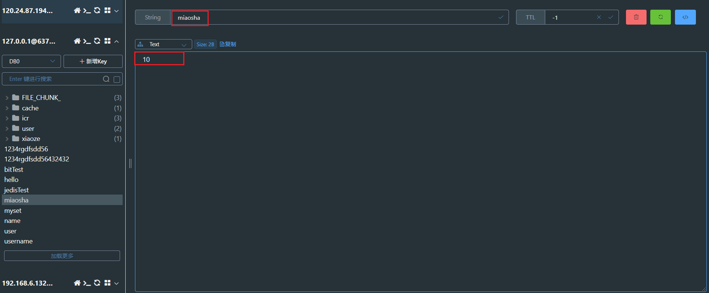
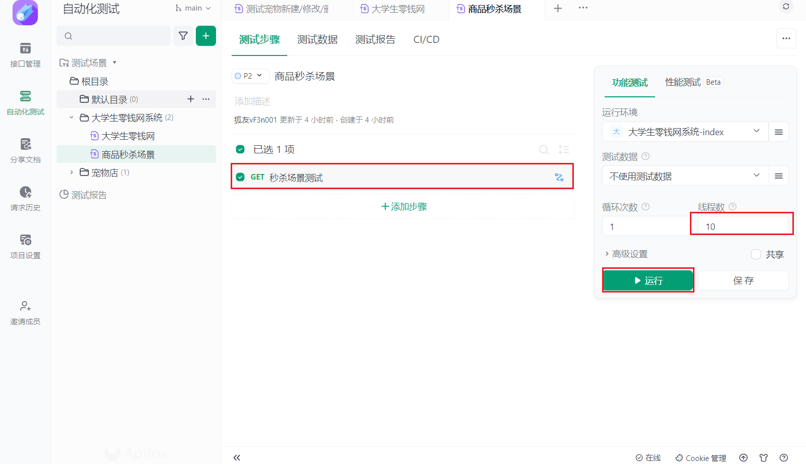
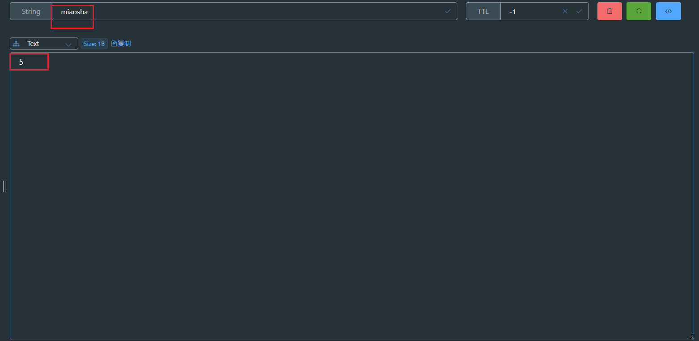
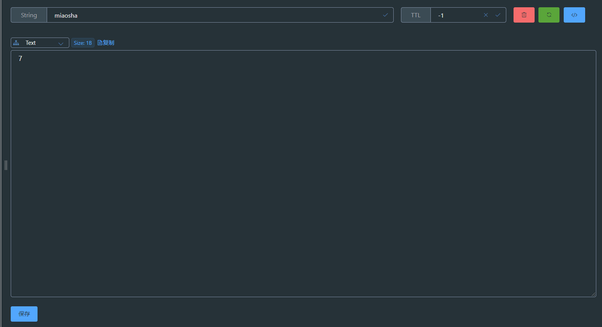

## 1：日常接口如何编写？

对于一个 `秒杀接口`，首先最重要的就是要抗住 **高并发**，也就是 **请求并行过来如何处理？**，
不能因为是高并发就导致这个接口流程逻辑出现问题，导致业务流程出现崩溃。

### 1.1 流程
:::warning 业务流程
- 1. 先去 `redis` 中查询 **库存数量**
- 2. 如果 **库存大于0**，则 **减库存**，然后 **更新redis中库存数量** ，并返回成功
- 3. 如果 **库存小于0**，则返回失败
:::

### 1.2 代码

```java
@RestController
@RequestMapping("/miaosha")
@Api(tags = "秒杀接口")
@CrossOrigin
public class MiaoShaController {

    @Autowired
    private StringRedisTemplate stringRedisTemplate;

    public static  final String MIAOSHA_PROID = "miaosha";

    @RequestMapping("miaoshaTest")
    public R miaosha(){
        // 1.查询库存
        Integer proNumber = Integer.valueOf(stringRedisTemplate.opsForValue().get(MIAOSHA_PROID));
        if(proNumber > 0) {
            // 2.减库存
            int realStock = proNumber - 1;
            // 3.更新库存
            stringRedisTemplate.opsForValue().set(MIAOSHA_PROID,realStock+"");
            System.out.println("扣减成功，剩余库存：" + realStock);
            R.ok().data("扣减成功，剩余库存为：",realStock);
        }else {
            System.out.println("扣减失败，剩余库存不足");
            R.error().message("扣减失败，库存不足");
        }
        return R.ok();
    }
}
```

### 1.3 测试





```java
扣减成功，剩余库存：9
扣减成功，剩余库存：9
扣减成功，剩余库存：9
扣减成功，剩余库存：9
扣减成功，剩余库存：9
扣减成功，剩余库存：9
扣减成功，剩余库存：8
扣减成功，剩余库存：7
扣减成功，剩余库存：6
扣减成功，剩余库存：5
```


### 1.4 问题

可以看到，此时虽然逻辑没问题，但是在高并发场景下却出现了问题，也就是
- 多个线程 **同时拿到redis中的缓存数量**，此时各执行各的，就会出现，多个线程去抢夺10个库存中的一个
- 相当于10个线程只消耗了五个库存，那么这五个库存就相当于被重复扣减了

## 2：synchronized锁

### 2.1 synchronized前置知识
`synchronized锁` 其实是 `jvm锁`，也就是 `单体项目锁`，如果对于 **集群项目部署**的话，那这个 **锁其实是不生效的**。假如说我现在有 `a`,`b`两个项目集群，此时`a`,已经请求 `c`请求到了`a`,然后 **a项目中已经加锁**了，但是此时再来一个请求 `d` 请求到了 `b项目`，但是**b项目其实是没有锁的**，也可以去获得 `redis` 中库存数量，所以对于集群来说，`synchronized`是没用的,不对于单体项目还是够用的，只不过会影响性能而已。

### 2.2 代码实现

```java
@RestController
@RequestMapping("/miaosha")
@Api(tags = "秒杀接口")
@CrossOrigin
public class MiaoShaController {

    @Autowired
    private StringRedisTemplate stringRedisTemplate;

    public static  final String MIAOSHA_PROID = "miaosha";

    @RequestMapping("miaoshaTest")
    public R miaosha(){
       synchronized (this){
           Integer proNumber = Integer.valueOf(stringRedisTemplate.opsForValue().get(MIAOSHA_PROID));
           if(proNumber > 0) {
               int realStock = proNumber - 1;
               stringRedisTemplate.opsForValue().set(MIAOSHA_PROID,realStock+"");
               System.out.println("扣减成功，剩余库存：" + realStock);
               R.ok().data("扣减成功，剩余库存为：",realStock);
           }else {
               System.out.println("扣减失败，剩余库存不足");
               R.error().message("扣减失败，库存不足");
           }
           return R.ok();
       }
    }
}
```
### 2.3 测试

毫无疑问，当然是可以的
```java
扣减成功，剩余库存：9
扣减成功，剩余库存：8
扣减成功，剩余库存：7
扣减成功，剩余库存：6
扣减成功，剩余库存：5
扣减成功，剩余库存：4
扣减成功，剩余库存：3
扣减成功，剩余库存：2
扣减成功，剩余库存：1
扣减成功，剩余库存：0
```

## 3：redis分布式锁

### 3.1 前置知识

redis分布式锁，其实是通过 `原子命令setNx` 来实现的，  
命令：`setNx(key,value)`
- key **存在**，则不进行更新，直接返回 **false**
- key **不存在**，则进行设置，并返回 **true**

### 3.2 代码实现

```java
@RestController
@RequestMapping("/miaosha")
@Api(tags = "秒杀接口")
@CrossOrigin
public class MiaoShaController {

    public static final String MIAOSHA_PROID = "miaosha";
    @Autowired
    private StringRedisTemplate stringRedisTemplate;

    @RequestMapping("miaoshaTest")
    public R miaosha() {
        String lockkey = "product_1";
        // redis分布式锁实现---加锁
        Boolean exist = stringRedisTemplate.opsForValue().setIfAbsent(lockkey, "123");
        if(!exist){
            System.out.println("获取锁失败，请重新尝试");
            return R.error().message("您获取锁失败，请稍后尝试");
        }
        try {
            // 获取库存数量
            Integer proNumber = Integer.valueOf(stringRedisTemplate.opsForValue().get(MIAOSHA_PROID));
            if (proNumber > 0) {
                // 扣减库存
                int realStock = proNumber - 1;
                // 更新库存
                stringRedisTemplate.opsForValue().set(MIAOSHA_PROID, realStock + "");
                System.out.println("扣减成功，剩余库存：" + realStock);
                R.ok().data("扣减成功，剩余库存为：", realStock);
            } else {
                System.out.println("扣减失败，剩余库存不足");
                R.error().message("扣减失败，库存不足");
            }
            return R.ok();
        }finally {
            // 释放锁
            stringRedisTemplate.delete(lockkey);
        }
    }
}
```

### 3.3 测试

```java
获取锁失败，请重新尝试
获取锁失败，请重新尝试
扣减成功，剩余库存：9
获取锁失败，请重新尝试
获取锁失败，请重新尝试
扣减成功，剩余库存：8
获取锁失败，请重新尝试
获取锁失败，请重新尝试
获取锁失败，请重新尝试
扣减成功，剩余库存：7
```
可以看出来，此时其实只有三个线程工作了，然后redis库存中也是7，这种情况是正常的，
因为此时 **锁已经生效**，所以 **多个线程只能有一个线程去抢锁**，抢到锁的线程才能去执行扣减库存的操作，而抢不到锁的线程，直接就返回了，不允许一直等待，增加系统压力。

### 3.4 问题以及解决方案


还有一个问题，比如说我执行到上面 **黄色框** 中，**服务挂了**，那肯定也走不到finally，那此时就算服务恢复了，也不可能再有线程能够成功获取到锁，此时，怎么解决？

> 解决方案：**加锁过期时间**

代码如下：

```java
@RestController
@RequestMapping("/miaosha")
@Api(tags = "秒杀接口")
@CrossOrigin
public class MiaoShaController {

    public static final String MIAOSHA_PROID = "miaosha";
    @Autowired
    private StringRedisTemplate stringRedisTemplate;

    @RequestMapping("miaoshaTest")
    public R miaosha() {
        String lockkey = "product_1";
        // redis分布式锁实现---加锁
        Boolean exist = stringRedisTemplate.opsForValue().setIfAbsent(lockkey, "123");
        // 防止 try 中的代码崩溃，此时就需要给锁加自动到期时间 10s
        stringRedisTemplate.opsForValue().getAndExpire(lockkey,10, TimeUnit.SECONDS);
        if(!exist){
            System.out.println("获取锁失败，请重新尝试");
            return R.error().message("您获取锁失败，请稍后尝试");
        }
        try {
            // 获取库存数量
            Integer proNumber = Integer.valueOf(stringRedisTemplate.opsForValue().get(MIAOSHA_PROID));
            if (proNumber > 0) {
                // 扣减库存
                int realStock = proNumber - 1;
                // 更新库存
                stringRedisTemplate.opsForValue().set(MIAOSHA_PROID, realStock + "");
                System.out.println("扣减成功，剩余库存：" + realStock);
                R.ok().data("扣减成功，剩余库存为：", realStock);
            } else {
                System.out.println("扣减失败，剩余库存不足");
                R.error().message("扣减失败，库存不足");
            }
            return R.ok();
        }finally {
            // 释放锁
            stringRedisTemplate.delete(lockkey);
        }
    }
}
```

会不会有新的问题呢？那肯定是有的。如图


怎么解决呢？那就是保证这两行代码原子性，用一个完整的api来替换这两行代码。

```java
Boolean exist = stringRedisTemplate.opsForValue().setIfAbsent(lockkey, "123", 10, TimeUnit.SECONDS);
```

完整代码如下：
```java
@RestController
@RequestMapping("/miaosha")
@Api(tags = "秒杀接口")
@CrossOrigin
public class MiaoShaController {

    public static final String MIAOSHA_PROID = "miaosha";
    @Autowired
    private StringRedisTemplate stringRedisTemplate;

    @RequestMapping("miaoshaTest")
    public R miaosha() {
        String lockkey = "product_1";
        // redis分布式锁实现---加锁
        // Boolean exist = stringRedisTemplate.opsForValue().setIfAbsent(lockkey, "123");
        // 防止 try 中的代码崩溃，此时就需要给锁加自动到期时间 10s
        // stringRedisTemplate.opsForValue().getAndExpire(lockkey,10, TimeUnit.SECONDS);

        Boolean exist = stringRedisTemplate.opsForValue().setIfAbsent(lockkey, "123", 10, TimeUnit.SECONDS);
        if(!exist){
            System.out.println("获取锁失败，请重新尝试");
            return R.error().message("您获取锁失败，请稍后尝试");
        }
        try {
            // 获取库存数量
            Integer proNumber = Integer.valueOf(stringRedisTemplate.opsForValue().get(MIAOSHA_PROID));
            if (proNumber > 0) {
                // 扣减库存
                int realStock = proNumber - 1;
                // 更新库存
                stringRedisTemplate.opsForValue().set(MIAOSHA_PROID, realStock + "");
                System.out.println("扣减成功，剩余库存：" + realStock);
                R.ok().data("扣减成功，剩余库存为：", realStock);
            } else {
                System.out.println("扣减失败，剩余库存不足");
                R.error().message("扣减失败，库存不足");
            }
            return R.ok();
        }finally {
            // 释放锁
            stringRedisTemplate.delete(lockkey);
        }
    }
}
```

> 那现在还有没有问题呢？也是有的，就是 **锁失效的问题**

举例：  

比如说我现在有两个线程 `a`,`b`，`a`线程执行到  **更新库存代码时** 已经到了 **十秒钟**，此时就会 **释放a锁**，然后此时 **b就会立马获得锁，但是由于a线程代码没执行完，所以需要去释放锁，此时释放锁的时候释放的并不是它自己的锁，而是b锁，那此时再来一个线程也可以去获得锁，那此时b锁就会失效，导致代码同步执行**。所以应该怎么解决呢？

> 解决方案：  
> 给 **每一个线程做一个标识**，在释放锁的时候只能释放自己的锁，不能释放别人的锁。使用uuid就可以了


```java
@RestController
@RequestMapping("/miaosha")
@Api(tags = "秒杀接口")
@CrossOrigin
public class MiaoShaController {

    public static final String MIAOSHA_PROID = "miaosha";
    @Autowired
    private StringRedisTemplate stringRedisTemplate;

    @RequestMapping("miaoshaTest")
    public R miaosha() {
        String lockkey = "product_1";
        // redis分布式锁实现---加锁
        // Boolean exist = stringRedisTemplate.opsForValue().setIfAbsent(lockkey, "123");
        // 防止 try 中的代码崩溃，此时就需要给锁加自动到期时间 10s
        // stringRedisTemplate.opsForValue().getAndExpire(lockkey,10, TimeUnit.SECONDS);

        String clientId = UUID.randomUUID().toString();
        Boolean exist = stringRedisTemplate.opsForValue().setIfAbsent(lockkey, clientId, 10, TimeUnit.SECONDS);
        if(!exist){
            System.out.println("获取锁失败，请重新尝试");
            return R.error().message("您获取锁失败，请稍后尝试");
        }
        try {
            // 获取库存数量
            Integer proNumber = Integer.valueOf(stringRedisTemplate.opsForValue().get(MIAOSHA_PROID));
            if (proNumber > 0) {
                // 扣减库存
                int realStock = proNumber - 1;
                // 更新库存
                stringRedisTemplate.opsForValue().set(MIAOSHA_PROID, realStock + "");
                System.out.println("扣减成功，剩余库存：" + realStock);
                R.ok().data("扣减成功，剩余库存为：", realStock);
            } else {
                System.out.println("扣减失败，剩余库存不足");
                R.error().message("扣减失败，库存不足");
            }
            return R.ok();
        }finally {
            // 释放锁
            if(clientId.equals(stringRedisTemplate.opsForValue().get(lockkey))){
                stringRedisTemplate.delete(lockkey);
            }
        }
    }
}
```

> 所以，此时还有没有问题呢？  
> 那肯定还是有的，就是 **在释放锁的时候，需要判断是否是本次的锁，然后再释放**。假如说我**代码执行到判断的时候，10s到了，那redis会自动释放该锁，然后此时b线程进来获取到锁，还没执行逻辑，我的a线程便继续去执行，也就是去删除锁，那此时b刚刚加的锁便会失效，此时c线程也可以进来，那b和c又开始进行并行了**。

所以，需要将 `判断` 和 `删锁` 进行 `原子化`，合成一条命令，但是确实是没有的，只能将他们封装成为 `lua脚本`，然后来执行。

```java
        String luaScript = "if(redis.call('GET', KEYS[1]) == ARGV[1]) then return redis.call('DEL', KEYS[1]) end";
        // 创建RedisScript对象
        DefaultRedisScript<Long> redisScript = new DefaultRedisScript<>();
        redisScript.setScriptText(luaScript);
        redisScript.setResultType(Long.class);

        // 执行脚本
        Long result = stringRedisTemplate.execute(redisScript, Collections.singletonList(lockkey), Collections.singletonList(clientId));

```

### 3.5 最终完整代码

```java
package com.xiaoze.exer.controller.HighConcurrency;

import com.xiaoze.exer.pojo.R;
import io.swagger.annotations.Api;
import org.springframework.beans.factory.annotation.Autowired;
import org.springframework.data.redis.core.StringRedisTemplate;
import org.springframework.data.redis.core.script.DefaultRedisScript;
import org.springframework.web.bind.annotation.CrossOrigin;
import org.springframework.web.bind.annotation.RequestMapping;
import org.springframework.web.bind.annotation.RestController;

import java.util.Collections;
import java.util.UUID;
import java.util.concurrent.TimeUnit;

/**
 * @author 小泽
 * @create 2024-04-25  11:34
 * 记得每天敲代码哦
 */
@RestController
@RequestMapping("/miaosha")
@Api(tags = "秒杀接口")
@CrossOrigin
public class MiaoShaController {

    public static final String MIAOSHA_PROID = "miaosha";
    @Autowired
    private StringRedisTemplate stringRedisTemplate;

    @RequestMapping("miaoshaTest")
    public R miaosha() {
        String lockkey = "product_1";
        // redis分布式锁实现---加锁
        // Boolean exist = stringRedisTemplate.opsForValue().setIfAbsent(lockkey, "123");
        // 防止 try 中的代码崩溃，此时就需要给锁加自动到期时间 10s
        // stringRedisTemplate.opsForValue().getAndExpire(lockkey,10, TimeUnit.SECONDS);

        String clientId = UUID.randomUUID().toString();
        Boolean exist = stringRedisTemplate.opsForValue().setIfAbsent(lockkey,clientId, 10, TimeUnit.SECONDS);
        if(!exist){
            System.out.println("获取锁失败，请重新尝试");
            return R.error().message("您获取锁失败，请稍后尝试");
        }
        try {
            // 获取库存数量
            Integer proNumber = Integer.valueOf(stringRedisTemplate.opsForValue().get(MIAOSHA_PROID));
            if (proNumber > 0) {
                // 扣减库存
                int realStock = proNumber - 1;
                // 更新库存
                stringRedisTemplate.opsForValue().set(MIAOSHA_PROID, realStock + "");
                System.out.println("扣减成功，剩余库存：" + realStock);
                R.ok().data("扣减成功，剩余库存为：", realStock);
            } else {
                System.out.println("扣减失败，剩余库存不足");
                R.error().message("扣减失败，库存不足");
            }
            return R.ok();
        }finally {
            // 释放锁
            // if(clientId.equals(stringRedisTemplate.opsForValue().get(lockkey))){
            //     stringRedisTemplate.delete(lockkey);
            // }
            String luaScript = "if(redis.call('GET', KEYS[1]) == ARGV[1]) then return redis.call('DEL', KEYS[1]) end";
            // 创建RedisScript对象
            DefaultRedisScript<Long> redisScript = new DefaultRedisScript<>();
            redisScript.setScriptText(luaScript);
            redisScript.setResultType(Long.class);

            // 执行脚本
            Long result = stringRedisTemplate.execute(redisScript, Collections.singletonList(lockkey), Collections.singletonList(clientId));

        }
    }
}
```

测试结果

```java
获取锁失败，请重新尝试
获取锁失败，请重新尝试
扣减成功，剩余库存：9
获取锁失败，请重新尝试
获取锁失败，请重新尝试
扣减成功，剩余库存：8
获取锁失败，请重新尝试
获取锁失败，请重新尝试
获取锁失败，请重新尝试
扣减成功，剩余库存：7
```



### 3.6 忽略不计的问题
上述代码已经很完美了，但是还是会出现问题的，就是 **设置锁过期时间10秒的问题**，如果说我的业务10秒没执行完，那此时锁就会过期，那此时其他线程就可以进来，那此时就会导致 **锁失效**，导致其他线程进来，然后进行并行操作，那此时就会导致 **数据错乱**。

其实这个问题就是 **锁续命** 的问题，其实就是 **后台一直跑一个线程，然后去判断改业务执行时间以及锁剩余时间，然后去刷新这个锁时间**


## 4：Redisson实现

### 4.1 pom.xml
```xml
    <!--        redisson-->
    <dependency>
        <groupId>org.redisson</groupId>
        <artifactId>redisson</artifactId>
        <version>3.13.6</version>
    </dependency>
```

### 4.2 配置类

```java
package com.xiaoze.exer.config;

import org.redisson.Redisson;
import org.redisson.api.RedissonClient;
import org.redisson.config.Config;
import org.springframework.context.annotation.Bean;
import org.springframework.context.annotation.Configuration;

@Configuration
public class RedissonConfig {

    @Bean
    public Redisson redisson() {
        Config config = new Config();
        //单节点情况下。
        config.useSingleServer().setAddress("redis://127.0.0.1:6379");
        //集群模式情况下.
        // config.useClusterServers()
        //         .setScanInterval(2000) // 集群状态扫描间隔时间，单位是毫秒
        //         .addNodeAddress();      //...代表这里可以输入多个节点信息。
        return (Redisson) Redisson.create(config);
    }
}
```
### 4.3 使用

```java
    @Autowired
    private Redisson redissonClient;

    @RequestMapping("redissonTest")
    public R miaoshaRedisson() {
        String lockkey = "product_1";
        RLock lock = redissonClient.getLock(lockkey);
        lock.lock();
        // 获取库存数量
        Integer proNumber = Integer.valueOf(stringRedisTemplate.opsForValue().get(MIAOSHA_PROID));
        if (proNumber > 0) {
            // 扣减库存
            int realStock = proNumber - 1;
            // 更新库存
            stringRedisTemplate.opsForValue().set(MIAOSHA_PROID, realStock + "");
            System.out.println("扣减成功，剩余库存：" + realStock);
            R.ok().data("扣减成功，剩余库存为：", realStock);
        } else {
            System.out.println("扣减失败，剩余库存不足");
            R.error().message("扣减失败，库存不足");
        }
        lock.unlock();
        return R.ok();

    }
```

### 4.4 底层原理


锁续命的源码如下
```Java
private void renewExpiration() {
        ExpirationEntry ee = EXPIRATION_RENEWAL_MAP.get(getEntryName());
        if (ee == null) {
            return;
        }
        
        Timeout task = commandExecutor.getConnectionManager().newTimeout(new TimerTask() {
            @Override
            public void run(Timeout timeout) throws Exception {
                ExpirationEntry ent = EXPIRATION_RENEWAL_MAP.get(getEntryName());
                if (ent == null) {
                    return;
                }
                Long threadId = ent.getFirstThreadId();
                if (threadId == null) {
                    return;
                }
                
                RFuture<Boolean> future = renewExpirationAsync(threadId);
                future.onComplete((res, e) -> {
                    if (e != null) {
                        log.error("Can't update lock " + getName() + " expiration", e);
                        return;
                    }
                    
                    if (res) {
                        // reschedule itself
                        renewExpiration();
                    }
                });
            }
        }, internalLockLeaseTime / 3, TimeUnit.MILLISECONDS);
        
        ee.setTimeout(task);
    }
```
## 5：Redisson源码解析

### 5.1 加锁阶段解析（+锁续约）

Lock 接口
```java
boolean tryLock();
 ```

```java
@Override
public boolean tryLock() {
    // get方法是等待异步回调成功后，拿到结果
    return get(tryLockAsync());
}
```

```java
@Override
public RFuture<Boolean> tryLockAsync() {
    return tryLockAsync(Thread.currentThread().getId());
}
```

```java
    @Override
    public RFuture<Boolean> tryLockAsync(long threadId) {
        return tryAcquireOnceAsync(-1, -1, null, threadId);
    }
```

```java
private RFuture<Boolean> tryAcquireOnceAsync(long waitTime, long leaseTime, TimeUnit unit, long threadId) {
    // 此时传递过来肯定是个 leaseTime = -1，所以直接向下执行
	// 当超时释放时间leaseTime!=-1时， 执行tryLockInnerAsync
   if (leaseTime != -1) {
       return tryLockInnerAsync(waitTime, leaseTime, unit, threadId, RedisCommands.EVAL_NULL_BOOLEAN);
   }
   
   RFuture<Boolean> ttlRemainingFuture = tryLockInnerAsync(waitTime,commandExecutor.getConnectionManager().getCfg().getLockWatchdogTimeout(),
   		TimeUnit.MILLISECONDS, threadId, RedisCommands.EVAL_NULL_BOOLEAN);
   ttlRemainingFuture.onComplete((ttlRemaining, e) -> {
       if (e != null) {
           return;
       }
       // lock acquired
       if (ttlRemaining) {
           scheduleExpirationRenewal(threadId);
       }
   });
   return ttlRemainingFuture;
}
```

可以看到，在代码内部，当超时释放时间 `leaseTime!=-1` 时， 执行 `tryLockInnerAsync()`方法，且入参是用户设定的超时释放时间 `leaseTime`。而用户没设置时，默认为-1，则执行下方的代码，其中 `tryLockInnerAsync()` 方法入参超时释放时间为：`commandExecutor.getConnectionManager().getCfg().getLockWatchdogTimeout()`,即添加了 **看门狗超时时间**， `private long lockWatchdogTimeout = 30 * 1000;` 默认是 `30s`。

先看用户 **设定了超时释放时间** 的代码，跟入 `tryLockInnerAsync()`中：

```java
<T> RFuture<T> tryLockInnerAsync(long waitTime, long leaseTime, TimeUnit unit, long threadId, RedisStrictCommand<T> command) {
	// 在此将超时时间转为毫秒，赋值给internalLockLeaseTime，后续将用到
    internalLockLeaseTime = unit.toMillis(leaseTime);
	
    return evalWriteAsync(getName(), LongCodec.INSTANCE, command,
          "if (redis.call('exists', KEYS[1]) == 0) then " +
                  "redis.call('hincrby', KEYS[1], ARGV[2], 1); " +
                  "redis.call('pexpire', KEYS[1], ARGV[1]); " +
                  "return nil; " +
                  "end; " +
                  "if (redis.call('hexists', KEYS[1], ARGV[2]) == 1) then " +
                  "redis.call('hincrby', KEYS[1], ARGV[2], 1); " +
                  "redis.call('pexpire', KEYS[1], ARGV[1]); " +
                  "return nil; " +
                  "end; " +
                  "return redis.call('pttl', KEYS[1]);",
          Collections.singletonList(getName()),
          internalLockLeaseTime, getLockName(threadId));
    }
```
进入方法后，将超时时间转为毫秒，赋值给 `internalLockLeaseTime`，后续将用到。

最终是直接调用lua脚本，进行加锁操作，保证多条命令执行的原子性。先来解析下lua脚本：

```lua
--- 调用脚本命令： eval('lua-script', key, leaseTime, threadId);
--- KEYS[1]: key
--- ARGV[1]: leaseTime
--- ARGV[2]: threadId=UUID+threadId
  if (redis.call('exists', KEYS[1]) == 0) then --判断锁的key是否存在，不存在则创建锁
      redis.call('hincrby', KEYS[1], ARGV[2], 1); -- ==0 是不存在锁，利用hash结构，将key, field=threadId, count(重入次数)数据创建
      redis.call('pexpire', KEYS[1], ARGV[1]);-- 设置过期时间，时间为leaseTime
      return nil;
   end;
  if (redis.call('hexists', KEYS[1], ARGV[2]) == 1) then " -- 若锁存在，再判断当前锁标识是否是【当前线程】，若是，则重入次数count自增
      redis.call('hincrby', KEYS[1], ARGV[2], 1); -- ==1 代表是当前线程的获取锁，自增重入次数
      redis.call('pexpire', KEYS[1], ARGV[1]); -- 同时需要设置过期时间，时间为leaseTime
      return nil; 
  end;
  return redis.call('pttl', KEYS[1]); --在此则表示获取锁失败，返回当前key单位毫秒的剩余超时释放时间 （ttl 返回单位秒的超时释放时间）。
  --**最后返回的是pttl ——为重试获取锁准备**
```

根据lua脚本分析，目前上锁的流程大概是和JUC下 `ReentrantLock` 上锁逻辑类似，都是先尝试获取锁，若是锁存在，在判断锁标识是否是当前线程，若是当前线程，则重入次数自增；否则，获取锁失败。

接着看用户未指定超时释放时间逻辑，即下面这段逻辑，与设置超时释放时间相比，主要多了两点。
- 设置了 **默认超时释放时间** —— **看门狗超时释放时间**
- 添加了Future监听器，执行 `tryLockInnerAsync()` 完成后，看是否存在异常，存在则直接返回；若正常，则看pttl时间（**注意：在此返回的ttlRemaining = return redis.call('pttl', KEYS[1]); 执行上述lua脚本获取锁失败返回的值**）是否>0，若大于0，则执行`scheduleExpirationRenewal()` 定时重置超时释放时间。

```java
   RFuture<Boolean> ttlRemainingFuture = tryLockInnerAsync(waitTime,commandExecutor.getConnectionManager().getCfg().getLockWatchdogTimeout(),
   		TimeUnit.MILLISECONDS, threadId, RedisCommands.EVAL_NULL_BOOLEAN);
   ttlRemainingFuture.onComplete((ttlRemaining, e) -> {
       if (e != null) {
           return;
       }
       // lock acquired
       if (ttlRemaining) {
           scheduleExpirationRenewal(threadId);
       }
   });
   return ttlRemainingFuture;
```

进入 `scheduleExpirationRenewal()` 方法，

```java
 	private static final ConcurrentMap<String, ExpirationEntry> EXPIRATION_RENEWAL_MAP = new ConcurrentHashMap<>();
    protected String getEntryName() {
        return  id(UUID) + ":" + name;
    }
    private void scheduleExpirationRenewal(long threadId) {
        ExpirationEntry entry = new ExpirationEntry();
        ExpirationEntry oldEntry = EXPIRATION_RENEWAL_MAP.putIfAbsent(getEntryName(), entry);
        if (oldEntry != null) {
            oldEntry.addThreadId(threadId);
        } else {
            entry.addThreadId(threadId);
            renewExpiration();
        }
    }
```

在该方法内，若当前锁已经在MAP重存在，则只添加 `addThreadId`，旨在为了让entry里面的`Map<Long, Integer> threadIds` 属性中保存的 `threadid++`，与重入次数类似，在此自增、自减操作是为了后续执行或清除定时任务——定时重置超时释放时间任务（锁续约）；

若当前锁未存在，则新增 `ExpirationEntry`， 并执行**renewExpiration();**方法，该方法则是最终执行定时任务主方法。

```java
 private void renewExpiration() {
        ExpirationEntry ee = EXPIRATION_RENEWAL_MAP.get(getEntryName());
        Timeout task = commandExecutor.getConnectionManager().newTimeout(new TimerTask() {
            @Override
            public void run(Timeout timeout) throws Exception {
                ExpirationEntry ent = EXPIRATION_RENEWAL_MAP.get(getEntryName());
                if (ent == null) { return;}
                Long threadId = ent.getFirstThreadId();
                if (threadId == null) { return;}
                
                RFuture<Boolean> future = renewExpirationAsync(threadId);
                future.onComplete((res, e) -> {
                    if (e != null) {
                        log.error("Can't update lock " + getName() + " expiration", e);
                        return;
                    }
                    // reschedule itself 
                    if (res) { renewExpiration();}
                });
            }
        }, internalLockLeaseTime / 3, TimeUnit.MILLISECONDS);
        ee.setTimeout(task);
    }
```

可以看到，使用 `newTimeout` 接口包装定时任务 `TimerTask`，其接口为：
`Timeout newTimeout(TimerTask task, long delay, TimeUnit unit);` 其中参数：`delay`： 是 **指定时任务延迟时间**。在此设置为 `internalLockLeaseTime / 3`，在上面文章说到，在`tryLockInnerAsync()` 方法中，将超时释放时间赋值给 `internalLockLeaseTime`，而此时的超时释放时间则是默认，也就是 **看门狗超时时间=30s，delay= 30/3s**。

```java
tryLockInnerAsync() {
// 在此将超时时间转为毫秒，赋值给internalLockLeaseTime，后续将用到
   internalLockLeaseTime = unit.toMillis(leaseTime);
   ...
 }
```

紧接着，在 `renewExpirationAsync()`执行刷新过期时间动作——**锁续约**。

```java
    protected RFuture<Boolean> renewExpirationAsync(long threadId) {
        return evalWriteAsync(getName(), LongCodec.INSTANCE, RedisCommands.EVAL_BOOLEAN,
                "if (redis.call('hexists', KEYS[1], ARGV[2]) == 1) then " +
                        "redis.call('pexpire', KEYS[1], ARGV[1]); " +
                        "return 1; " +
                        "end; " +
                        "return 0;",
                Collections.singletonList(getName()),
                internalLockLeaseTime, getLockName(threadId));
    }
```

还是同理，`redisson` 绝大部分执行 `redis` 命令，都是借助于lua脚本的原子性来执行。在该方法中，首先**判断当前锁是否存在且是当前线程ID所持有，若是，则重置超时释放时间，单位毫秒，返回1。若不是，返回0**。

当然，`redisson` 还监听了设置超时时间的future，当其完成时，若返回1，则再次执行`renewExpiration` 方法：`if (res) { renewExpiration();}`， 也就是每10s 延迟执行刷新超时时间动作。

在此，`RedissonLock`加锁阶段已经分析完成。


### 5.2 释放锁阶段解析

`redissonLock` 解锁直接调用 `unlock();` 方法。

```java
redisLock.unlock();
```

首先，进入unlock方法内部，

```java
    public void unlock() {
        try {
            get(unlockAsync(Thread.currentThread().getId()));
        } catch (RedisException e) {
            if (e.getCause() instanceof IllegalMonitorStateException) {
                throw (IllegalMonitorStateException) e.getCause();
            } else {
                throw e;
            }
        }
    }
```

主要是 `unlockAsync()`方法实现 **解锁逻辑**，get是阻塞拿到异步处理结果。在进入unlockAsync()方法，

```java
public RFuture<Void> unlockAsync(long threadId) {
        RPromise<Void> result = new RedissonPromise<Void>();
        // 调用lua脚本执行解锁操作
        RFuture<Boolean> future = unlockInnerAsync(threadId);
        future.onComplete((opStatus, e) -> {
            cancelExpirationRenewal(threadId);
            if (e != null) { result.tryFailure(e); return; }
            if (opStatus == null) {
                IllegalMonitorStateException cause = new IllegalMonitorStateException("attempt to unlock lock, not locked by current thread by node id: "
                        + id + " thread-id: " + threadId);
                result.tryFailure(cause);
                return;
            }
            result.trySuccess(null);
        });
        return result;
    }
```

可以看到，最终执行释放锁逻辑在 `unlockInnerAsync()`方法，返回 `RFuture`对象。不出所料，redisson还是使用lua脚本执行解锁操作，如下：

```lua
    protected RFuture<Boolean> unlockInnerAsync(long threadId) {
        return evalWriteAsync(getName(), LongCodec.INSTANCE, RedisCommands.EVAL_BOOLEAN,
                "if (redis.call('hexists', KEYS[1], ARGV[3]) == 0) then " +  --判断锁是否存在，且线程ID是当前线程
                        "return nil;" + --不存在则直接返回
                        "end; " +
                        "local counter = redis.call('hincrby', KEYS[1], ARGV[3], -1); " + --先将重入次数-1，
                        "if (counter > 0) then " + --在判断是否>0，若大于0，则重置超时时间
                        "redis.call('pexpire', KEYS[1], ARGV[2]); " + --重置超时时间
                        "return 0; " + --返回0
                        "else " +  --若<=0，则代表重入次数为0，将锁删除
                        "redis.call('del', KEYS[1]); " + --删除锁
                        "redis.call('publish', KEYS[2], ARGV[1]); " + --发布消息（后续获取锁重试将会用到）
                        "return 1; " + -- 返回1
                        "end; " +
                        "return nil;",
                Arrays.asList(getName(), getChannelName()), LockPubSub.UNLOCK_MESSAGE, internalLockLeaseTime, getLockName(threadId));
    }
```

执行释放锁脚本后，执行后续监听器，清除之前设置的看门狗定时刷新超时时间任务，若有设置的话。也就是执行 `cancelExpirationRenewal(threadId)`;方法，

```java
    void cancelExpirationRenewal(Long threadId) {
        ExpirationEntry task = EXPIRATION_RENEWAL_MAP.get(getEntryName());
        if (task == null) { return; } //若为空，则代表没设置看门狗机制
        if (threadId != null) {
            task.removeThreadId(threadId);
        }
        if (threadId == null || task.hasNoThreads()) {
            Timeout timeout = task.getTimeout();
            if (timeout != null) {
                timeout.cancel();
            }
            EXPIRATION_RENEWAL_MAP.remove(getEntryName());
        }
    }
```

`EXPIRATION_RENEWAL_MAP` 变量在尝试获取锁时，会将当前锁生成 `ExpirationEntry` 对象，在此就是根据锁获取出来，若为空，则代表没有设置看门狗机制。

若存在，则依次删除线程ID，取消定时任务，最后移除MAP中的由锁创建的 `ExpirationEntry` 对象。


