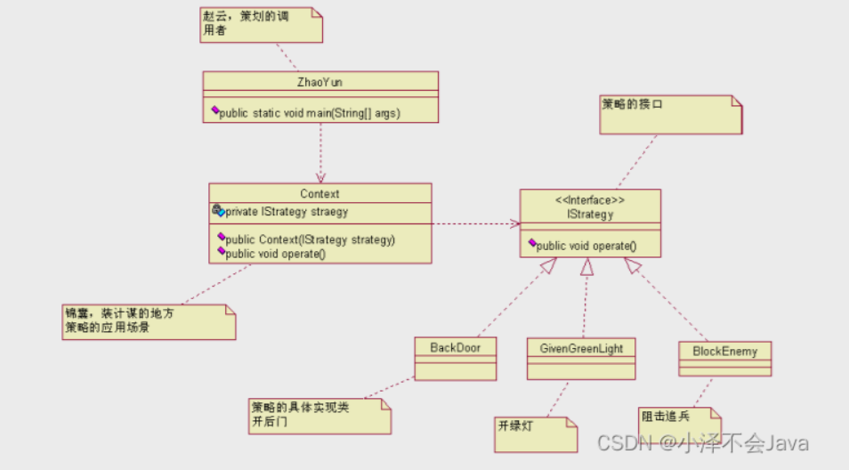

 作为一个程序猿，开发需要选择一款开发工具，当然可以进行代码开发的工具有很多，可以选择Idea进行开发，也可以使用eclipse进行开发，也可以使用其他的一些开发工具。

 

 ## 1：定义

 >         该模式定义了一系列算法，并将每个算法封装起来，使它们可以相互替换，且算法的变化不会影响使用算法的客户。策略模式属于对象行为模式，它通过对算法进行封装，把使用算法的责任和算法的实现分割开来，并委派给不同的对象对这些算法进行管理。

 ## 2：结构

 > 策略模式的主要角色如下：
- `抽象策略（Strategy）类`：这是一个抽象角色，通常由一个接口或抽象类实现。此角色给出所有的具体策略类所需的接口。
- `具体策略（Concrete Strategy）类`：实现了抽象策略定义的接口，提供具体的算法实现或行为。
- `环境（Context）类`：持有一个策略类的引用，最终给客户端调用。

## 3：举例

> 刘备要到江东娶老婆了，走之前诸葛亮给赵云（伴郎）三个锦囊妙计，说是按天机拆开解决棘手问题， 嘿，还别说，真是解决了大问题，搞到最后是周瑜陪了夫人又折兵呀，那咱们先看看这个场景是什么样子 的。  
> 先说这个场景中的要素：三个妙计，一个锦囊，一个赵云，妙计是小亮同志给的，妙计是放置在锦囊 里，俗称就是锦囊妙计嘛，那赵云就是一个干活的人，从锦囊中取出妙计，执行，然后获胜，用 JAVA 程序 怎么表现这个呢？


> 对于这个举例呢，其实
  策略接口或者类
  三个妙计  -->三个具体策略类
  一个锦囊  -->环境
  一个赵云  -->策略调用者



### 1）策略接口

```java
public interface IStrategy {
    //每个锦囊妙计都是一个可执行的算法
    public void operate();
}
```

### 2）三个具体策略类
```java
public class BackDoor implements IStrategy {
       @Override
       public void operate() {
              System.out.println("找乔国老帮忙，让吴国太给孙权施加压力");
       }
}
 
 
 
 
public class GivenGreenLight implements IStrategy{
       @Override
       public void operate() {
              System.out.println("求吴国太开个绿灯,放行！");
       }
}
 
 
 
public class BlockEnemy implements IStrategy{
       @Override
       public void operate() {
              System.out.println("孙夫人断后，挡住追兵");
       }
}
```


### 3）环境

```java
public class Context {
       private IStrategy straegy;
       //构造函数，你要使用那个妙计
       public Context(IStrategy iStrategy){
              this.straegy = iStrategy;
       }
       //使用计谋了，看我出招了
       public void operate(){
              this.straegy.operate();
       }
}
```

### 4）调用环境

```java
public class StrategyTest {
       public static void main(String[] args) {
              Context context;
              //刚刚到吴国的时候拆第一个
              System.out.println("-----------刚刚到吴国的时候拆第一个-------------");
              context = new Context(new BackDoor()); //拿到妙计
              context.operate(); //拆开执行
              System.out.println("\n\n\n\n\n\n\n\n");
 
              //刘备乐不思蜀了，拆第二个了
              System.out.println("-----------刘备乐不思蜀了，拆第二个了-------------");
              context = new Context(new GivenGreenLight());
              context.operate(); //执行了第二个锦囊了
              System.out.println("\n\n\n\n\n\n\n\n");
 
              //孙权的小兵追了，咋办？拆第三个
              System.out.println("-----------孙权的小兵追了，咋办？拆第三个 -------------");
              context = new Context(new BlockEnemy());
              context.operate(); //孙夫人退兵
       }
}
```

## 4：优缺点

- 1，优点：
  - 策略类之间可以自由切换
  - 由于策略类都实现同一个接口，所以使它们之间可以自由切换。
  - 易于扩展
  - 增加一个新的策略只需要添加一个具体的策略类即可，基本不需要改变原有的代码，符合“开闭原则“
  - 避免使用多重条件选择语句（if else），充分体现面向对象设计思想。
- 2，缺点：
  - 客户端必须知道所有的策略类，并自行决定使用哪一个策略类。
  - 策略模式将造成产生很多策略类，可以通过使用享元模式在一定程度上减少对象的数量。

## 5：使用场景

- 一个系统需要动态地在几种算法中选择一种时，可将每个算法封装到策略类中。
- 一个类定义了多种行为，并且这些行为在这个类的操作中以多个条件语句的形式出现，可将每个条件分支移入它们各自的策略类中以代替这些条件语句。
- 系统中各算法彼此完全独立，且要求对客户隐藏具体算法的实现细节时。
- 系统要求使用算法的客户不应该知道其操作的数据时，可使用策略模式来隐藏与算法相关的数据结构。
- 多个类只区别在表现行为不同，可以使用策略模式，在运行时动态选择具体要执行的行为。


## 6：JDK源码解析

`Comparator` 中的策略模式。在 `Arrays` 类中有一个 `sort()` 方法，如下：

```java
public class Arrays{
    public static <T> void sort(T[] a, Comparator<? super T> c) {
        if (c == null) {
            sort(a);
        } else {
            if (LegacyMergeSort.userRequested)
                legacyMergeSort(a, c);
            else
                TimSort.sort(a, 0, a.length, c, null, 0, 0);
        }
    }
}
```

Arrays就是一个环境角色类，这个 `sort方法` 可以传一个 `新策略` 让 `Arrays` 根据这个策略来进行排序。就比如下面的测试类。

```java
public class demo {
    public static void main(String[] args) {
 
        Integer[] data = {12, 2, 3, 2, 4, 5, 1};
        // 实现降序排序
        Arrays.sort(data, new Comparator<Integer>() {
            public int compare(Integer o1, Integer o2) {
                return o2 - o1;
            }
        });
        System.out.println(Arrays.toString(data)); //[12, 5, 4, 3, 2, 2, 1]
    }
}
```

这里我们在调用 `Arrays` 的 `sort方法` 时，第二个参数传递的是 `Comparator接口的子实现类对象` 。所以 `Comparator` 充当的是 `抽象策略角色` ，而 `具体的子实现类` 充当的是 `具体策略角色`。环境角色类（Arrays）应该持有抽象策略的引用来调用。那么，`Arrays类` 的 `sort方法` 到底有没有使用`Comparator` 子实现类中的 `compare()` 方法吗？让我们继续查看 `TimSort类` 的 `sort()` 方法，代码如下：

```java
class TimSort<T> {
    static <T> void sort(T[] a, int lo, int hi, Comparator<? super T> c,
                         T[] work, int workBase, int workLen) {
        assert c != null && a != null && lo >= 0 && lo <= hi && hi <= a.length;
 
        int nRemaining  = hi - lo;
        if (nRemaining < 2)
            return;  // Arrays of size 0 and 1 are always sorted
 
        // If array is small, do a "mini-TimSort" with no merges
        if (nRemaining < MIN_MERGE) {
            int initRunLen = countRunAndMakeAscending(a, lo, hi, c);
            binarySort(a, lo, hi, lo + initRunLen, c);
            return;
        }
        ...
    }   
        
    private static <T> int countRunAndMakeAscending(T[] a, int lo, int hi,Comparator<? super T> c) {
        assert lo < hi;
        int runHi = lo + 1;
        if (runHi == hi)
            return 1;
 
        // Find end of run, and reverse range if descending
        if (c.compare(a[runHi++], a[lo]) < 0) { // Descending
            while (runHi < hi && c.compare(a[runHi], a[runHi - 1]) < 0)
                runHi++;
            reverseRange(a, lo, runHi);
        } else {                              // Ascending
            while (runHi < hi && c.compare(a[runHi], a[runHi - 1]) >= 0)
                runHi++;
        }
 
        return runHi - lo;
    }
}
```

上面的代码中最终会跑到 `countRunAndMakeAscending()` 这个方法中。我们可以看见，只用了 `compare` 方法，所以在调用 `Arrays.sort` 方法只传具体 `compare` 重写方法的类对象就行，这也是 `Comparator` 接口中必须要子类实现的一个方法。

总结：就是调用整合策略类，也就是环境时，通过传入不同实现策略接口得实现类，最终调用得还是他本身实现得方法。（传入策略不同，实现就不同）


