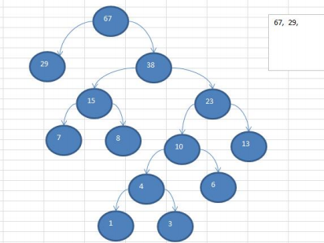

## 1：基本介绍

- 1) 给定 `n` 个 **权值** 作为 `n` 个叶子结点，构造一棵二叉树，若该树的 **带权路径长度(wpl)** 达到 **最小**，称这样的二叉树为 **最优二叉树**，也称为 **哈夫曼树**(Huffman Tree), 还有的书翻译为霍夫曼树。 
- 2) 赫夫曼树是带权路径长度最短的树，权值较大的结点离根较近

## 2：概念和说明

- 1) `**路径和路径长度**`：在一棵树中，从一个结点往下可以达到的孩子或孙子结点之间的通路，称为 `路径`。通路 中分支的数目称为 `路径长度`。若规定根结点的层数为 1，则从根结点到第 L 层结点的路径长度为 L-1 
- 2) `**结点的权及带权路径长度**`：若将树中结点赋给一个有着某种含义的数值，则这个数值称为该结点的 `权`。`**结点的带权路径长度为**`：从根结点到该结点之间的路径长度与该结点的权的 **乘积**
- 3) `**树的带权路径长度**`：树的**带权路径长度**规定为 **所有叶子结点的带权路径长度之和**，记为 WPL(weighted path length) ,**权值越大的结点离根结点越近的二叉树才是最优二叉树**。 
- 4) WPL 最小的就是赫夫曼树


## 3：创建思路图解

给你一个数列 `{13, 7, 8, 3, 29, 6, 1}`，要求转成一颗赫夫曼树.

思路分析(示意图)： `{13, 7, 8, 3, 29, 6, 1}`

> 构成赫夫曼树的步骤： 

- 1) 从小到大进行排序, 将每一个数据，每个数据都是一个节点 ， 每个节点可以看成是一颗最简单的二叉树 
- 2) 取出 **根节点权值最小** 的两颗二叉树 
- 3) 组成一颗 **新的二叉树**, 该新的二叉树的 **根节点的权值是前面两颗二叉树根节点权值的和**
- 4) 再将这颗新的二叉树，**以根节点的权值大小** 再次 **排序**， 不断重复 1-2-3-4 的步骤，直到数列中，所有的数据都被处理，就得到一颗赫夫曼树 
- 5) 图解:


## 4：代码实现

```java
import java.util.ArrayList;
import java.util.Collections;
import java.util.List;

public class HuffmanTree {

	public static void main(String[] args) {
		int arr[] = { 13, 7, 8, 3, 29, 6, 1 };
		Node root = createHuffmanTree(arr);
		
		//测试一把
		preOrder(root); //
		
	}
	
	//编写一个前序遍历的方法
	public static void preOrder(Node root) {
		if(root != null) {
			root.preOrder();
		}else{
			System.out.println("是空树，不能遍历~~");
		}
	}

	// 创建赫夫曼树的方法
	/**
	 * 
	 * @param arr 需要创建成哈夫曼树的数组
	 * @return 创建好后的赫夫曼树的root结点
	 */
	public static Node createHuffmanTree(int[] arr) {
		// 第一步为了操作方便
		// 1. 遍历 arr 数组
		// 2. 将arr的每个元素构成成一个Node
		// 3. 将Node 放入到ArrayList中
		List<Node> nodes = new ArrayList<Node>();
		for (int value : arr) {
			nodes.add(new Node(value));
		}
		
		//我们处理的过程是一个循环的过程
		
		
		while(nodes.size() > 1) {
		
			//排序 从小到大 
			Collections.sort(nodes);
			
			System.out.println("nodes =" + nodes);
			
			//取出根节点权值最小的两颗二叉树 
			//(1) 取出权值最小的结点（二叉树）
			Node leftNode = nodes.get(0);
			//(2) 取出权值第二小的结点（二叉树）
			Node rightNode = nodes.get(1);
			
			//(3)构建一颗新的二叉树
			Node parent = new Node(leftNode.value + rightNode.value);
			parent.left = leftNode;
			parent.right = rightNode;
			
			//(4)从ArrayList删除处理过的二叉树
			nodes.remove(leftNode);
			nodes.remove(rightNode);
			//(5)将parent加入到nodes
			nodes.add(parent);
		}
		
		//返回哈夫曼树的root结点
		return nodes.get(0);
		
	}
}

// 创建结点类
// 为了让Node 对象持续排序Collections集合排序
// 让Node 实现Comparable接口
class Node implements Comparable<Node> {
	int value; // 结点权值
	char c; //字符
	Node left; // 指向左子结点
	Node right; // 指向右子结点

	//写一个前序遍历
	public void preOrder() {
		System.out.println(this);
		if(this.left != null) {
			this.left.preOrder();
		}
		if(this.right != null) {
			this.right.preOrder();
		}
	}
	
	public Node(int value) {
		this.value = value;
	}

	@Override
	public String toString() {
		return "Node [value=" + value + "]";
	}

	@Override
	public int compareTo(Node o) {
		// TODO Auto-generated method stub
		// 表示从小到大排序
		return this.value - o.value;
	}

}
```