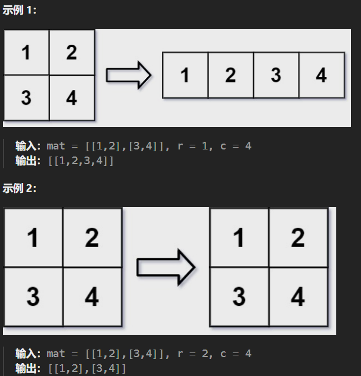
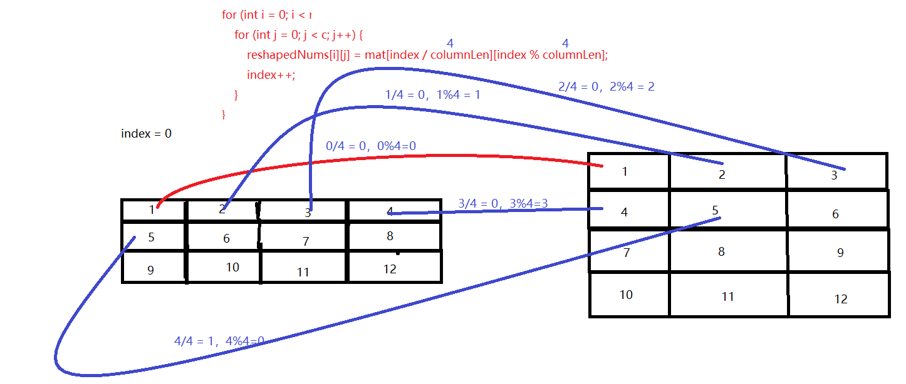

## 1：知识点

- 数组的优点:
  - 存取速度快
- 数组的缺点:
  - 事先必须知道 **数组的长度**
  - 插入删除元素很慢
  - 空间通常是有限制的
  - 需要大块连续的内存块
  - 插入删除元素的效率很低
  
## 2：数组与矩阵相关题目

### 1）把数组中的 0 移到末尾

[刷题链接283](https://leetcode.cn/problems/move-zeroes/?utm_source=LCUS&utm_medium=ip_redirect&utm_campaign=transfer2china)

> 给定一个数组 nums，编写一个函数将所有 0 移动到数组的末尾，同时保持非零元素的相对顺序。

请注意 ，必须在不复制数组的情况下原地对数组进行操作。

- 示例 1:
  - 输入: nums = [0,1,0,3,12]
  - 输出: [1,3,12,0,0]
- 示例 2:
  - 输入: nums = [0]
  - 输出: [0]

```java
class Solution {
    public void moveZeroes(int[] nums) {
        int index = 0;  // 当前不为0的数的 索引
        // 1.遍历该数组，只要不为0的数
        for(int num : nums){
            if(num != 0){
                nums[index++] = num;
            }
        }

        // 2.判断index和该数组现在长度是否相等（相等则代表没有0，不相等则代表有0，然后右边进行0填充）
        while(index < nums.length){
            nums[index++] = 0;
        }
    }
}
```

### 2）改变矩阵维度

[题目链接566](https://leetcode.cn/problems/reshape-the-matrix/description/)

在 `MATLAB` 中，有一个非常有用的函数 `reshape` ，它可以将一个 `m` x `n` 矩阵重塑为另一个大小不同（`r` x `c`）的新矩阵，但保留其原始数据。

给你一个由二维数组 `mat` 表示的 `m` x `n` 矩阵，以及两个正整数 `r` 和 `c` ，分别表示想要的重构的矩阵的 `行数` 和 `列数` 。

重构后的矩阵需要将原始矩阵的所有元素以相同的 `行遍历顺序` 填充。

如果具有给定参数的 `reshape` 操作是可行且合理的，则输出新的重塑矩阵；否则，输出原始矩阵。



```java
class Solution {
    public int[][] matrixReshape(int[][] mat, int r, int c) {
        // 1：检验数据合法性
        // 1.1 获取行数
        int rowLen = mat.length;
        // 1.2 获取列数
        int columnLen = mat[0].length;
        // 1.3 判断数据合法性
        if(rowLen * columnLen != r * c){
            return mat;
        }

        // 2：到这里开始真正的逻辑，前面判断已经校验了数据的合法性
        // 2.1 定义一个新的返回数组
        int[][] reshapedNums = new int[r][c];
        // 2.2 定义此时数据被赋值到得索引处
        int index = 0;
        // 2.3 开始真正得数组赋值逻辑
        // 主要思路：我如何对原矩阵进行操作，
        // a、首先有个共同的特点，就是我必须根据列数去进行操作
        // b、每一行的数据索引，假如变后矩阵的列数是4
        // [
        //   [mat[0,0],mat[0,1],mat[0,2],mat[0,3]],
        //   [mat[1,0],mat[1,1],mat[1,2],mat[2,3]],
        // ]
        // c、取得时候第一行行索引都是0，列索引是0，1，2，3，
        //    然后第二行行索引都是1，列索引是0，1，2，3
        // d、所以只需要控制行索引（/）和列索引（%）就行
        for (int i = 0; i < r; i++) {
            for (int j = 0; j < c; j++) {
                reshapedNums[i][j] = mat[index / columnLen][index % columnLen];
                index++;
            }
        }

        // 3：返回
        return reshapedNums;
    }
}
```

解题思路：


### 3）找出数组中最长的连续 1

[题目链接485](https://leetcode.cn/problems/max-consecutive-ones/description/)

> 给定一个二进制数组 nums ， 计算其中最大连续 1 的个数。

- 示例 1：
  - 输入：nums = [1,1,0,1,1,1]
  - 输出：3
  - 解释：开头的两位和最后的三位都是连续 1 ，所以最大连续 1 的个数是 3.
- 示例 2:
  - 输入：nums = [1,0,1,1,0,1]
  - 输出：2


```java
class Solution {
    public int findMaxConsecutiveOnes(int[] nums) {
        // 定义最大值
        int max = 0;
        // 定义当前值
        int current = 0;
        for(int i = 0; i < nums.length;i++){
            // 为1时，current++
            if(nums[i] == 1){
                current++;
                // 判断current和max，保证max永远是最大的
                if(current > max){
                    max = current;
                }
            }else{ //否则 。重置current=0
                current = 0;
            }
        }
        return max;
    }
}
```

### 4）有序矩阵查找

既然是有序，那就必须考虑 `二分查找`

> 编写一个高效的算法来搜索 `m` x `n` 矩阵 `matrix` 中的一个目标值 `target` 。该矩阵具有以下特性：

- 每行的元素 `从左到右` 升序排列。
- 每列的元素 `从上到下` 升序排列。


```java
class Solution {
    public boolean searchMatrix(int[][] matrix, int target) {
        if (matrix == null || matrix.length == 0 || matrix[0].length == 0)
            return false;

        // 开始主要逻辑
        int m = matrix.length, n = matrix[0].length;
        int row = 0, col = n - 1;
        while (row < m && col >= 0) {
            if (target == matrix[row][col])
                return true;
            else if (target < matrix[row][col])
                col--;//上移
            else
                row++;//右移
        }
        return false;
    }
}
```
