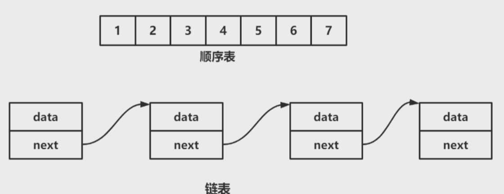
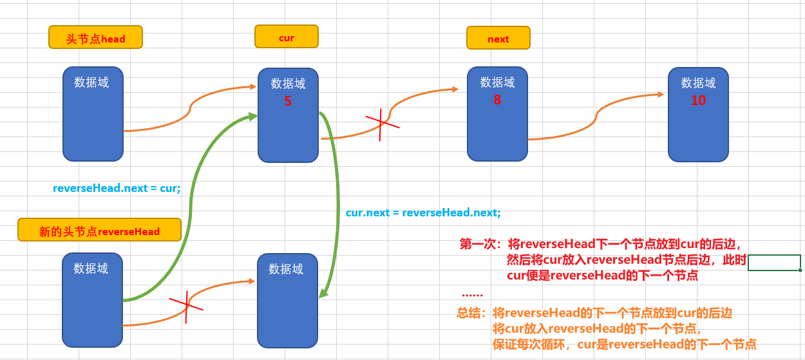

## 1：定义及结构

### 1-1 概念

:::warning 概念
**链表** 是一种 **物理存储结构**上 **非连续**、 **非顺序** 的 `存储结构`，但链表在逻辑上是连续的，顺序的，而数据元素的逻辑顺序是通过链表中的指针连接次序实现的。
:::

### 1-2 结构

:::warning 结构
`单链表（Singly Linked List）` 是一种常用的数据结构，它由若干个 **节点** 组成，**每个节点包含两部分：`数据域` 和 `指针域`**。`数据域`用于 **存储数据**，而 `指针域` 则用于 **指向下一个节点的地址**。单链表中每个节点只有一个指针域，指向下一个节点，最后一个节点的指针域指向 NULL，表示链表的结尾。
:::



> 一看到这种结构有就会问，`顺序表` 的 `存储方式` 和 `单链表` 哪里不同呢？


- **顺序表** 是一种基于`数组`实现的 `线性数据结构`，**其元素在内存中是连续存储的**，其实就是数组的原理。
- **单链表** 是一种 `逻辑连续`，**物理不一定连续的线性表**，实际上在内存中，**每个结点可能会隔得很远，只是通过指针的方式将他们像绳子一样穿起来，也是每个结点都指向下一个结点地址空间。**

### 1-3 特点

**头节点没有 `数据域`，尾节点的地址域为 `null`**

与顺序表不同，单链表的元素不是连续存储的，而是通过指针相连形成链式结构。因此，单链表具有以下优缺点。  
**优点：**

- **支持动态内存分配**。由于单链表不需要预先分配一段连续的空间，因此可以根据实际需求动态地申请、释放节点空间，避免浪费内存。
- **支持高效的插入、删除操作**。由于单链表中的节点是通过指针相连的，因此在插入、删除一个节点时，只需要修改其前驱节点或后继节点的指针即可，时间复杂度为O (1) 。

**缺点：**

- **不支持随机访问**。由于单链表中的节点不是连续存储的，因此不能像数组一样通过下标来直接访问一个元素，**需要从头节点开始遍历整个链表才能访问任意位置的元素。**


## 2：单链表的实现

### 2-1 定义node节点
```java
//定义HeroNode ， 每个HeroNode 对象就是一个节点
class HeroNode {
	public int no;
	public String name;
	public String nickname;
	public HeroNode next; //指向下一个节点
	//构造器
	public HeroNode(int no, String name, String nickname) {
		this.no = no;
		this.name = name;
		this.nickname = nickname;
	}
	//为了显示方法，我们重新toString
	@Override
	public String toString() {
		return "HeroNode [no=" + no + ", name=" + name + ", nickname=" + nickname + "]";
	}
	
}
```

### 2-2 crud方法

```java
//定义SingleLinkedList 管理我们的英雄
class SingleLinkedList {
	//先初始化一个头节点, 头节点不要动, 不存放具体的数据
	private HeroNode head = new HeroNode(0, "", "");
	//返回头节点
	public HeroNode getHead() {
		return head;
	}

	//添加节点到单向链表
	//思路，当不考虑编号顺序时
	//1. 找到当前链表的最后节点
	//2. 将最后这个节点的next 指向 新的节点
	public void add(HeroNode heroNode) {
		
		//因为head节点不能动，因此我们需要一个辅助遍历 temp
		HeroNode temp = head;
		//遍历链表，找到最后
		while(true) {
			//找到链表的最后
			if(temp.next == null) {//
				break;
			}
			//如果没有找到最后, 将将temp后移
			temp = temp.next;
		}
		//当退出while循环时，temp就指向了链表的最后
		//将最后这个节点的next 指向 新的节点
		temp.next = heroNode;
	}
	
	//第二种方式在添加英雄时，根据排名将英雄插入到指定位置
	//(如果有这个排名，则添加失败，并给出提示)
	public void addByOrder(HeroNode heroNode) {
		//因为头节点不能动，因此我们仍然通过一个辅助指针(变量)来帮助找到添加的位置
		//因为单链表，因为我们找的temp 是位于 添加位置的前一个节点，否则插入不了
		HeroNode temp = head;
		boolean flag = false; // flag标志添加的编号是否存在，默认为false
		while(true) {
			if(temp.next == null) {//说明temp已经在链表的最后
				break; //
			} 
			if(temp.next.no > heroNode.no) { //位置找到，就在temp的后面插入
				break;
			} else if (temp.next.no == heroNode.no) {//说明希望添加的heroNode的编号已然存在
				
				flag = true; //说明编号存在
				break;
			}
			temp = temp.next; //后移，遍历当前链表
		}
		//判断flag 的值
		if(flag) { //不能添加，说明编号存在
			System.out.printf("准备插入的英雄的编号 %d 已经存在了, 不能加入\n", heroNode.no);
		} else {
			//插入到链表中, temp的后面
			heroNode.next = temp.next;
			temp.next = heroNode;
		}
	}

	//修改节点的信息, 根据no编号来修改，即no编号不能改.
	//说明
	//1. 根据 newHeroNode 的 no 来修改即可
	public void update(HeroNode newHeroNode) {
		//判断是否空
		if(head.next == null) {
			System.out.println("链表为空~");
			return;
		}
		//找到需要修改的节点, 根据no编号
		//定义一个辅助变量
		HeroNode temp = head.next;
		boolean flag = false; //表示是否找到该节点
		while(true) {
			if (temp == null) {
				break; //已经遍历完链表
			}
			if(temp.no == newHeroNode.no) {
				//找到
				flag = true;
				break;
			}
			temp = temp.next;
		}
		//根据flag 判断是否找到要修改的节点
		if(flag) {
			temp.name = newHeroNode.name;
			temp.nickname = newHeroNode.nickname;
		} else { //没有找到
			System.out.printf("没有找到 编号 %d 的节点，不能修改\n", newHeroNode.no);
		}
	}
	
	//删除节点
	//思路
	//1. head 不能动，因此我们需要一个temp辅助节点找到待删除节点的前一个节点
	//2. 说明我们在比较时，是temp.next.no 和  需要删除的节点的no比较
	public void del(int no) {
		HeroNode temp = head;
		boolean flag = false; // 标志是否找到待删除节点的
		while(true) {
			if(temp.next == null) { //已经到链表的最后
				break;
			}
			if(temp.next.no == no) {
				//找到的待删除节点的前一个节点temp
				flag = true;
				break;
			}
			temp = temp.next; //temp后移，遍历
		}
		//判断flag
		if(flag) { //找到
			//可以删除
			temp.next = temp.next.next;
		}else {
			System.out.printf("要删除的 %d 节点不存在\n", no);
		}
	}
	
	//显示链表[遍历]
	public void list() {
		//判断链表是否为空
		if(head.next == null) {
			System.out.println("链表为空");
			return;
		}
		//因为头节点，不能动，因此我们需要一个辅助变量来遍历
		HeroNode temp = head.next;
		while(true) {
			//判断是否到链表最后
			if(temp == null) {
				break;
			}
			//输出节点的信息
			System.out.println(temp);
			//将temp后移， 一定小心
			temp = temp.next;
		}
	}
}
```

## 3：代码解释

### 3-1 添加节点

**添加需要头节点参与，所以 `HeroNode temp = head;`**


```java
//第二种方式在添加英雄时，根据排名将英雄插入到指定位置
	//(如果有这个排名，则添加失败，并给出提示)
	public void addByOrder(HeroNode heroNode) {
		//因为头节点不能动，因此我们仍然通过一个辅助指针(变量)来帮助找到添加的位置
		//因为单链表，因为我们找的temp 是位于 添加位置的前一个节点，否则插入不了
		HeroNode temp = head;
		boolean flag = false; // flag标志添加的编号是否存在，默认为false
		while(true) {
			if(temp.next == null) {//说明temp已经在链表的最后
				break; //
			} 
			if(temp.next.no > heroNode.no) { //位置找到，就在temp的后面插入
				break;
			} else if (temp.next.no == heroNode.no) {//说明希望添加的heroNode的编号已然存在
				
				flag = true; //说明编号存在
				break;
			}
			temp = temp.next; //后移，遍历当前链表
		}
		//判断flag 的值
		if(flag) { //不能添加，说明编号存在
			System.out.printf("准备插入的英雄的编号 %d 已经存在了, 不能加入\n", heroNode.no);
		} else {
			//插入到链表中, temp的后面
			heroNode.next = temp.next;
			temp.next = heroNode;
		}
	}
```

### 3-2 修改节点

:::warning 主要思路
- 1、主要确定要修改的节点，根据no编号来修改，若存在，则进行修改，若不存在，则提示不能修改
- 2、**主要是判断该编号所在节点的位置**
- 3、修改节点和 `地址域` 没有关系，只修改该节点的`data域`信息
- 4、**修改不需要头节点参与，所以 `HeroNode temp = head.next;`**
:::

```java
//修改节点的信息, 根据no编号来修改，即no编号不能改.
	//说明
	//1. 根据 newHeroNode 的 no 来修改即可
	public void update(HeroNode newHeroNode) {
		//判断是否空
		if(head.next == null) {
			System.out.println("链表为空~");
			return;
		}
		//找到需要修改的节点, 根据no编号
		//定义一个辅助变量
		HeroNode temp = head.next;
		boolean flag = false; //表示是否找到该节点
		while(true) {
			if (temp == null) {
				break; //已经遍历完链表
			}
			if(temp.no == newHeroNode.no) {
				//找到
				flag = true;
				break;
			}
			temp = temp.next;
		}
		//根据flag 判断是否找到要修改的节点
		if(flag) {
			temp.name = newHeroNode.name;
			temp.nickname = newHeroNode.nickname;
		} else { //没有找到
			System.out.printf("没有找到 编号 %d 的节点，不能修改\n", newHeroNode.no);
		}
	}
```

### 3-3 删除节点

:::warning 主要思路
- 1、首先判断链表是否为空，若为空，则提示删除失败
- 2、定义一个辅助变量，遍历链表，找到待删除节点的前一个节点，然后将该节点的`next`域指向待删除节点的`next`域，即可删除该节点
- 3、**删除需要头节点参与，所以 `HeroNode temp = head;`**
- 4、注意：
  - 1、头节点不能动，因此我们定义一个辅助变量，遍历链表，找到待删除节点的前一个节点，然后将该节点的`next`域指向待删除节点的`next`域，即可删除该节点
  - 2、待删除节点不能是本节点，待删除的节点必须是temp节点的 `next`域，因为如果该删除节点是temp节点，无法让 `temp` **上一个节点** 和 **下一个节点** 连接起来，**因为他是只有后驱节点，所以无法找到前一个节点**
:::

```java
	//删除节点
	//思路
	//1. head 不能动，因此我们需要一个temp辅助节点找到待删除节点的前一个节点
	//2. 说明我们在比较时，是temp.next.no 和  需要删除的节点的no比较
	public void del(int no) {
		HeroNode temp = head;
		boolean flag = false; // 标志是否找到待删除节点的
		while(true) {
			if(temp.next == null) { //已经到链表的最后
				break;
			}
			if(temp.next.no == no) {
				//找到的待删除节点的前一个节点temp
				flag = true;
				break;
			}
			temp = temp.next; //temp后移，遍历
		}
		//判断flag
		if(flag) { //找到
			//可以删除
			temp.next = temp.next.next;
		}else {
			System.out.printf("要删除的 %d 节点不存在\n", no);
		}
	}
```
### 3-4 显示链表

单纯遍历就可以了

**遍历不需要头节点参与，所以 `HeroNode temp = head.next;`**

```java
	//显示链表[遍历]
	public void list() {
		//判断链表是否为空
		if(head.next == null) {
			System.out.println("链表为空");
			return;
		}
		//因为头节点，不能动，因此我们需要一个辅助变量来遍历
		HeroNode temp = head.next;
		while(true) {
			//判断是否到链表最后
			if(temp == null) {
				break;
			}
			//输出节点的信息
			System.out.println(temp);
			//将temp后移， 一定小心
			temp = temp.next;
		}
	}

```

## 4：相关算法

### 4-1 计算链表长度

:::warning 思路
- 1、遍历链表，统计有效节点的个数，即不包含头节点的个数
:::
```java
//方法：获取到单链表的节点的个数(如果是带头结点的链表，需求不统计头节点)
	/**
	 * 
	 * @param head 链表的头节点
	 * @return 返回的就是有效节点的个数
	 */
	public static int getLength(HeroNode head) {
		if(head.next == null) { //空链表
			return 0;
		}
		int length = 0;
		//定义一个辅助的变量, 这里我们没有统计头节点
		HeroNode cur = head.next;
		while(cur != null) {
			length++;
			cur = cur.next; //遍历
		}
		return length;
	}
```

### 4-2 查找单链表中的倒数第k个结点 

:::warning 思路
- 1. 编写一个方法，接收 `head` 节点，同时接收一个 `index`
- 2. `index` 表示是倒数第 `index` 个节点
- 3. 先把链表从头到尾遍历，得到链表的总的长度 `getLength`
- 4. 得到 `size` 后，我们从链表的第一个开始遍历 `(size-index)` 个，就可以得到
- 5. 如果找到了，则返回该节点，否则返回 `null`
:::

```java
//查找单链表中的倒数第k个结点 【新浪面试题】
	//思路
	//1. 编写一个方法，接收head节点，同时接收一个ixndex 
	//2. index 表示是倒数第index个节点
	//3. 先把链表从头到尾遍历，得到链表的总的长度 getLength
	//4. 得到size 后，我们从链表的第一个开始遍历 (size-index)个，就可以得到
	//5. 如果找到了，则返回该节点，否则返回nulll
	public static HeroNode findLastIndexNode(HeroNode head, int index) {
		//判断如果链表为空，返回null
		if(head.next == null) {
			return null;//没有找到
		}
		//第一个遍历得到链表的长度(节点个数)
		int size = getLength(head);
		//第二次遍历  size-index 位置，就是我们倒数的第K个节点
		//先做一个index的校验
		if(index <=0 || index > size) {
			return null; 
		}
		//定义给辅助变量， for 循环定位到倒数的index
		HeroNode cur = head.next; //3 // 3 - 1 = 2
		for(int i =0; i< size - index; i++) {
			cur = cur.next;
		}
		return cur;
		
	}
```

### 4-3 将单链表反转(破坏原链表)



```java
//将单链表反转
	public static void reversetList(HeroNode head) {
		//如果当前链表为空，或者只有一个节点，无需反转，直接返回
		if(head.next == null || head.next.next == null) {
			return ;
		}
		
		//定义一个辅助的指针(变量)，帮助我们遍历原来的链表
		HeroNode cur = head.next;
		HeroNode next = null;// 指向当前节点[cur]的下一个节点
		HeroNode reverseHead = new HeroNode(0, "", "");
		//遍历原来的链表，每遍历一个节点，就将其取出，并放在新的链表reverseHead 的最前端
		//动脑筋
		while(cur != null) { 
			next = cur.next;//先暂时保存当前节点的下一个节点，因为后面需要使用
			cur.next = reverseHead.next;//将cur的下一个节点指向新的链表的最前端
			reverseHead.next = cur; //将cur 连接到新的链表上
			cur = next;//让cur后移
		}
		//将head.next 指向 reverseHead.next , 实现单链表的反转
		head.next = reverseHead.next;
	}
```

### 4-4 单链表的反转(利用栈)

```java
//方式2：
	//可以利用栈这个数据结构，将各个节点压入到栈中，然后利用栈的先进后出的特点，就实现了逆序打印的效果
	public static void reversePrint(HeroNode head) {
		if(head.next == null) {
			return;//空链表，不能打印
		}
		//创建要给一个栈，将各个节点压入栈
		Stack<HeroNode> stack = new Stack<HeroNode>();
		HeroNode cur = head.next;
		//将链表的所有节点压入栈
		while(cur != null) {
			stack.push(cur);
			cur = cur.next; //cur后移，这样就可以压入下一个节点
		}
		//将栈中的节点进行打印,pop 出栈
		while (stack.size() > 0) {
			System.out.println(stack.pop()); //stack的特点是先进后出
		}
	}
```
