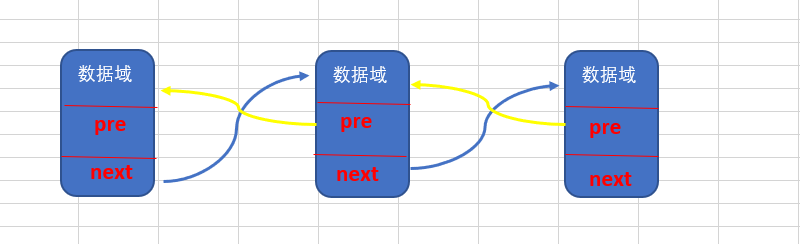

## 1：结构

:::warning 双向链表

`数据域` + `前驱节点(pre)` + `后驱节点(next)`

:::


## 2：代码实现

### 2-1 显示链表

```java
// 遍历双向链表的方法
	// 显示链表[遍历]
	public void list() {
		// 判断链表是否为空
		if (head.next == null) {
			System.out.println("链表为空");
			return;
		}
		// 因为头节点，不能动，因此我们需要一个辅助变量来遍历
		HeroNode2 temp = head.next;
		while (true) {
			// 判断是否到链表最后
			if (temp == null) {
				break;
			}
			// 输出节点的信息
			System.out.println(temp);
			// 将temp后移， 一定小心
			temp = temp.next;
		}
	}
```

### 2-2 添加节点

:::warning 双向链表添加节点
- 1. 遍历链表，找到最后 -> `temp`
- 2. 将 `newHerNode` 设置为 `temp` 下一个节点 - > `temp.next = newHeroNode;`
- 3. 将 `newHeroNode` 的前驱节点设置为 `temp` - > `newHeroNode.pre = temp;`
:::

```java
// 添加一个节点到双向链表的最后.
	public void add(HeroNode2 heroNode) {

		// 因为head节点不能动，因此我们需要一个辅助遍历 temp
		HeroNode2 temp = head;
		// 遍历链表，找到最后
		while (true) {
			// 找到链表的最后
			if (temp.next == null) {//
				break;
			}
			// 如果没有找到最后, 将将temp后移
			temp = temp.next;
		}
		// 当退出while循环时，temp就指向了链表的最后
		// 形成一个双向链表
		temp.next = heroNode;
		heroNode.pre = temp;
	}
```

### 2-3 修改节点

```java
// 修改一个节点的内容, 可以看到双向链表的节点内容修改和单向链表一样
	// 只是 节点类型改成 HeroNode2
	public void update(HeroNode2 newHeroNode) {
		// 判断是否空
		if (head.next == null) {
			System.out.println("链表为空~");
			return;
		}
		// 找到需要修改的节点, 根据no编号
		// 定义一个辅助变量
		HeroNode2 temp = head.next;
		boolean flag = false; // 表示是否找到该节点
		while (true) {
			if (temp == null) {
				break; // 已经遍历完链表
			}
			if (temp.no == newHeroNode.no) {
				// 找到
				flag = true;
				break;
			}
			temp = temp.next;
		}
		// 根据flag 判断是否找到要修改的节点
		if (flag) {
			temp.name = newHeroNode.name;
			temp.nickname = newHeroNode.nickname;
		} else { // 没有找到
			System.out.printf("没有找到 编号 %d 的节点，不能修改\n", newHeroNode.no);
		}
	}
```

### 2-4 删除节点

`双向链表` 可以删除 `当前节点`，和单链表有区别，**因为单链表只能往后走，双向链表前后都可以走**

:::warning 双向链表删除节点
- 1. 先遍历链表，找到要删除的节点的位置 `temp`
- 2. 将 `temp` 的 **后驱节点** 指向 `temp` 的 **前驱节点** 的 **后驱节点** -> `temp.pre.next = temp.next;`
- 3. 将 `temp` 的 **后驱节点** 的 **前驱节点** 指向 `temp` 的 **前驱节点** -> `temp.next.pre = temp.pre;` ，注意，如果是 **最后一个节点**，那么 `temp.next` 为 `null`，那么 `temp.next.pre` 会报空指针，所以需要判断 `temp.next 是否为 null`
:::
```java
	// 从双向链表中删除一个节点,
	// 说明
	// 1 对于双向链表，我们可以直接找到要删除的这个节点
	// 2 找到后，自我删除即可
	public void del(int no) {

		// 判断当前链表是否为空
		if (head.next == null) {// 空链表
			System.out.println("链表为空，无法删除");
			return;
		}

		HeroNode2 temp = head.next; // 辅助变量(指针)
		boolean flag = false; // 标志是否找到待删除节点的
		while (true) {
			if (temp == null) { // 已经到链表的最后
				break;
			}
			if (temp.no == no) {
				// 找到的待删除节点的前一个节点temp
				flag = true;
				break;
			}
			temp = temp.next; // temp后移，遍历
		}
		// 判断flag
		if (flag) { // 找到
			// 可以删除
			// temp.next = temp.next.next;[单向链表]
			temp.pre.next = temp.next;
			// 这里我们的代码有问题?
			// 如果是最后一个节点，就不需要执行下面这句话，否则出现空指针
			if (temp.next != null) {
				temp.next.pre = temp.pre;
			}
		} else {
			System.out.printf("要删除的 %d 节点不存在\n", no);
		}
	}
```