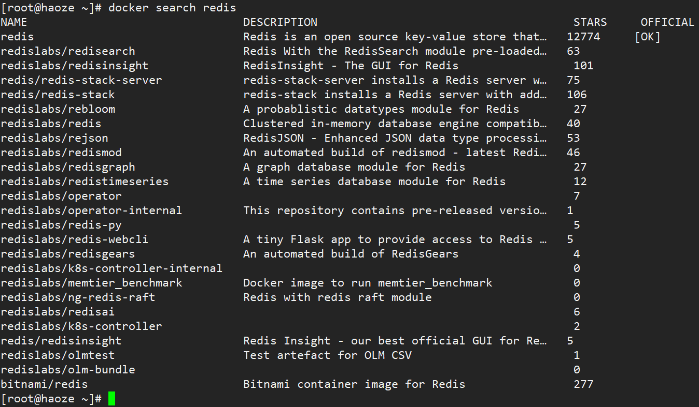
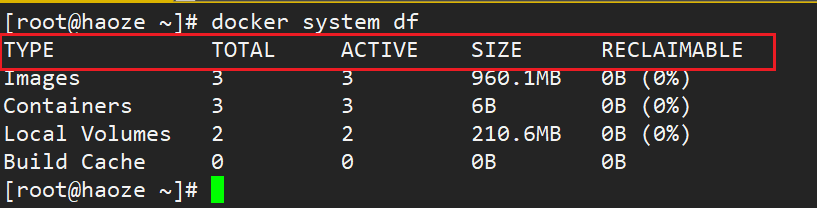
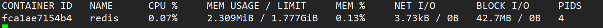

## 1：帮助启动类命令

### 1.1 启动docker

```shell
systemctl start docker
```

### 1.2 停止docker

```shell
systemctl stop docker
```

### 1.3 重启docker

```shell
systemctl restart  docker
```

### 1.4 查看docker状态

```shell
systemctl status docker
```

### 1.5 设置开机自启

```shell
systemctl enable docker
```

### 1.6 查看docker概要信息

```shell
docker info
```

### 1.7 查看docker总体帮助文档

```shell
docker --help
```

### 1.8 查看docker命令帮助文档

```shell
docker 具体命令 --help

example：
docker run --help
```

## 2：镜像命令

### 2.1 docker images

列出本地主机上有的镜像

```shell
docker images [OPTIONS]
 
常用参数：
-a ：列出所有的镜像 （含历史映像层）
-q ：只显示镜像ID
 
example：
docker images -a
docker images -q
docker images -aq
docker images redis   #查找镜像名为redis的镜像
docker images redis:6.0.8   #查找镜像名:版本号(REPOSITORY：TAG)对应的镜像
```


> 字段解析：  
- `REPOSITORY`：表示镜像的仓库源
- `TAG`：镜像的标签版本号
- `IMAGE ID`：镜像ID
- `CREATED`：镜像创建时间
- `SIZE`：镜像大小 


**同一仓库源可以有多个 `TAG版本`，代表这个仓库源的不同个版本，我们使用 `REPOSITORY:TAG` 来定义不同的镜像。如果你不指定一个镜像的版本标签，例如你只使用 ubuntu，docker 将默认使用 ubuntu:latest 镜像**


### 2.2 docker search

从docker hub查找镜像

```shell
docker search [OPTIONS] 镜像名字
 
常用参数：
--limit nu   #只输出查到的前nu条记录
 
example：
docker search redis
docker search --limit 3 redis
docker search redis --limit 3    # 放在镜像名称前面后面均可
```



> 字段解析：
- `NAME`：镜像名称
- `DISCRIPTION`：镜像说明
- `STARTS`：点赞数
- `OFFICAL`：是否是官方认可的
- `AUTOMATED`：是否自动构建 

### 2.3 docker pull

从远程库拉取镜像

```shell
docker pull 镜像名字[:TAG]
 
example：
docker pull redis:6.0.8
docker pull ubuntu  # 没有指定版本即拉取最新版 即默认为 ubuntu:latest
```

### 2.4 docker system df

查看镜像/容器/数据卷所占的空间

```shell
docker system df
```




### 2.5 docker rmi

删除镜像

```shell
#删除单个
docker rmi 镜像ID  #删除镜像，如果此时镜像上面有容器正在运行，会报错无法删除
docker rmi  -f 镜像ID   #强制(forced)删除镜像
 
 
#删除多个
docker rmi -f 镜像名1:TAG 镜像名2:TAG 
 
 
#删除全部（慎用）
docker rmi -f $(docker images -qa)  
#首先docker images -qa会列举本地所有的镜像的ID，然后作为一个集合送入rmi一个个删除
```

### 2.6 docker commit

Docker中的镜像分层，**支持通过扩展现有镜像，创建新的镜像。我们进行扩展后提交到本地成为一个新的镜像**

```shell
docker commit -m="提交的描述信息" -a="作者" 容器ID 要创建的目标镜像名:[标签名]
 
example：
 
docker pull ubuntu  # 从镜像仓库拉取基础ubuntu镜像（支持扩展），原始的默认Ubuntu镜像是不带着vim命令的
 
#外网联通的情况下，在容器内安装vim命令
apt-get update
apt-get -y install vim
 
#安装完成后，commit我们自己的新镜像
docker commit -m="ubuntu-add-vim" -a="zjy" a4b1b1cc54f0 atguigu/myubuntu:1.3
```

### 2.7 docker build

通过 `Dcokerfile`构建镜像

```shell
docker build -t 新镜像名字:TAG .  # 注意 TAG后面有个空格，有个点
 
example：
docker build -t centosjava8:1.5 .
```

## 3：容器命令

### 3.1 docker run

新建并启动容器

```shell
docker run [OPTIONS] IMAGE [COMMAND] [ARG...]
 
常用参数：
docker run [OPTIONS] IMAGE [COMMAND] [ARG...]
 
常用参数：
--name=NAME   #为容器指定名字为NAME，不使用的话系统自动为容器命名
-d: 后台运行容器并返回容器ID，也即启动守护式容器(后台运行)；
 
-i：以交互模式运行容器，通常与 -t 同时使用；
-t：为容器重新分配一个伪输入终端，通常与 -i 同时使用；
也即启动交互式容器(前台有伪终端，等待交互，一般连用，即-it)；
 
-P: 随机端口映射，大写P
-p: 指定端口映射，小写p
 
 
example：
 
以ubuntu为例，启动后要交互先声明交互模式，其次交互得需要一个终端，因此参数为-it
docker run -it ubuntu /bin/bash
 
指定名称
docker run -it --name=myubuntu ubuntu /bin/bash
```

**启动守护式容器**

在大部分的场景下，我们希望 docker 的服务是在后台运行的，  
我们可以过 `-d` 指定容器的 **后台运行模式**。

```shell
docker run -d 容器名
 
example：
docker run -d redis:6.0.8
docker run -d ubuntu
```

:::warning 注意
注意
上面的 `docker run -d ubuntu` 执行后，使用 `docker ps -a`进行查看，会发现容器已经退出

很重要的要说明的一点: **Docker容器后台运行,就必须有一个前台进程**.

这个是docker的机制问题,比如你的web容器,我们以nginx为例，正常情况下,我们配置启动服务只需要启动响应的service即可。例如service nginx start。但是,这样做,nginx为后台进程模式运行,就导致docker前台没有运行的应用, 这样的容器后台启动后,会立即自杀，因为它觉得他没事可做了.    

最佳的解决方案是,**将你要运行的程序以前台进程的形式运行，常见就是命令行模式，类似centos、ubuntu**

:::

### 3.2 docker ps

查看正在运行的容器

```shell
docker ps [OPTIONS]
 
常用参数：
-a :列出当前所有正在运行的容器+历史上运行过的
-l :显示最近创建的容器。
-n nu：显示最近nu个创建的容器。
-q :静默模式，只显示容器编号。
 
example：
docker ps -aq
docker ps -n 3
docker ps -l
```

### 3.3 退出容器

#### ① exit

run进去容器，exit退出，容器停止

#### ② ctrl+p+q

run进去容器，`ctrl+p+q`退出，容器不停止


### 3.4 进入正在运行的容器并以命令行交互

#### ① `docker exec -it 容器ID/容器名称 bashShell`

#### ② `docker attach 容器ID`

```shell
example：
 
#容器ID
docker exec -it c32f612cc218 /bin/bash
docker attach c32f612cc218
 
#容器名称
docker exec -it wizardly_booth /bin/bash
docker attach wizardly_booth
```

:::warning 区别
区别 

`exec` 是在容器中打开新的终端，并且可以启动新的进程。用 `exit`退出，**不会导致容器的停止**。

`attach` 直接进入容器启动命令的终端，不会启动新的进程。用 `exit`退出，**会导致容器的停止**。

推荐大家使用 `docker exec` 命令，因为 **退出容器终端，不会导致容器的停止**。

:::

### 3.5 启动已停止运行的容器

```shell
docker start 容器ID或者容器名
```

### 3.6 重启容器

```shell
docker restart 容器ID或者容器名
```

### 3.7 停止容器

```shell
docker stop 容器ID或者容器名
```

### 3.8 强制停止容器

```shell
docker kill 容器ID或者容器名
```

### 3.9 删除已停止的容器

```shell
#删除一个
docker rm 容器ID  
docker rm -f 容器ID  #强制删除
 
 
#删除多个
docker rm -f $(docker ps -a -q)
或
docker ps -a -q | xargs docker rm
```

### 3.10 查看容器日志

```shell
docker logs 容器ID
```

### 3.11 查看容器内运行的进程

```shell
docker top 容器ID
```
  
### 3.12 查看容器内部细节

```shell
docker inspect 容器ID
```


### 3.13 从容器内拷贝文件到主机上

```shell
docker cp  容器ID:容器内路径 目的主机路径
 
example:
#以ubuntu为例，我们在/tmp目录下通过touch a.txt创建a文本，将其复制到本机download目录下
docker cp 958443b97285:/tmp/a.txt /download```
```
### 3.14 导入和导出容器

`export` 导出容器的内容留作为一个tar归档文件 `[对应import命令]`

`import` 从tar包中的内容创建一个新的文件系统再导入为镜像`[对应export]`

```shell
docker export 容器ID > 文件名.tar
cat 文件名.tar | docker import - 镜像用户/镜像名:镜像版本号
 
 
example:
 
#以ubuntu为例
docker export 958443b97285 > abcd.tar
cat abcd.tar | docker import - ubuntu:3.7  # 注意 - 左右有分别有一个空格
```

### 3.15 容器数据卷挂载

将 `docker`容器内的 **数据**保存进 **宿主机的磁盘**中

```shell
# 运行一个带有容器卷存储功能的容器实例
docker run -it --privileged=true -v /宿主机绝对路径目录:/容器内目录:[OPTION] 镜像名
 
OPTION：
rw   可读可写（read + write）
ro   容器实例内部被限制，只能读取不能写，仅读（read only）
 
example：
 
docker run -it --privileged=true --name=u1 -v /tmp/docker_data:/tmp/dockertest:ro ubuntu /bin/bash
 
 
docker run -it --privileged=true --name=u2 -v /tmp/docker_data:/tmp/dockertest ubuntu /bin/bash  # 不写OPTION默认rw
```

**挂载后可通过 `【docker inspect 容器ID】` 查看是否挂载成功**

### 3.16 容器数据卷继承

```shell
docker run -it  --privileged=true --volumes-from 父类  --name u2 ubuntu
 
example：
# 新创建u3容器继承u2容器的数据卷挂载，此时u2就算stop也不影响u3
docker run -it --privileged=true --volumes-from u2 --name u3 ubuntu
```


### 3.17 查看容器资源占用情况

显示容器资源的使用情况，包括：CPU、内存、网络 I/O 等。

```shell
docker stats [OPTIONS] [CONTAINER...]
 
 
OPTIONS：
--all , -a :显示所有的容器，包括未运行的。
 
--format :指定返回值的模板文件。
 
--no-stream :展示当前状态就直接退出了，不再实时更新。
 
--no-trunc :不截断输出。
 
 
example：
docker stats
docker stats mynginx  # 容器名
docker stats af7928654200  # 容器ID
```



> 字段解析：
- `CONTAINER ID 与 NAME`: 容器 ID 与名称。
- `CPU % 与 MEM %`: 容器使用的 CPU 和内存的百分比。
- `MEM USAGE / LIMIT`: 容器正在使用的总内存，以及允许使用的内存总量。
- `NET I/O`: 容器通过其网络接口发送和接收的数据量。
- `BLOCK I/O`: 容器从主机上的块设备读取和写入的数据量。
- `PIDs`: 容器创建的进程或线程数。

:::warning 注意
**docker stats统计结果只能是当前宿主机的全部容器，数据资料是实时的，没有地方存储、没有健康指标过线预警等功能，如果现象要实现监控数据持久化并以图表等形式展现，可以使用CIG，即CAdvisor监控收集+InfluxDB存储数据+Granfana展示图表**
:::

### 3.18 Docker save 
`docker save` 命令用于将 Docker镜像 保存成 tar 包。

```shell
docker save [OPTIONS] IMAGE [IMAGE...]
docker save 镜像名:版本号 -o 打包压缩存放位置
 
OPTIONS:
docker save -o, --output	将归档文件输出到的文件。
 
 
example:
docker save 67fa590cfc1c -o haicoder_centos.tar  //打包到当前目录下
```

### 3.19 Docker load

`docker load` 命令用于从 `tar` 归档文件或者标准输入流载入镜像。`docker load` 命令的相对应的命令为 `docker save`。

```shell
docker load [OPTIONS]
 
OPTIONS：
-i	指定导出的文件。
-q	精简输出信息。
 
docker load -i haicoder_centos.tar  // 将归档的镜像文件，载入到镜像。
```

## 4：docker网络命令


###  4.1 查看网络

```shell
docker network ls
```

### 4.2 创建网络

```shell
docker network create xxx网络名字

docker network create --driver bridge --subnet 192.168.0.0/16 --gateway 192.168.0.1 mynet
```

### 4.3 查看网络源数据


```shell
docker network inspect  XXX网络名字
```

### 4.4 删除网络

```shell
docker network rm XXX网络名字
```

## 5：Docker-compose容器编排命令

```shell
docker-compose -h                      # 查看帮助
docker-compose up                      # 启动所有docker-compose服务
docker-compose up -d                   # 启动所有docker-compose服务并后台运行
docker-compose down                    # 停止并删除容器、网络、卷、镜像。
docker-compose exec  yml里面的服务id          # 进入容器实例内部  
docker-compose exec docker-compose.yml文件中写的服务id /bin/bash
docker-compose ps                      # 展示当前docker-compose编排过的运行的所有容器
docker-compose top                     # 展示当前docker-compose编排过的容器进程
 
docker-compose logs  yml里面的服务id    # 查看容器输出日志
docker-compose config     # 检查配置
docker-compose config -q  # 检查配置，有问题才有输出
docker-compose restart   # 重启服务
docker-compose start     # 启动服务
docker-compose stop      # 停止服务
```