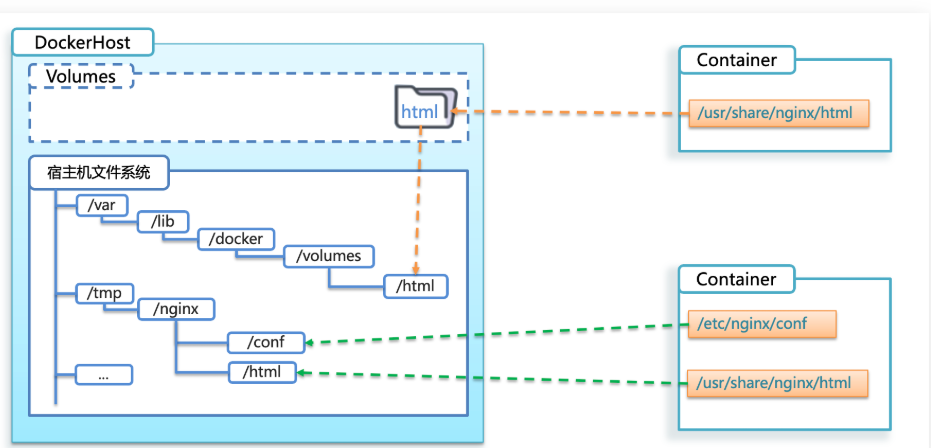

## 1：介绍

**数据卷（volume）** 是一个虚拟目录，指向 **宿主机文件系统中的某个目录**。


一旦完成 **数据卷挂载**，对容器的一切操作都会作用在数据卷对应的宿主机目录了。

这样，我们操作 **宿主机** 的 `/var/lib/docker/volumes/html`目录，就等于操作容器内的 `/usr/share/nginx/html`目录了

## 2：数据卷操作命令


数据卷操作的基本语法如下：

```sh
docker volume [COMMAND]
```

`docker volume`命令是数据卷操作，根据命令后跟随的 `command`来确定下一步的操作：

- `create` 创建一个volume
- `inspect` 显示一个或多个volume的信息
- `ls` 列出所有的volume
- `prune` 删除未使用的volume
- `rm` 删除一个或多个指定的volume

## 3：创建和查看数据卷

### 3.1 创建数据卷

```shell
docker volume create html
```

### 3.2 查看所有数据卷

```sh
docker volume ls
```

### 3.3 查看数据卷详细信息卷

```sh
docker volume inspect html
```


可以看到，我们创建的html这个数据卷关联的宿主机目录为`/var/lib/docker/volumes/html/_data`目录。

### 3.4 总结

数据卷的作用：

- 将容器与数据分离，解耦合，方便操作容器内数据，保证数据安全

数据卷操作：

- `docker volume create`：创建数据卷
- `docker volume ls`：查看所有数据卷
- `docker volume inspect`：查看数据卷详细信息，包括关联的宿主机目录位置
- `docker volume rm`：删除指定数据卷
- `docker volume prune`：删除所有未使用的数据卷

## 4：挂载数据卷

我们在创建容器时，可以通过 -v 参数来挂载一个数据卷到某个容器内目录，命令格式如下：

```sh
docker run \
  --name mn \
  -v html:/root/html \
  -p 8080:80
  nginx \
```

这里的-v就是 **挂载数据卷**的命令：

- `-v html:/root/htm` ：把 **html数据卷**挂载到 **容器内的/root/html**这个目录中


## 5：举例

### 5.1 nginx挂载数据卷

**需求**：创建一个 `nginx`容器，修改容器内的`html`目录内的`index.html`内容


**分析**：上个案例中，我们进入nginx容器内部，已经知道nginx的html目录所在位置`/usr/share/nginx/html` ，我们需要把这个目录挂载到 `html`这个数据卷上，方便操作其中的内容。

**提示**：运行容器时使用 -v 参数挂载数据卷

步骤：

- ① 创建容器并挂载数据卷到容器内的HTML目录

```sh
docker run --name mn -v html:/usr/share/nginx/html -p 80:80 -d nginx
```


② 进入html数据卷所在位置，并修改HTML内容

```sh
# 查看html数据卷的位置
docker volume inspect html
# 进入该目录
cd /var/lib/docker/volumes/html/_data
# 修改文件
vi index.html
```

### 5.2 mysql挂载数据卷

容器不仅仅可以挂载数据卷，也可以直接挂载到宿主机目录上。关联关系如下：

- 带数据卷模式：宿主机目录 --> 数据卷 ---> 容器内目录
- 直接挂载模式：宿主机目录 ---> 容器内目录



**语法**：

目录挂载与数据卷挂载的语法是类似的：

- -v [宿主机目录]:[容器内目录]
- -v [宿主机文件]:[容器内文件]


**需求**：创建并运行一个MySQL容器，将宿主机目录直接挂载到容器


> 实现思路如下：

- 1）在将本地 `mysql.tar`文件上传到 **虚拟机**，通过 `load`命令加载为镜像
- 2）创建目录 `/tmp/mysql/data`
- 3）创建目录 `/tmp/mysql/conf`，将资料提供的 `hmy.cnf`文件上传到 `/tmp/mysql/conf`
- 4）去DockerHub查阅资料，创建并运行MySQL容器，要求：
  - ① 挂载 `/tmp/mysql/data`到mysql容器内 **数据存储目录**
  - ② 挂载 `/tmp/mysql/conf/hmy.cnf`到mysql容器的 **配置文件**
  - ③ 设置MySQL密码

## 6：总结

`docker run`的命令中通过 `-v` 参数挂载文件或目录到容器中：

- `-v volume名称`:容器内目录
- `-v 宿主机文件`:容器内文
- `-v 宿主机目录`:容器内目录

> 数据卷挂载与目录直接挂载的

- 数据卷挂载耦合度低，由docker来管理目录，但是目录较深，不好找
- 目录挂载耦合度高，需要我们自己管理目录，不过目录容易寻找查看