## 1：文件相关命令

### 1：pwd   显示路径


### 2：ls   列出目录


### 3：cd  切换目录

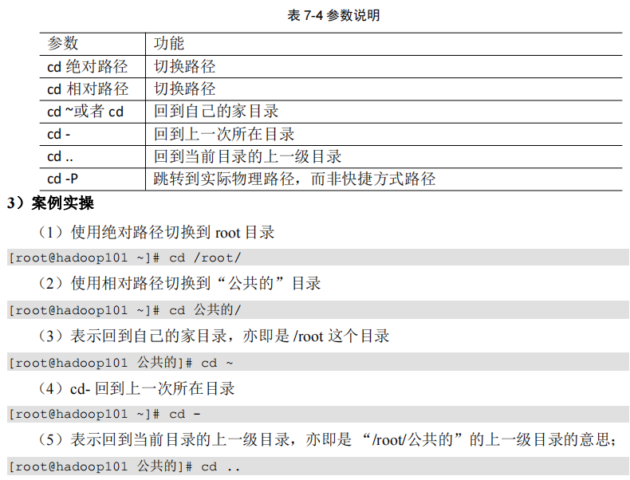

### 4：**mkdir ** 创建目录


### 5：**rmdir **   删除空目录


### 6：**touch** **创建空文件**


### 7：**cp** **复制文件或目录**

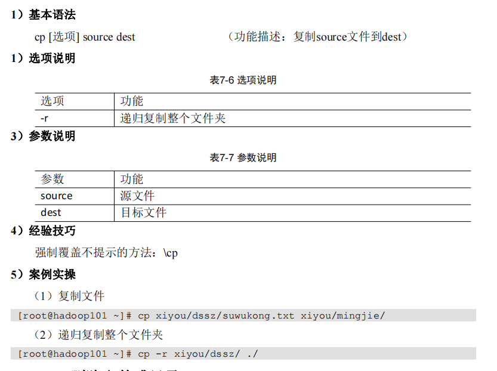

### 8：**rm** **删除文件或目录**


### 9：**mv** **移动文件与目录或重命名**


### 10：**cat** **查看文件内容**


### 11：**more** **文件内容分屏查看器**


### 12：**less** **分屏显示文件内容**

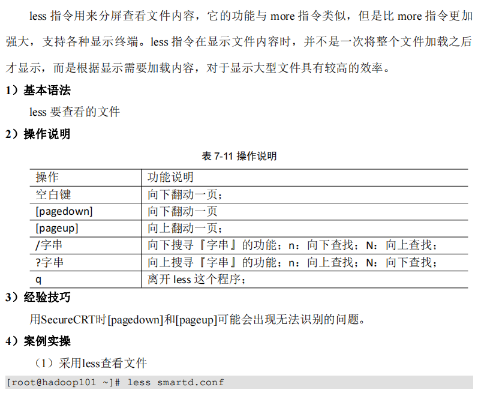

### 13：**echo**

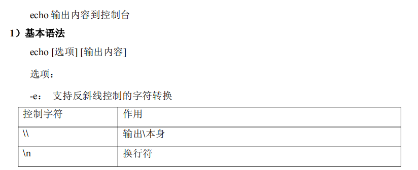


### **14： head** **显示文件头部内容**


### **15： tail** **输出文件尾部内容**


### 16：**>** **输出重定向和** **>>** **追加**


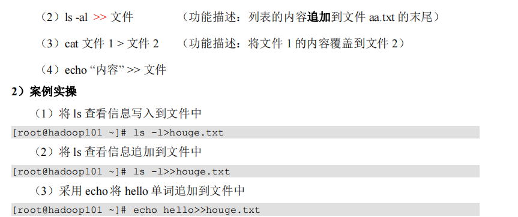

### **17： ln** **软链接**


### **18：history** **查看已经执行过历史命令**


## 2：vim相关命令


### 1：一般模式


### 2：编辑模式

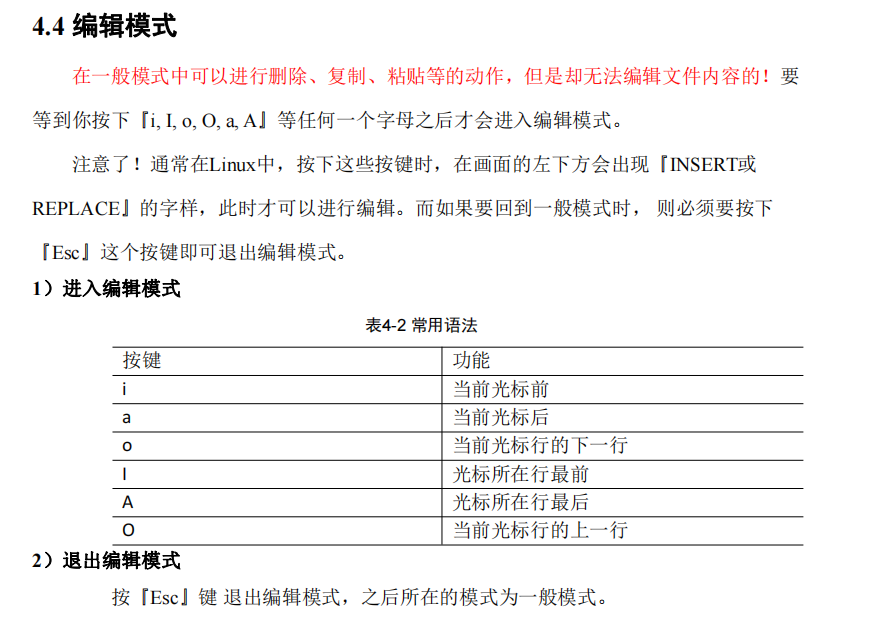

### 3：指令模式 


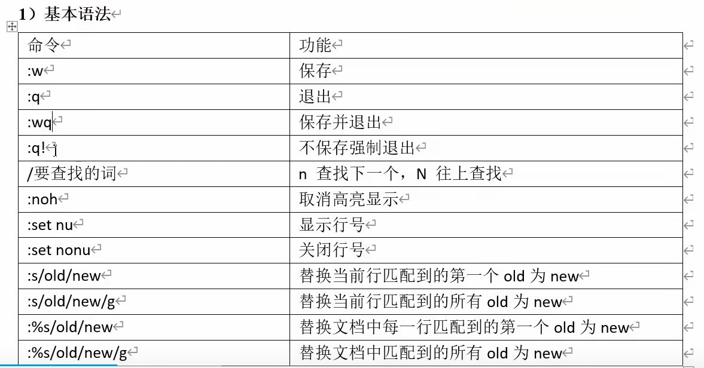

### 4：vim键盘图


## 3： **时间日期类**


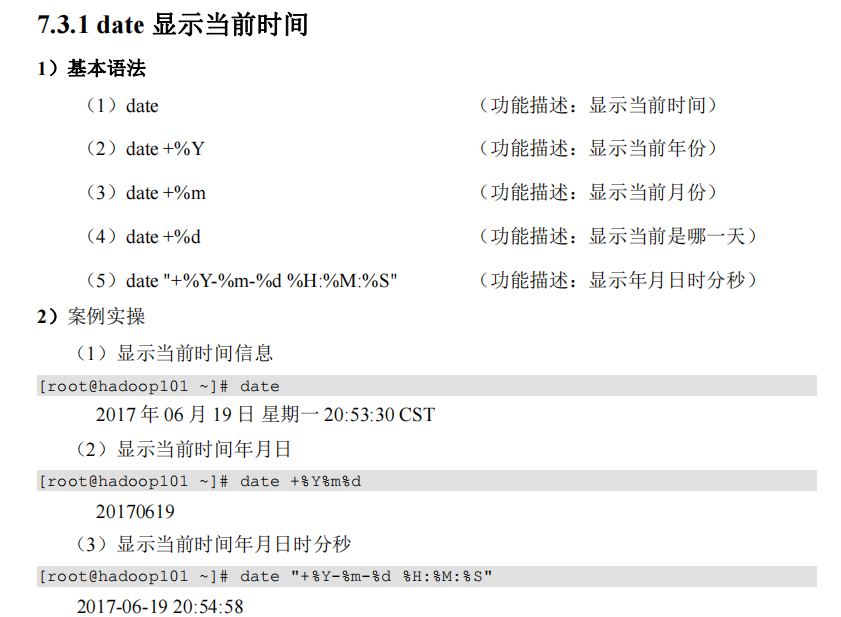


## 4：**用户管理命令**

### 1：**useradd** **添加新用户**

```linux
useradd + 新用户名称   			（功能描述，添加新用户）
useradd -g 组名  新用户名称       （功能描述，添加新用户到某个组）
```


### 2：**passwd** **设置用户密码**

```linux
passwd 用户名 （功能描述：设置用户密码）
```


### **3： id** **查看用户是否存在**

```linux
id   +  用户名
```

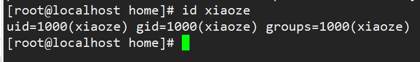

### **4 ：cat /etc/passwd** **查看创建了哪些用户**

```linux
cat /etc/passwd
```


### **5： su** **切换用户**

```linux
su + 用户名
```


### **6： userdel** **删除用户**

```linux
（1）userdel 用户名    		（功能描述：删除用户但保存用户主目录）
（2）userdel -r 用户名 		（功能描述：用户和用户主目录，都删除）
```


### **7 ：who** **查看登录用户信息**

```linux
（1）whoami    		（功能描述：显示自身用户名称）
（2）who am i  		（功能描述：显示登录用户的用户名以及登陆时间）
```

### **8： sudo** **设置普通用户具有** **root** **权限**

修改配置文件

```linux
vim /etc/sudoers
```

添加光标信息。给 xiaoze 用户赋予root权限


查看结果。

```linux
sudo xiaoze
```

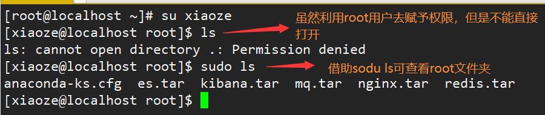

### **9： usermod** **修改用户**

```linux
usermod -g 用户组 用户名
```


## **5**： **用户组管理命令**

每个用户都有一个用户组，系统可以对一个用户组中的所有用户进行集中管理。不同 Linux 系统对用户组的规定有所不同， 

如Linux下的用户属于与它同名的用户组，这个用户组在创建用户时同时创建。 

用户组的管理涉及用户组的添加、删除和修改。组的增加、删除和修改实际上就是对    /etc/group   文件的更新。

### 1： groupadd**新增组**

```linux
groupadd 组名
```

### **2： groupdel** **删除组**

```linux
groupdel 组名
```

### **3：groupmod** **修改组**

```linux
groupmod -n 新组名 老组名
```


### **4：cat /etc/group** **查看创建了哪些组**

```linux
cat /etc/group
```

## **6** ：**文件权限类**

### **1** ：**文件属性**

​		Linux系统是一种典型的多用户系统，不同的用户处于不同的地位，拥有不同的权限。 为了保护系统的安全性，Linux系统对不同的用户访问同一文件（包括目录文件）的权限做 了不同的规定。在Linux中我们可以使用ll或者ls -l命令来显示一个文件的属性以及文件所属 的用户和组。


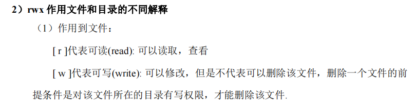


### **2：chmod** **改变权限**


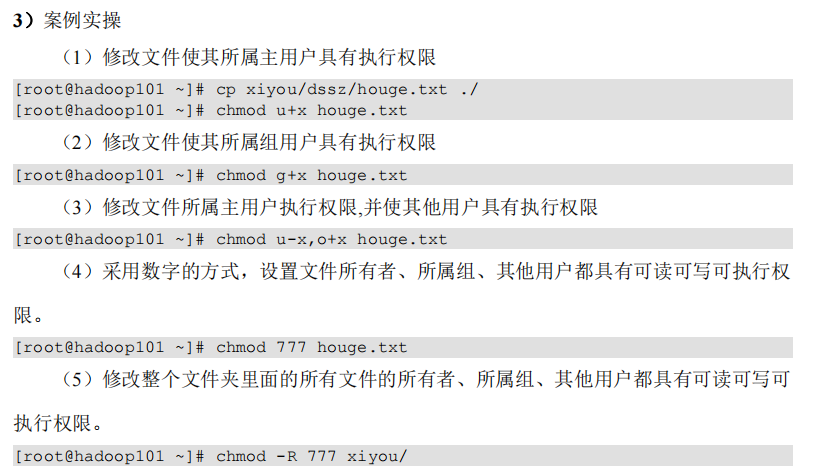

### **3：chown** **改变所有者**


### **4：chgrp** **改变所属组**


## **7**： **搜索查找类**

### **1 find** **查找文件或者目录**

find 指令将从指定目录向下递归地遍历其各个子目录，将满足条件的文件显示在终端。


### **2 locate** **快速定位文件路径**

locate 指令利用事先建立的系统中所有文件名称及路径的 locate 数据库实现快速定位给 定的文件。Locate 指令无需遍历整个文件系统，查询速度较快。为了保证查询结果的准确 度，管理员必须定期更新 locate 时刻。

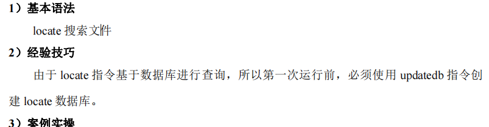

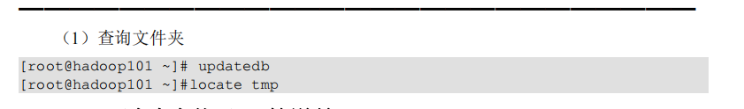

### **3 grep** 过滤查找及管道符

管道符，“|”，表示将前一个命令的处理结果输出传递给后面的命令处理


## **8**： **压缩和解压类**

### **1 gzip/gunzip** **压缩**

```linux
gzip 文件        		（功能描述：压缩文件，只能将文件压缩为*.gz 文件） 
gunzip 文件.gz   		（功能描述：解压缩文件命令）
```


### **2 zip/unzip** **压缩**

```linux
zip [选项] XXX.zip 将要压缩的内容 	    （功能描述：压缩文件和目录的命令）
unzip [选项] XXX.zip 					（功能描述：解压缩文件）
```


### **3 tar** **打包**

```linux
tar [选项] XXX.tar.gz 将要打包进去的内容 （功能描述：打包目录，压缩后的 文件格式.tar.gz）
```


## **9**： **磁盘查看和分区类**

### **1 du** **查看文件和目录占用的磁盘空间**

```linux
du 目录/文件 （功能描述：显示目录下每个子目录的磁盘使用情况）
```


### **2 df** **查看磁盘空间使用情况**

```linux
df 选项 （功能描述：列出文件系统的整体磁盘使用量，检查文件系统的磁盘空间占 用情况）
```


### **3 lsblk** **查看设备挂载情况**

```linux
lsblk （功能描述：查看设备挂载情况）
```


### **4 fdisk** **分区**

```linux
fdisk -l        		（功能描述：查看磁盘分区详情） 
fdisk 硬盘设备名 		（功能描述：对新增硬盘进行分区操作）
```


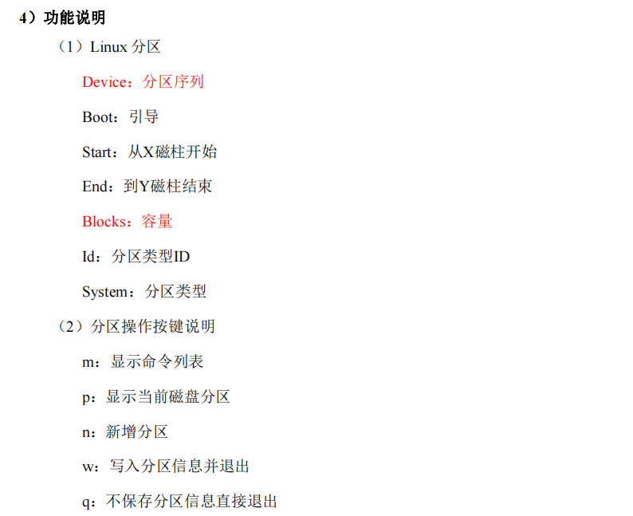


## **10**： **进程管理类**

进程是正在执行的一个程序或命令，每一个进程都是一个运行的实体，都有自己的地 址空间，并占用一定的系统资源。

### **1 ps** **查看当前系统进程状态**

ps:process status 进程状态

```linux
ps aux | grep xxx 		（功能描述：查看系统中所有进程）
ps -ef | grep xxx 		（功能描述：可以查看子父进程之间的关系）
```


（1）ps aux 显示信息说明

- USER：该进程是由哪个用户产生的 

- PID：进程的 ID 号 

- %CPU：该进程占用 CPU 资源的百分比，占用越高，进程越耗费资源； 
- %MEM：该进程占用物理内存的百分比，占用越高，进程越耗费资源； 
- VSZ：该进程占用虚拟内存的大小，单位 KB； 
- RSS：该进程占用实际物理内存的大小，单位 KB； 
- TTY：该进程是在哪个终端中运行的。对于 CentOS 来说，tty1 是图形化终端， 
- tty2-tty6 是本地的字符界面终端。pts/0-255 代表虚拟终端。 
- STAT：进程状态。常见的状态有：R：运行状态、S：睡眠状态、T：暂停状态、 Z：僵尸状态、s：包含子进程、l：多线程、+：前台显示 
- START：该进程的启动时间
- TIME：该进程占用 CPU 的运算时间，注意不是系统时间 
- COMMAND：产生此进程的命令名

（2）ps -ef 显示信息说明

- UID：用户 ID 
- PID：进程 ID 
- PPID：父进程 ID 
- C：CPU 用于计算执行优先级的因子。数值越大，表明进程是 CPU 密集型运算， 
- 执行优先级会降低；数值越小，表明进程是 I/O 密集型运算，执行优先级会提高 
- STIME：进程启动的时间 
- TTY：完整的终端名称 
- TIME：CPU 时间 
- CMD：启动进程所用的命令和参数

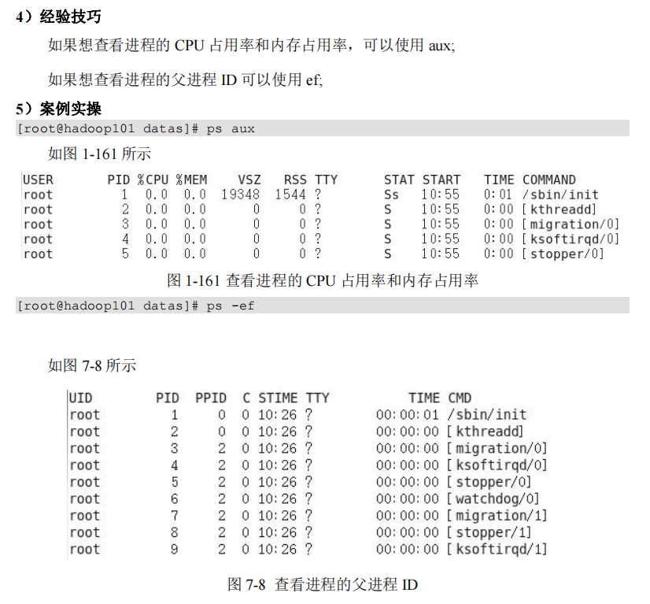

### **2 kill** **终止进程**

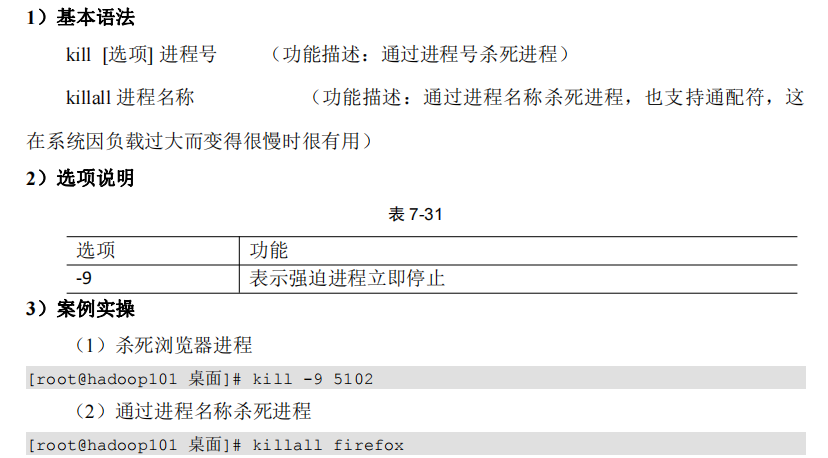

### **3 pstree** **查看进程树**


### **4 top** **实时监控系统进程状态**


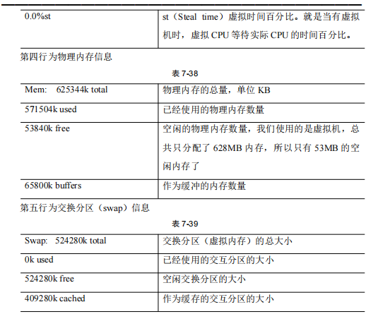


### **5 netstat** **显示网络状态和端口占用信息**

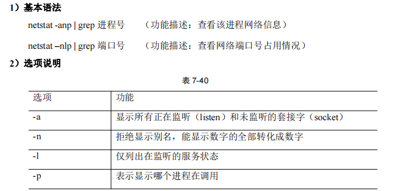

## **11： crontab** **系统定时任务**

### **1 crontab** **服务管理**

重新启动 crond 服务

```linux
systemctl restart crond
```

### **2 crontab** **定时任务设置**

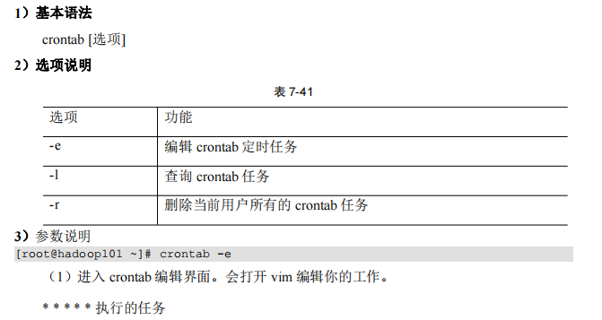


（1）每隔 1 分钟，向/root/bailongma.txt 文件中添加一个 11 的数字

```linux
*/1 * * * * /bin/echo ”11” >> /root/bailongma.txt
```

