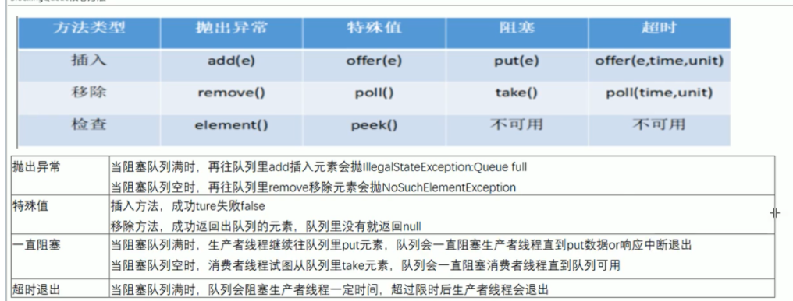
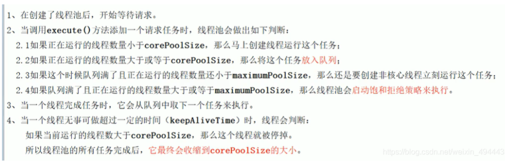
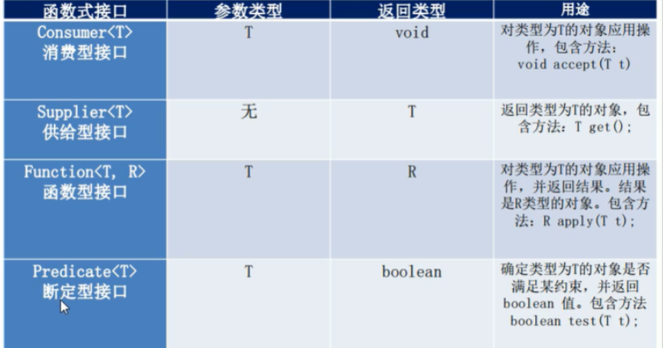

## 一：juc概述。

- juc就是 **java.util.concurrent**包的首字母

- 下面又分 并发包、 atomic 和 locks 包

- 也就是所谓的并发工具类

- 进程： 是程序的一次执行，拥有独立资源的单位

- 线程：轻量级进程，共享进程中的内存资源 ，程序调度和分配的基本单位， 更好的使程序并发的执行

- 并发： 是在程序在宏观上是并行， 实则是交替的执行

- 并行： 两个程序一起执行，同步执行。

- 在高内聚低耦合的前端下： 多线程编程的企业级套路 + 模板：

  - 线程 操作（对外暴露的调用方法） 资源类

  - 多线程操作共享资源

  - 先写共享资源类

  - 在写对共享资源的操作

  - 实现Runnable接口的匿名实现


## 二：卖票。

### 1：*过去javase的写法*

```java
//过去javase的写法
class Ticket{//资源类
    //票
    private int number = 30;

    public synchronized void saleTicket(){
        if (number > 0){
            System.out.println(Thread.currentThread().getName()+"\t卖出第："+(number--)+"\t还剩下："+number);
        }
    }
}
public class SellTicket {
    public static void main(String[] args) {

        Ticket ticket = new Ticket();

        //设置三个线程窗口，'A'  'B'  'C'，来取票。
        new Thread(new Runnable() {
            @Override
            public void run() {
                for (int i = 0; i < 40; i++) {
                    ticket.saleTicket();
                }
            }
        },"A").start();

        new Thread(new Runnable() {
            @Override
            public void run() {
                for (int i = 0; i < 40; i++) {
                    ticket.saleTicket();
                }
            }
        },"B").start();

        new Thread(new Runnable() {
            @Override
            public void run() {
                for (int i = 0; i < 40; i++) {
                    ticket.saleTicket();
                }
            }
        },"C").start();
    }
}

```

### 2：Lock得使用

```java
//利用lock写法 lock相较于synchronized较为灵活， 而且锁的范围更少， 有点类似于操作系统的信号量,使锁更粒子化。
class Ticket1{//资源类
    //票
    private int number = 30;
    private Lock lock = new ReentrantLock();
    public  void saleTicket(){
        //手动设置锁
        lock.lock();
        try {
            if (number > 0){
                System.out.println(Thread.currentThread().getName()+"\t卖出第："+(number--)+"\t还剩下："+number);
            }
        } catch (Exception e) {
            e.printStackTrace();
        } finally {
            //手动释放锁
            lock.unlock();
        }
    }
}
public class SellTicketForLock {
    public static void main(String[] args) {

        Ticket1 ticket = new Ticket1();

        //设置三个线程窗口，'A'  'B'  'C'，来取票。
        new Thread(new Runnable() {
            @Override
            public void run() {
                for (int i = 0; i < 40; i++) {
                    ticket.saleTicket();
                }
            }
        },"A").start();

        new Thread(new Runnable() {
            @Override
            public void run() {
                for (int i = 0; i < 40; i++) {
                    ticket.saleTicket();
                }
            }
        },"B").start();

        new Thread(new Runnable() {
            @Override
            public void run() {
                for (int i = 0; i < 40; i++) {
                    ticket.saleTicket();
                }
            }
        },"C").start();
    }

}
```

### 3：[Lambda](https://so.csdn.net/so/search?q=Lambda&spm=1001.2101.3001.7020)表达式

- 对于一个接口来说如果只一个没有实现的方法可以直接用lambda表达式替换 （为什么说没有实现， 因为jdk8 接口中可以写默认实现， 以及静态方法）

- 对于声明式函数接口 的注解@FunctionalInterface

- 原则 拷贝中括号， 写死右箭头， 落地大括号

- ```java
  //什么意思呢
  interface Foo{
        int div ();
  }
  //我们就可以这么做
  Foo f = () -> {写实现;  return 值;};
  f.div();即可
  // 对于有返回值有参数的
   interface Foo{
        int div (int a, int b);
  }
  Foo f = (a, b) -> {写实现； return 值};
  f.div(1, 2);就可以
  
  ```

```java
class Ticket1{//资源类
    //票
    private int number = 30;
    private Lock lock = new ReentrantLock();
    public  void saleTicket(){
        //手动设置锁
        lock.lock();
        try {
            if (number > 0){
                System.out.println(Thread.currentThread().getName()+"\t卖出第："+(number--)+"\t还剩下："+number);
            }
        } catch (Exception e) {
            e.printStackTrace();
        } finally {
            //手动释放锁
            lock.unlock();
        }
    }
}
public class SellTicketForLock {
    public static void main(String[] args) {

        Ticket1 ticket = new Ticket1();

        //设置三个线程窗口，'A'  'B'  'C'，来取票。
        new Thread(() ->{ for (int i = 0; i < 40; i++)  ticket.saleTicket(); },"A").start();

        new Thread(() ->{ for (int i = 0; i < 40; i++) ticket.saleTicket(); },"B").start();

        new Thread(() ->{ for (int i = 0; i < 40; i++)  ticket.saleTicket(); },"C").start();
    }
```

## 三：线程间的通信

- 一个进程内， 线程间的协调和调度， 操作共享资源。
- 不同进程间的通信得利用操作系统中讲的进程通信。

```java
import java.util.concurrent.locks.Lock;
import java.util.concurrent.locks.ReentrantLock;

/**
 * @author xiaofei
 * @create 2021-07-28 9:53
 */
/*
 * 题目： 现在两个线程， 可以操作初始值位零的一个变量，
 * 实现一个进程对变量加一， 一个线程对改变量减一
 * 实现交替， 来10轮， 变量初始值为零
 *
 *
 * 1、高内聚低耦合， 线程操作资源类
 * 2、判断/干活/通知
 * 3、多线程交互中， 必须要防止多线程的续集唤醒， 也即 （判断使用while不
 * 能用if）
 * 4、标志位
 * 唤醒的时候还必须在判断
 * */

class AirConditioner {
    private int num = 0;
    private Lock lock = new ReentrantLock();

    public synchronized void add() throws InterruptedException {
          //这种情况会出错的原因是线程被唤醒的时侯就不需要在拍段一次条件了故在面对超过两个线程的时候就出现错误
//        if (num != 0) this.wait();
//        num ++;
//        System.out.println(Thread.currentThread().getName() + " " + num);
//
//        this.notifyAll();
        //第一种解决办法
        while (num != 0) this.wait();
        num ++;
        System.out.println(Thread.currentThread().getName() + " " + num);

        this.notifyAll();

        //第二种解决办法 说到底都是 让其唤醒的时候在经历一次判断 另外这样写可能打出来的结果可能不是40行
        // 因为被唤醒之后就不是去去执行本次的操作而是直接本次操作结束 执行 i++ 了
//        if (num == 0) {
//            num ++;
//            System.out.println(Thread.currentThread().getName() + " " + num);
//            this.notifyAll();
//        }else
//            this.wait();
    }

    public synchronized void sub() throws InterruptedException {

        while (num == 0) this.wait();
        num --;
        System.out.println(Thread.currentThread().getName() + " " + num);
        this.notifyAll();

//        if (num == 1) {
//            num --;
//            System.out.println(Thread.currentThread().getName() + " " + num);
//            this.notifyAll();
//        }else
//            this.wait();
    }
}
public class ThreadWaitNotifyDemo {
    public static void main(String[] args) throws Exception{
        AirConditioner airConditioner = new AirConditioner();
        new Thread(() -> {
            try {
//                for (int i = 0; i < 10; i ++) airConditioner.sub();
                while (true) airConditioner.sub();
            } catch (InterruptedException e) {
                e.printStackTrace();
            }
        }, "B").start();
        new Thread(() -> {
            try {
//                for (int i = 0; i < 10; i ++) airConditioner.add();
                while (true) airConditioner.sub();
            } catch (InterruptedException e) {
                e.printStackTrace();
            }
        }, "A").start();

        new Thread(() -> {
            try {
//                for (int i = 0; i < 10; i ++) airConditioner.add();
                while (true) airConditioner.add();
            } catch (InterruptedException e) {
                e.printStackTrace();
            }
        }, "c").start();
        new Thread(() -> {
            try {
//                for (int i = 0; i < 10; i ++) airConditioner.sub();
                while (true) airConditioner.add();
            } catch (InterruptedException e) {
                e.printStackTrace();
            }
        }, "d").start();

    }
}

```

- 新版的生产者消费者

```java
class AirConditioner {
    private int num = 0;
    private Lock lock = new ReentrantLock();
    Condition condition = lock.newCondition();

    public  void add() throws InterruptedException {
        lock.lock();
        try {
            while (num != 0) condition.await();
            num ++;
            System.out.println(Thread.currentThread().getName() + " " + num);
            condition.signalAll();
        } catch (InterruptedException e) {
            e.printStackTrace();
        } finally {
            lock.unlock();
        }

    }

    public void sub() throws InterruptedException {

        lock.lock();
        try {
            while (num == 0) condition.await();
            num --;
            System.out.println(Thread.currentThread().getName() + " " + num);
            condition.signalAll();
        } catch (InterruptedException e) {
            e.printStackTrace();
        } finally {
            lock.unlock();
        }
    }
}

```

一道经典的线程按顺序打印

```java
/*
* 多线程之间按顺序调用， 实现A -> B -> C
* 三个线程启动， 要求如下：
* A 打印5次 B 打印10次， CC打印15次
* 接着
* AA打印5次， BB打印10次， CC打印15次
* 来10轮
*  下订单 -> 减库存 -> 调支付
*
* synchronized 它最大的缺点就是不能精确唤醒某个线程
* lock  它灵活可以多个锁精确唤醒
* 可以让某个锁放开当前线程
* 非常像操作系统的信号量的传参， 当前参数被那个锁给await了那么就只能用这把锁把他唤醒，
* 跟线程同步有关操作系统
* */

class Print{

    private int num = 1;  // 1：A 2：B 3 C
    private Lock lock = new ReentrantLock();
    Condition A = lock.newCondition();    //用来锁A的
    Condition B = lock.newCondition();    // 用来锁B的
    Condition C = lock.newCondition();    //用来锁C的

    public void print(int sign){
        if (sign == 1){
            lock.lock();
            try {
                while (num != 1){
                    A.await();
                }
                for (int i = 0; i < 5; i ++){
                    System.out.println(Thread.currentThread().getName() + " " + i);
                }
                num ++;
                B.signal();
            } catch (InterruptedException e) {
                e.printStackTrace();
            } finally {
                lock.unlock();
            }
        }else if (sign == 2){
            lock.lock();
            try {
                while (num != 2){
                    B.await();
                }
                for (int i = 0; i < 10; i ++){
                    System.out.println(Thread.currentThread().getName() + " " + i);
                }
                num ++;
                C.signal();
            } catch (InterruptedException e) {
                e.printStackTrace();
            } finally {
                lock.unlock();
            }
        }else {
            lock.lock();
            try {
                while (num != 3){
                    C.await();
                }
                for (int i = 0; i < 15; i ++){
                    System.out.println(Thread.currentThread().getName() + " " + i);
                }
                num = (num + 1) % 3;
                A.signal();
            } catch (InterruptedException e) {
                e.printStackTrace();
            } finally {
                lock.unlock();
            }
        }
    }
}
public class ThreadOrderAccess {

    public static void main(String[] args) {
        Print print = new Print();
        new Thread(
                () -> {
                    for (int i = 0; i < 10; i ++) print.print(1);
                }, "A"
        ).start();
        new Thread(
                () -> {
                    for (int i = 0; i < 10; i ++) print.print(2);
                }, "B"
        ).start();new Thread(
                () -> {
                    for (int i = 0; i < 10; i ++) print.print(3);
                }, "C"
        ).start();

    }
}


```

## 四：多线程得8锁

```java
  /*
*
* 题目：多线程8锁
* 1、两个普通的同步方法 先打印邮件还是sms ：邮件
* 2、邮件方法暂停3秒钟， 请问先打印那个： 邮件
* 3、邮件方法暂停3秒钟 新增一个普通方法hello()和发邮件, 先打印邮件还是hello : hello
* 4、两部手机一个发邮件一个发短信   发短信
* 5、两个静态同步方法、同一部手机先打印那个 邮件
* 6、两个静态同步方法  两部手机 ： 邮件
* 7、一个静态同步方法， 一个普通同步方法  同一部手机 ： SMS
* 8、一个静态同步方法， 一个普通同步方法  2部手机 ： SMS
*
* 想两个拿同一个手机 一个想打电话一个想发消息， 同一时间是不是只能有一个人拿到这部手机
* 笔记：
*   一个对象里面如果有多个synchronized. 某个时刻内， 只要有一个线程去调用其中的一个synchronized方法
*   其他线程都只能等待， 换句话说， 某个时刻内， 只能有一个对象去访问同一个资源类中的synchronized方法
*   锁的是当前对象this, 被锁定后， 其他线程都不能进入到当前对象的其他的synchronized方法
*   加个普通方法后和同步锁无关
*   换成两个对象之后， 不是同一把锁了， 故无关
*   都换成静态同步方法的时候 对于静态方法的锁是 本类.class
*
*   静态同步方法于非静态同步方法之间是不会有竞态条件的
*   但是一旦一个静态同步方法获取锁后， 其他的静态方法都必须等待该方法释放锁后才能获取锁
*   总之 对于锁相同的时候同时只能有一个线程访问
*
* */

class Phone{
    public static synchronized void sendEmail() throws InterruptedException {
        Thread.sleep(3000);
        System.out.println("sendEmail");
    }
    public  synchronized void sendSmS(){
        System.out.println("sendSMS");
    }

    public void hello(){
        System.out.println("hello");
    }

}
public class Lock8 {

    public static void main(String[] args) {
        Phone phone1 = new Phone();
        Phone phone2 = new Phone();
        new Thread(() -> {
            try {
                phone1.sendEmail();
            } catch (InterruptedException e) {
                e.printStackTrace();
            }
        }, "A").start();

        new Thread(() -> {
            phone2.sendSmS();
        }, "B").start();

        new Thread(() -> {
            phone1.hello();
        }, "C").start();
    }
}


```

## 五：集合线程不安全

```java
/*
* 笔记：
*   写时复制
*   CopyOnWrite 容器即写时复制的容器， 往一个容器添加元素的时候， 不直接往当前容器的object[]添加元素， 而是先将当前容器Object[]
*   进行复制出一个新的容器object[] newElements， 让后新的容器object[] newElements里添加元素， 添加元素之后，
*   在将原容器的引用指向心的容器 setArray(newElements) 这样做的好处时可以对CopyOnWrite容器进行并发的读，
*   而不需要加锁， 因为当前容器不会添加任何元素， 所以CopyOnWrite容器也是一种读写分离的思想， 读和写不同的容器
*    public boolean add(E e) {
*        final ReentrantLock lock = this.lock;
*       lock.lock();
*        try {
*            Object[] elements = getArray();
*            int len = elements.length;
*            Object[] newElements = Arrays.copyOf(elements, len + 1);
*            newElements[len] = e;
*            setArray(newElements);
*            return true;
*        } finally {
*            lock.unlock();
*        }
*    }
*    HashSet底层就是hashmap add方法add一个值就是hashmap的key, value是写死的Object
*    hashMap 底层是一个Node类型的数组加链表+红黑树， 他是使用的拉链发实现的hash表， 数组长度起始为16 负载因子0.75
*    链表超过8就是变成红黑树。
*
* 题目： 请举例说明集合类是不安全的
* ArrayList hashSet hashmap 是线程不安全的
* vector 是线程安全的  only-one 不在乎性能只在乎 线程安全不安全
* 1、故障现象
* 会出现java.utils.concurrentModificationException
*
* 2、导致原因
*    并发修改异常
* 3、解决方案
*   1、 vector
*   2、 Collections.synchronizedList
*   3、 CopyOnWriteArrayList  多线程用这个
*       写的时候复制一份， 让读跟写分离
*     Object[] newElements = Arrays.copyOf(elements, len + 1);
*     newElements[len] = e;
*     setArray(newElements);
*   4、CurrentHashMap -> hashMap
*   5、LinkedList -> ConcurrentLinkedQueue
*   6、hashSet 他的底层就是HashMap所以
*
* 4、优化建议 （同样的错误， 不出现第二次）
*
* */
public class NotSafeDemo {

    public static void main(String[] args) {

        setNoteSafe();

    }

    public static void MapNotSafe(){
//        Map<String, String> map = new HashMap<>();
        Map<String, String> map = new ConcurrentHashMap<>();

    }

    public static void setNoteSafe (){
//        Set<String> set = new HashSet<>();
        Set<String> set = new CopyOnWriteArraySet<>();
        for (int i = 1; i <= 30; i++) {
            new Thread(() ->
            {
                set.add(UUID.randomUUID().toString().substring(0, 8));
                System.out.println(set);
            }, String.valueOf(i)).start();
        }

    }

    public static void listNotSafe (){
//          List list = new ArrayList();
//        List<Object> list = new Vector<>();
//        List<Object> list = Collections.synchronizedList(new ArrayList<Object>());
        List<Object> list = new CopyOnWriteArrayList<>();   //写时复制技术
        for (int i = 1; i <= 30; i++) {
            new Thread(() ->
            {
                list.add(UUID.randomUUID().toString().substring(0, 8));
                System.out.println(list);
            }, String.valueOf(i)).start();
        }
    }

}

```

## 六：实现多线程方式

要想使用  **Callable** 接口来创建线程，首先在Thread（）类构造器中，并没有  可以实现 **Callable** 的构造器，所以需要找到一个可以实现**Callable** ，又可以实现 **Runnable** ，他就是  **FutureTask()**

```java

class MyThread1 implements Runnable{
    @Override
    public void run() {

    }
}

class MyThread2 implements Callable<Integer> {
    @Override
    public Integer call() throws Exception {

        System.out.println("aaaaa");
        Thread.sleep(1000);
        return 1024;
    }
}
public class CallableDemo {
    public static void main(String[] args) {

        // 一个futureTask不管多少个线程调都只会被调用一次
        FutureTask futureTask = new FutureTask(new MyThread2());
        try {
            //以下两个线程只会出现一次调用
            new Thread(futureTask,"A").start();
            new Thread(futureTask,"B").start();
            Object o = futureTask.get();   //尽量放在后面在取， 否者会导致程序堵塞
            System.out.println(o);
        } catch (InterruptedException e) {
            e.printStackTrace();
        } catch (ExecutionException e) {
            e.printStackTrace();
        }
    }
}
```

## 七：CountDownLatch

```java
 *
 *  CountDownLatch 主要有两个方法， 当一个或多个线程调用await方法， 这些线程回阻塞
 *  其他线程调用countDown方法会将计数器减一，  调用countDown方法的线程不会阻塞
 *  当计数器变为0的时候， 被await的方法才会唤醒继续执行
 *
 */
public class CountDownLatchDemo {

    // 正确做法 实际上我感觉我还没看源码呢，  这个类似于操作系统的P，V操作实现线程同步
    public static void main(String[] args) throws InterruptedException {

        CountDownLatch countDownLatch = new CountDownLatch(6);
        for (int i = 1; i <= 6; i++) {

            new Thread(() ->{
                System.out.println(Thread.currentThread().getName() + "同学离开");
                countDownLatch.countDown();
            }, String.valueOf(i)).start();

        }
        //这个证明唤醒所有
        new Thread(() ->{
            try {
                countDownLatch.await();
            } catch (InterruptedException e) {
                e.printStackTrace();
            }
            System.out.println(Thread.currentThread().getName() + "同学离开");

        }, "test").start();
        countDownLatch.await();
        System.out.println(Thread.currentThread().getName() + "班长走了");

    }

    // 要实现班长要比其他同学先走
    //结果
    /*
    * 1同学离开
        main班长走了
        3同学离开
        2同学离开
        6同学离开
        5同学离开
        4同学离开
    * */
    void errorOptions(){
        for (int i = 1; i <= 6; i++) {

            new Thread(() ->{
                System.out.println(Thread.currentThread().getName() + "同学离开");
            }, String.valueOf(i)).start();
        }

        System.out.println(Thread.currentThread().getName() + "班长走了");
    }
}

```

## 八：CyclicBarrier

```java
/*
*
* CyclicBarrier
*
* 刚好够多少个数量才能进行下去，  人够了才能开会
* */
public class CyclicBarrierDemo {

    //结果  做加法 达到多少个线程才会执行
    /*
    * 第1个龙珠
        第3个龙珠
        第5个龙珠
        第6个龙珠
        第4个龙珠
        第2个龙珠
        召唤神龙
    * */
    public static void main(String[] args) {

        //CyclicBarrier(int parties, Runnable barrierAction)
        CyclicBarrier cyclicBarrier = new CyclicBarrier(6, () ->{
            System.out.println("召唤神龙");
        });

        for (int i = 1; i <= 6; i++) {
            final int t = i;
            new Thread(() -> {
                System.out.println("第" + t + "个龙珠");
                try {
                    cyclicBarrier.await();
                } catch (InterruptedException e) {
                    e.printStackTrace();
                } catch (BrokenBarrierException e) {
                    e.printStackTrace();
                }
                System.out.println(cyclicBarrier.getParties());

            }, String.valueOf(i)).start();
        }


    }
}


```

## 九：读写锁

```java
/*
*
* 多个线程同时读一个资源类没有任何问题， 所以为了满足并发量， 读取共享资源应该可以同时进行
*  但是
*   如果有一个线程想去写共享资源， 就不能应该再有其他线程可以对该资源进行读写
*   小结
*      读读 能共存
*      读写 不能共存
*      写写 不能共存
*
* 加读写锁的时候，  写入的时候不能背加塞， 一次性成功完成 ， 也完成了数据的完成性
* */

class MyCache{
    private volatile Map<String, Object> map = new HashMap<>();
    private ReadWriteLock readWriteLock = new ReentrantReadWriteLock();

    public void put (String key, Object value){

        readWriteLock.writeLock().lock();
        try {
            System.out.println(Thread.currentThread().getName() + "开始写入");
            try {
                TimeUnit.MILLISECONDS.sleep(300);
            } catch (InterruptedException e) {
                e.printStackTrace();
            }
            map.put(key, value);
            System.out.println(Thread.currentThread().getName() + "写成功" + key);
        } finally {
            readWriteLock.writeLock().unlock();

        }

    }

    public Object read (String key){
        readWriteLock.readLock().lock();
        Object o;
        try {
            System.out.println(Thread.currentThread().getName() + "开始读");
            try {
                TimeUnit.MILLISECONDS.sleep(300);
            } catch (InterruptedException e) {
                e.printStackTrace();
            }
            o = map.get(key);
            System.out.println(Thread.currentThread().getName() + "读成功"  + o);
        } finally {

            readWriteLock.readLock().unlock();
        }
        return o;
    }
}
public class ReadWriteLockDemo {

    public static void main(String[] args) {
        MyCache myCache = new MyCache();
        for (int i = 1; i <= 6; i++) {
            final int t = i;
            new Thread(() -> {
                myCache.put(t + "", t);
            }, String.valueOf(i)).start();
        }

        for (int i = 1; i <= 6; i++) {
            final int t = i;
            new Thread(() -> {
                myCache.read(t + "");
            }, String.valueOf(i)).start();
        }
    }
}

```

## 十：阻塞队列


- 当队列是空的， 从队列中获取元素的操作将会被阻塞
- 当队列是满的， 从队列中添加元素的操作将会被阻塞。
- 试图从空的队列中获取元素的线程将会被阻塞， 直到其他线程往空的队列出入新的元素
- 试图向满的队列中添加新元素的线程将会被阻塞， 直到其他线程从队列中移除一个或者多个元素或者完全被清空， 使队列变得空闲起来并后续新增。
- 在多线程领域： 所谓阻塞， 在某些情况下会被挂起线程， 一旦条件满足， 挂起的线程又会自动被唤醒

**为什么需要blockingQueue**

好处是我们不需要关心什么时候需要阻塞线程， 什么时候需要唤醒线程， 因为这一切BlockingQueue都给你一手包办了

在concurent包发布以前， 在多线程环境下， 我们每个程序员都必须取自己控制这些细节， 尤其还有兼顾效率和线程安全， 而这会给我们的程序带来不小的复杂度。




```java

* 阻塞队列
*  1、数据结构 栈和队列
*
*  2、阻塞队列
*     2、1 阻塞 必须要阻塞/不得不阻塞
*
*
* */

public class BlockingQueueDemo {

    public static void main(String[] args) throws InterruptedException {

        BlockingQueue<String> blockingQueue = new ArrayBlockingQueue<>(3);

//        //true
//        System.out.println(blockingQueue.add("a"));
//        System.out.println(blockingQueue.add("b"));
//        System.out.println(blockingQueue.add("c"));
//        //再加就抛异常， 队列已满
        System.out.println(blockingQueue.add("d"));
        //得到队首
//        System.out.println(blockingQueue.element());
//
//        // 结果 a b c
//        System.out.println(blockingQueue.remove());
//        System.out.println(blockingQueue.remove());
//        System.out.println(blockingQueue.remove());
//        //空 抛出异常
//      //  System.out.println(blockingQueue.remove());
          // 队不满返回true
//        System.out.println(blockingQueue.offer("a"));
//        System.out.println(blockingQueue.offer("b"));
//        System.out.println(blockingQueue.offer("c"));
//        // 队满返回false
//        System.out.println(blockingQueue.offer("x"));
//
//        System.out.println(blockingQueue.poll());
//        System.out.println(blockingQueue.poll());
//        System.out.println(blockingQueue.poll());
//        //队空 返回空
//        System.out.println(blockingQueue.poll());
        //没有返回值
//        blockingQueue.put("a");
//        blockingQueue.put("a");
//        blockingQueue.put("a");
//        //队满 等待阻塞直到队有空间
        blockingQueue.put("a");
//
//        System.out.println(blockingQueue.take());
//        System.out.println(blockingQueue.take());
//        System.out.println(blockingQueue.take());
//        //队空阻塞
//        System.out.println(blockingQueue.take());

        System.out.println(blockingQueue.offer("b"));
        System.out.println(blockingQueue.offer("b"));
        System.out.println(blockingQueue.offer("b"));
        //队满 阻塞一定时间如果还不为空就走i
        System.out.println(blockingQueue.offer("z", 3L, TimeUnit.SECONDS));

    }
}


```

## 十一：线程池


Executors是一个工具类


- 这个new的三个池子实际上都是调用的一样的处理方法

```java
    public static ExecutorService newSingleThreadExecutor(ThreadFactory threadFactory) {
        return new FinalizableDelegatedExecutorService
            (new ThreadPoolExecutor(1, 1,
                                    0L, TimeUnit.MILLISECONDS,
                                    new LinkedBlockingQueue<Runnable>(),
                                    threadFactory));
    }

    public static ExecutorService newCachedThreadPool() {
        return new ThreadPoolExecutor(0, Integer.MAX_VALUE,
                                      60L, TimeUnit.SECONDS,
                                      new SynchronousQueue<Runnable>());
    }


    public static ExecutorService newCachedThreadPool(ThreadFactory threadFactory) {
        return new ThreadPoolExecutor(0, Integer.MAX_VALUE,
                                      60L, TimeUnit.SECONDS,
                                      new SynchronousQueue<Runnable>(),
                                      threadFactory);
    }

```

### 1：一池N个

**ExecutorService threadPool = Executors.newFixedThreadPool(5);**     //一池五个线程，相当于一个银行五个窗口

- ​      一池五个线程，相当于一个银行五个窗口。

-  	执行长期任务性能好，创建一个线程池，一池有N个固定的线程，有固定线程数的线程。

- ​    下面实例可以看到，如果加了暂缓的话就可以控制线程，也就是说 网络拥堵会对线程池造成威胁。

  ​    加了暂缓，可以让其平均。

  ​    不加暂缓，不能保证其平均，也就是说谁调用了谁不能确定。

- threadPool.execute（）当然调用底层任然是Runnable接口。

```java
public class MyThreadDemo {
    public static void main(String[] args) {
        ExecutorService threadPool = Executors.newFixedThreadPool(5); //一池五个线程，相当于一个银行五个窗口
        try {
            //模拟有是个顾客来办理业务，但是银行只有五个工作窗口。
            for (int i = 0; i < 10; i++) { threadPool.execute(() ->{
                System.out.println(Thread.currentThread().getName()+ "\t 办理业务");
            });
             //暂缓。
                TimeUnit.MILLISECONDS.sleep(400);   //在这里可以看到，网络拥堵会对线程池造成威胁。（10个中会每个生成两个）

            }
        } catch (Exception e) {
            e.printStackTrace();
        } finally {
            //关闭线程池。
            threadPool.shutdown();
        }
    }
}

```

源代码，默认可以进行用户自己创建

```java
    public static ExecutorService newFixedThreadPool(int nThreads) {
        return new ThreadPoolExecutor(nThreads, nThreads,
                                      0L, TimeUnit.MILLISECONDS,
                                      new LinkedBlockingQueue<Runnable>());
    }
```


### 2：一池一个

 **ExecutorService executor = Executors.newSingleThreadExecutor();**     //一池一个线程，相当于银行只有一个窗口

```java
public class MyThreadDemo {
    public static void main(String[] args) {
        // ExecutorService threadPool = Executors.newFixedThreadPool(5); //一池五个线程，相当于一个银行五个窗口
        ExecutorService executor = Executors.newSingleThreadExecutor();  //一池一个线程，相当于银行只有一个窗口
        try {
            //模拟有是个顾客来办理业务，但是银行只有五个工作窗口。
            for (int i = 0; i < 10; i++) { executor.execute(() ->{
                System.out.println(Thread.currentThread().getName()+ "\t 办理业务");
            });
             //暂缓。
                TimeUnit.MILLISECONDS.sleep(400);   //在这里可以看到，网络拥堵会对线程池造成威胁。（10个中会每个生成两个）

            }
        } catch (Exception e) {
            e.printStackTrace();
        } finally {
            //关闭线程池。
            executor.shutdown();
        }
    }
}

```

源代码默认是一池一个

```java
    public static ExecutorService newSingleThreadExecutor() {
        return new FinalizableDelegatedExecutorService
            (new ThreadPoolExecutor(1, 1,
                                    0L, TimeUnit.MILLISECONDS,
                                    new LinkedBlockingQueue<Runnable>()));
    }
```

### 3：伸缩池

   **ExecutorService threadPool = Executors.newCachedThreadPool();**     //  一池N个线程，相当于银行有N个窗口

- 执行很多短期异步任务，线程池根据需要创建新线程，但在先前构建的线程可用时将重用他们。可扩容，遇强则强。

```java
public class MyThreadDemo {
    public static void main(String[] args) {
        // ExecutorService threadPool = Executors.newFixedThreadPool(5);    //一池五个线程，相当于一个银行五个窗口
        // ExecutorService executor = Executors.newSingleThreadExecutor();  //一池一个线程，相当于银行只有一个窗口
        ExecutorService threadPool = Executors.newCachedThreadPool();       //  一池N个线程，相当于银行有N个窗口
        try {
            //模拟有是个顾客来办理业务，但是银行只有五个工作窗口。
            for (int i = 0; i < 10; i++) { threadPool.execute(() ->{
                System.out.println(Thread.currentThread().getName()+ "\t 办理业务");
            });
             //暂缓。
                TimeUnit.MILLISECONDS.sleep(400);   //在这里可以看到，网络拥堵会对线程池造成威胁。（10个中会每个生成两个）
            }
        } catch (Exception e) {
            e.printStackTrace();
        } finally {
            //关闭线程池。
            threadPool.shutdown();
        }
    }
}

```

### 4：几个重要的参数（七个）

```java
    public ThreadPoolExecutor(int corePoolSize,
                          int maximumPoolSize,
                          long keepAliveTime,
                          TimeUnit unit,
                          BlockingQueue<Runnable> workQueue,
                          ThreadFactory threadFactory,
                          RejectedExecutionHandler handler) {

```


## 十二：线程池的原理




如何设置合理的参数

- 再工作中用哪个哪一个都不用

**拒绝策略****

- abortPolicy(默认)：直接抛出 RejectedExecutionException
- CallerRunPolicy: "调用者运行“ 一种调节机制，该策略即不会抛弃任务， 也不会抛出异常， 而是将某些任务回退到调用者， 从而降低新任务的流量（谁让你来找到线程池的就退回给谁）
- discardOldestPolicy: 抛弃队列中等待最久的任务， 然后把当前任务加入队列中尝试在其提交任务
- discardPolicy: 该策略默默地丢弃无法处理的任务， 不予任何处理也不报异常， 如果允许任务丢失， 这是最好的一种策略

**最大线程数选择**

- 如果是cpu密集型（计算型）选择cpu核心数加一
- 可以利用这个得到内核数System.out.println(Runtime.getRuntime().availableProcessors());
- I/o密集型（多I/o）选择 1/核数/阻塞系数

```java
public class MyThreadPoolDemo {

   public static void main(String[] args) {
       //得到运行环境的cpu核心数
       System.out.println(Runtime.getRuntime().availableProcessors());
//        ExecutorService threadPool = new ThreadPoolExecutor( 2, 5, 2L,
//                                                          TimeUnit.MILLISECONDS,
//                                                          new LinkedBlockingQueue<>(3),
//                                                          Executors.defaultThreadFactory(), new ThreadPoolExecutor.AbortPolicy());
       /*
       * 用callerRunsPolicy 这个策略 当出现 等待区满了， max也满了 无法接续为新任务服务 就回退给调用者
       *   pool-1-thread-1办理业务
           pool-1-thread-3办理业务
           pool-1-thread-3办理业务
           main办理业务
           pool-1-thread-2办理业务
           pool-1-thread-5办理业务
           pool-1-thread-3办理业务
           pool-1-thread-1办理业务
           pool-1-thread-4办理业务
       * */
//        ExecutorService threadPool = new ThreadPoolExecutor( 2, 5, 2L,
//                                                                  TimeUnit.MILLISECONDS,
//                                                                  new LinkedBlockingQueue<>(3),
//                                                                  Executors.defaultThreadFactory(), new ThreadPoolExecutor.CallerRunsPolicy());
       // 10进8 超过就直接放弃 （前提允许任务丢失）
//         ExecutorService threadPool = new ThreadPoolExecutor( 2, 5, 2L,
//                                                                          TimeUnit.MILLISECONDS,
//                                                                          new LinkedBlockingQueue<>(3),
//                                                                          Executors.defaultThreadFactory(), new ThreadPoolExecutor.DiscardPolicy());
       // 抛弃等待队列中等待时间最长的 也就是队首
       ExecutorService threadPool = new ThreadPoolExecutor( 2, 5, 2L,
                                                                                 TimeUnit.MILLISECONDS,
                                                                                 new LinkedBlockingQueue<>(3),
                                                                                 Executors.defaultThreadFactory(), new ThreadPoolExecutor.DiscardOldestPolicy());

       try {
           //模拟10个人办理银行办理业务  等待区满了， max也满了 无法接续为新任务服务 就拒绝（拒绝策略）
           for (int i = 1; i <= 9; i++) {
//                Thread.sleep(5);   //加上这个就不会出现超过8个线程就拒接， 因为有的就完成了
               threadPool.execute(() -> {
                   System.out.println(Thread.currentThread().getName() + "办理业务");
               });
           }
       } catch (Exception e) {
           e.printStackTrace();
       } finally {
           threadPool.shutdown();
       }
   }

   public void init(){
       //一个池中有几个线程
//        ExecutorService threadPool = Executors.newFixedThreadPool(5);
       //一个池中只有一个线程
//        ExecutorService threadPool = Executors.newSingleThreadExecutor();
       //执行很多短期异步任务， 线程池根据需要创建新线程， 但再先前构建的线程可用时将重用他们。 可扩容。
       ExecutorService threadPool = Executors.newCachedThreadPool();

       try {
           //模拟10个人办理银行办理业务
           for (int i = 1; i <= 10; i++) {
               threadPool.execute(() -> {
                   System.out.println(Thread.currentThread().getName() + "办理业务");
               });
           }
       } finally {
           threadPool.shutdown();
       }
   }
}

```


## 十三：strem流式计算

java内置核心四大函数式接口



```java
public class Funcations {
    public static void main(String[] args) {

        Consumer<String> consumer = s -> {
            System.out.println(s);
        };

        consumer.accept("Aaaa");

        Supplier<String> supplier = () -> {return "aaa";};


        System.out.println(supplier.get());


        Function<String, Integer> function = s -> {return Integer.parseInt(s);};

        System.out.println(function.apply("234"));

        Predicate<String> predicate = s -> {return !s.isEmpty();};
        System.out.println(predicate.test("aaaa"));

    }
}


```

- 流到底是什么呢

  是数据渠道， 用于操作数据源（集合、数组等）所生成的元素序列。 “集合讲的是数据， 流讲的是计算”（筛选、过滤）

- 特点： stream不会储存元素， stream不会改变源对象。 相反他们会返回一个持有结果的新stream， Stream操作时延迟执行的。 这意味着他们呢会等到需要结果的时候才执行。

- 阶段（有三个处理流程）

  - 创建一个Stream :一个数据源（数组、集合）
  - 中间操作： 一个中间操作、进行处理数据源
  - 终止操作： 一个终止操作、执行中间操作链， 产生结果。
  - 源头 => 中间流水线 => 结果

```java
public class Funcations {
    /*
    * 按照给定的数据， 找出同时满足以下条件的用户， 也即以下条件全部满足
    *  偶数Id且年龄大于24且用户名转为大写且用户名字母倒序
    *  只输出一个用户名字
    * */
    public static void main(String[] args) {

        User user1 = new User(11, "a", 23);
        User user2 = new User(12, "b", 24);
        User user3 = new User(13, "c", 22);
        User user4 = new User(14, "d", 28);
        User user5 = new User(16, "e", 26);

        List<User> list = Arrays.asList(user1, user2, user3, user4, user5);
        //filter过滤 map把每个返回值重新映射倒list sort排序 count计数
//        list.stream()
//                .filter(t -> {return t.getId() % 2 == 0 && t.getAge() > 24;})
//                .map(s -> {return s.getUsername().toUpperCase();})
//                .sorted((o1, o2) -> {return o2.compareTo(o1);}).limit(1)
//                .forEach(System.out::println);

        //这个省略大括号
        list.stream()
                .filter(t ->  t.getId() % 2 == 0 && t.getAge() > 24)
                .map(s -> {return s.getUsername().toUpperCase();})
                .sorted((o1, o2) -> {return o2.compareTo(o1);}).limit(1)
                .forEach(System.out::println);
        fun();
    }
    //四大函数式接口
    static void fun(){
        Consumer<String> consumer = s -> System.out.println(s);


        consumer.accept("Aaaa");

        Supplier<String> supplier = () ->"aaa";


        System.out.println(supplier.get());


        Function<String, Integer> function = s -> {return Integer.parseInt(s);};

        System.out.println(function.apply("234"));

        Predicate<String> predicate = s -> {return !s.isEmpty();};
        System.out.println(predicate.test("aaaa"));

    }
}
class User{

    private Integer id;
    private String username;
    private Integer age;

    public User() {
    }

    public User(Integer id, String username, Integer age) {
        this.id = id;
        this.username = username;
        this.age = age;
    }

    public String getUsername() {
        return username;
    }

    public void setUsername(String username) {
        this.username = username;
    }

    public Integer getAge() {
        return age;
    }

    public void setAge(Integer age) {
        this.age = age;
    }

    public Integer getId() {
        return id;
    }

    public void setId(Integer id) {
        this.id = id;
    }

    @Override
    public String toString() {
        return "User{" +
                "id=" + id +
                ", username='" + username + '\'' +
                ", age=" + age +
                '}';
    }
}

```

## 十四：分支合并框架

- ForkJoinPool
- ForkJoinTask
- RecursiveTask

```java
/*
*
* 计算0 - 100进行分支计算
* */
class MyTask extends RecursiveTask<Integer>{

    private static final Integer ADJUST_VALUE = 10;

    private int begin;
    private int end;
    private int result;

    @Override
    protected Integer compute() {
        if (end - begin <= ADJUST_VALUE){
            for (int i = begin; i <= end; i ++) {
                result += i;
            }
        }else {
            int middle = (end + begin) / 2;
            MyTask task01 = new MyTask(begin, middle);
            MyTask task02 = new MyTask(middle + 1, end);
            task01.fork();
            task02.fork();
            result += task01.join() + task02.join();
        }
        return result;
    }


    public MyTask(int begin, int end) {
        this.begin = begin;
        this.end = end;
    }
}

public class ForkJoinDemo {

    public static void main(String[] args) throws ExecutionException, InterruptedException {
        MyTask myTask = new MyTask(0, 100);

        ForkJoinPool threadPool = new ForkJoinPool();

        ForkJoinTask<Integer> submit = threadPool.submit(myTask);

        System.out.println(submit.get());

        threadPool.shutdown();
    }
}

```

### 异步回调

- CompletableFuturDemo

```java
public class CompletableFutureDemo {

    public static void main(String[] args) throws Exception {

        CompletableFuture<Void> completableFuture = CompletableFuture.runAsync(
                () -> {
                    System.out.println("*****没有返回值");
                });
        completableFuture.get();
        //有返回值的异步
        CompletableFuture<Integer> completableFuture2 = CompletableFuture.supplyAsync(
                () -> {
                    System.out.println(Thread.currentThread().getName() + "有返回值");
                    try {
                        Thread.sleep(1000);
                    } catch (InterruptedException e) {
                        e.printStackTrace();
                    }
                    int age = 10 / 0;
                    return 1024;
                }
                );
        System.out.println("aaaa"); // 这个aaa先显示证明的却时异步的
        // 没有异常上一个分支， 有就走exceptionally分支
        System.out.println(completableFuture2.whenComplete((t, u) -> {
            System.out.println(t);
            System.out.println(u);
        }).exceptionally(f -> {
            System.out.println(f.getMessage());
            return 4444;
        }).get());

    }
}

```

## 十五：JMM

- volatile是java虚拟机提供的轻量级的同步机制
  - 保证可见性
  - 不保证原子性
  - 禁止指令重排
  - 只能修饰成员变量和静态成员变量
