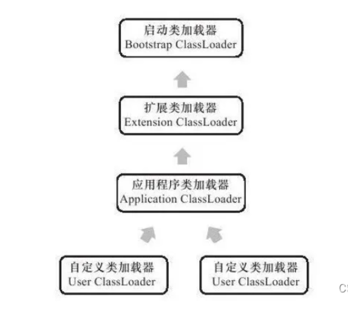
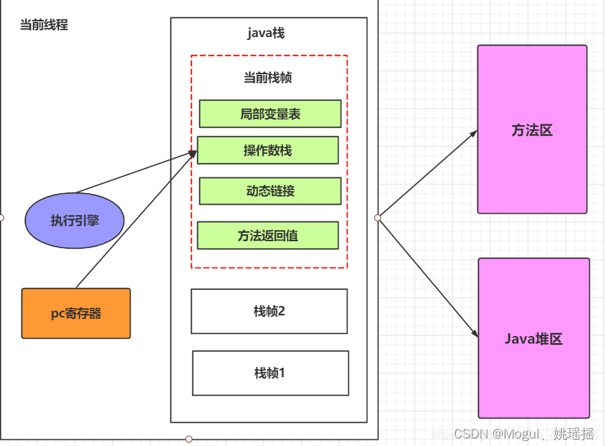
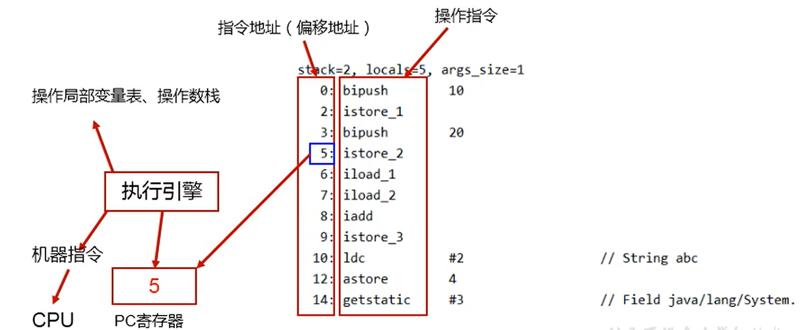
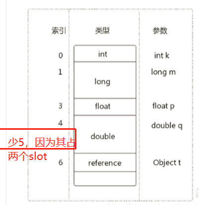
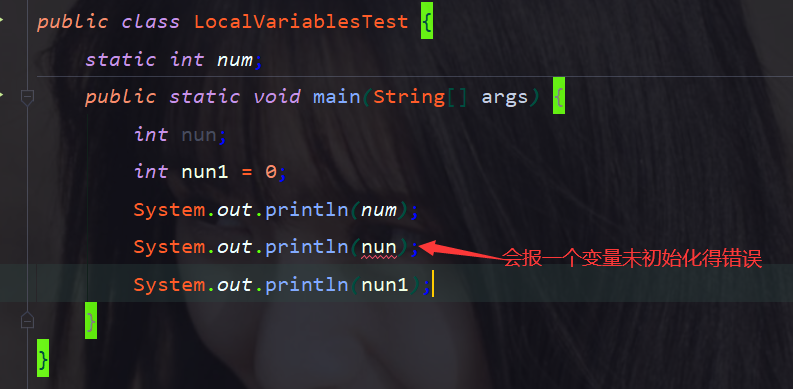
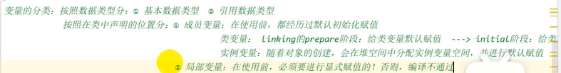
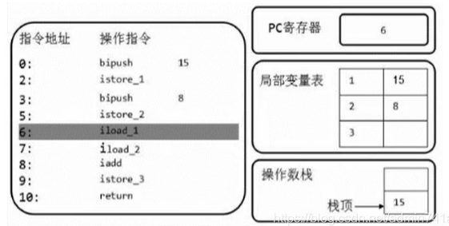

## 一：JVM的生命周期

### 1：虚拟机的启动

   	Java虚拟机的启动是通过引导类加载器(bootstrap class loader)创建个初始类(initial class)来完成的，这个类是由虚拟机的具体实现指定的。

### 2：虚拟机的执行

- 一个运行中的Java虚拟机有着一个清晰的任务:执行Java程序。
- 程序开始执行时他才运行，程序结束时他就停止。
- 执行一个所谓的Java程序的时候，真真正正在执行的是一个叫做Java虚拟机的进程。

### 3：虚拟机的退出

​    有如下的几种情况:

- ​		程序正常执行结束
- ​		程序在执行过程中遇到了异常或错误而异常终止
- ​		由于操作系统出现错误而导致Java虚拟机进程终止
- ​		某线程调用Runtime类或System类的exit方法，或Runtime类的halt方法，并且Java安全管理器也允许这次exit或halt操作。
- ​		除此之外，JNI(JavaNative Interface)规范描述了用JNIInvocation API来加载或卸载Java虚拟机时，Java虚拟机的退出情况。

## 二：JVM内存模型

​		内存是非常重要的系统资源，是硬盘和CPU的中间仓库及桥梁，承载着操作系统和应用程序的实时运行。JVM内存布局规定了Java在这行过程中内存申请、分配、管理的策略，保证了JVM的高效稳定运行。不同的JVM对于内存的划分方式和管理机制存在着部分差异。

简图：


详细图：


## 三：类加载器

### 1：类加载器

#### （1）概述类加载器


类加载器子系统负责从文件系统或者网络中加载Class文件，class文件开头有特定的文件标识。

ClassLoader只负责class文件的加载，至于它是否可以运行，则由ExcutionEngine（也就是执行引擎）决定。

加载的类信息存放于一块称为方法区的内存空间。除了类的信息外，方法区中还会存放运行时常量池信息，可能还包括字符串和数字常量（这部分信息是Class文件中常量池部分的内存映射）

#### （2）类加载器ClassLoader角色

      

- class file 存在于本地磁盘上，可以理解为设计师画在纸上的模板，而最终这个模板在执行的时候是要加载到JVM当中来根据这个文件实例化出N个一模一样的的实例。
- class file 加载到JVM中，被称为DNA元数据模板，放在方法区。
- 在.class文件—》 JVM —》 最终成为元数据模块，此过程就要一个运输工具（类装载器Class Loader），扮演一个快递员的角色

### 2：类的加载过程


#### （1）加载

- 通过一个类的全限定名获取定义此类的二进制字节流

- 将这个字节流所代表的静态存储结构转化为方法区的运行时数据结构
- 在内存中生成一个代表这个类的java.lang.Class对象，作为方法区这个类的各种数据的访问入口

补充：加载.class文件的方式

- 从本地系统中直接加载

- 通过网络获取，典型场景：Web Applet
- 从zip压缩包中获取，打包好的jar、war格式的基础
- 运行时计算生成，使用最多的是：动态代理技术
- 由其他文件生成，典型场景：JSP应用
- 从专有数据库中提取.class文件，比较少见
- 从加密文件中获取，典型的防Class文件被反编译后的保护措施

#### （2）链接

##### ①：验证(Verify):

- 目的在于确保Class文件的字节流中包含信息符合当前虚拟机要求，保证被加载类的正确性，不会危害虚拟机自身安全。

- 主要包括四种验证：

1. 文件格式验证：主要按照Class文件16进制背后的秘密文章中的阐述的格式，严格的进行校验。

2. 元数据验证：主要是语义校验，保证不存在不符合Java语言规范的元数据信息，如：没有父类，继承了final类，接口的非抽象类实现没有完整实现方法等。

3. 字节码验证：主要对数据流和控制流进行分析，确定成行语义是否合法，符合逻辑。

   不合法的例子：

   操作数栈放置了int类型数据，却当成long类型使用；

   把父类对象赋值给了子类数据类型；

   . . . . . .

4. 符号引用验证：解析阶段发生的验证，当把符号引用转化为直接引用的时候进行验证。这主要是对类自身以外的信息进行匹配性校验。主要包括：

   全限定名是否可以找到对应的类；

   指定类是否存在符合方法的字段描述符以及简单名称所描述的方法和字段；

   校验类，字段和方法的可见性；

   . . . . . .

#####   ②：准备(Prepare)

- 为类变量分配内存并设置该类变量的默认初始值，即零值。
- 这里不包含用final修饰的static，因为final在编译的时候就分配了，准备阶段会显示初始化；
- 这里不会为实例变量分配初始化，类变量会分配在方法区中，而实例变量是会随着对象一起分配到Java堆中

#####    ③：解析(Resolve)

- 将常量池内的符号引用转为直接引用的过程。
- 事实上，解析操作往往会伴随着JVM在执行完初始化之后再执行。
- 符号引用就是一组符号来描述所引用的目标。符号引用字面量形式明确定义在《Java虚拟机规范》的Class文件格式中。直接引用就是直接指向目标的指针、相对偏移量或一个间接定位到目标的句柄。
- 解析动作主要针对类或接口、字段、类方法、接口方法、方法类型等；对应常量池中的CONDTANT_Class_info、CONSTANT_Fielder_info、CONSTANT_Methodref_info等。

#### （3）初始化

- 初始化阶段就是执行类构造器方法和< clinit >()的过程。

- 此方法不需定义，是javac编译器自动收集类中的所有类变量的赋值动作和静态代码块中的语句合并而来。

- 构造器方法中指令按语句在源文 件中出现的顺序来执行。

  < clinit >()不同于类的构造器(< init >)是类加载的时候执行的比如静态代码块。（关联：构造器是虚拟机视角下的< init >()）

- 若该类具有父类，JVM会保证子类的< clinit >()执行前，父类的< clinit >()已经执行完毕。
- 虚拟机必须保证一个类的< clinit >()方法在多线程下被同步加锁。

### 3：种类


在jvm类加载过程中,有一步叫做加载的流程

加载 : 根据类的全限定名获取到其定义的二进制字节流,并将其加载到内存中. 此时需要借助类加载器来帮助完成

全限定名 : 包名 + 类名

类加载器分为4类 :

%JAVA_HOME% : 为JDK设置的环境变量路径. 如环境变量里设置了%java_home%=C:\jdk1.8.0

-  Bootstrap Classloader  :  启动类加载器,用来加载 %JAVA_HOME%/jre/lib 下的, 如 rt.jar中的class文件 或者 xbootclasspath选项指定            的jar包
-  Extension Classloader :   扩展类加载器 , 用来加载 %JAVA_HOME%/jre/ext 中的class文件 或者 -Djava.ext.dirs指定目录下的jar包
-  Application Classloader : 应用类加载器 , 用来加载classpath下的class文件
-  Custom Classloader : 用户自定义类加载器,用来加载自定义内容.此加载器需要用户自己继承Classloader类

## 四：双亲委派机制

- java虚拟机对class文件采用的是按需加载的方式，也就是说当需要使用该类时才会将它的class文件加载到内存生成class对象。而且加载某个类的class文件时，Java虚拟机采用的是双亲委派模式，即把请求交由父类处理，它是一种任务委派模式。

- JVM支持两种类型的类加载器，分别是引导类加载器（Bootstrap Classloader），自定义类加载器（Userdefined Classloader）。

  从概念上来讲，自定义类加载器一般指的是程序中由开发人员自定义的一类类加载器，但是Java虚拟机规范却没有这么定义，而是将所有继承自Classloader的加载器定义为自定义加载器。

  


### 1：引导类加载器

启动类加载器（引导类加载器，Bootstrap ClassLoader）

- 这个类加载器是使用C/C++语言实现的，嵌套在JVM内部。
- 它用来加载Java的核心库（JAVA_HOME/jre/lib/rt.jar、resources.jar或sun.boot.class.path路径下的内容），用于提供JVM自身需要的类
- 并不继承自ava.lang.ClassLoader，没有父加载器。
- 加载扩展类和应用程序类加载器，并指定为他们的父类加载器。
- 出于安全考虑，Bootstrap启动类加载器只加载包名为java、javax、sun等开头的类

### 2：扩展类加载器

（Extension ClassLoader）

- Java语言编写，由sun.misc.Launcher$ExtClassLoader实现。
- 派生于ClassLoader类
- 父类加载器为启动类加载器
- 从java.ext.dirs系统属性所指定的目录中加载类库，或从JDK的安装目录的jre/1ib/ext子目录（扩展目录）下加载类库。如果用户创建的JAR放在此目录下，也会自动由扩展类加载器加载

### 3：应用类加载器

（系统类加载器，AppClassLoader）

- java语言编写，由sun.misc.LaunchersAppClassLoader实现
- 派生于ClassLoader类
- 父类加载器为扩展类加载器
- 它负责加载环境变量classpath或系统属性java.class.path指定路径下的类库
- 该加载器是用户编写的程序默认的类加载器，一般来说，Java应用的类都是由它来完成加载
- 通过ClassLoader#getSystemclassLoader() 方法可以获取到该类加载器

### 4：为什么要用双亲委派机制？

优势
● 避免类的重复加载
● 保护程序安全，防止核心API被随意篡改
○ 自定义类：java.lang.String
○ 自定义类：java.lang.ShkStart（报错：阻止创建 java.lang开头的类）

### 5：双亲委派机制工作原理

1）如果一个类加载器收到了类加载请求，它并不会自己先去加载，而是先把这个请求委托给父类的加载器去执行；
2）如果父类加载器还存在其父类加载器，则进一步向上委托，依次递归，请求最终将到达顶层的启动类加载器；
3）如果父类加载器可以完成类加载任务，就成功返回，倘若父类加载器无法完成此加载任务，子加载器才会尝试自己去加载，这就是双亲委派模式。


### 6：用户自定义类加载器实现步骤

   1.开发人员可以通过继承抽象类java.lang.ClassLoader类的方式，实现 自己的类加载器，以满足一些特殊的需求
2. 在JDK1.2之前，在自定义类加载器时，总会去继承ClassLoader类并重写loadClass()方法，从而实现自定义的类加载类，但是在JDK1.2之后已不再建议用户去覆盖loadClass()方法，而是建议把自定义的类加载逻辑写在findClass()方法中
3. 在编写自定义类加载器时，如果没有太过于复杂的需求，可以直接继承URLClassLoader类，这样就可以避免自己去编写findClass()方法及其获取字节码流的方式，使自定义类加载器编写更加简洁。

## 五：程序计数器(PC Register)

### 1：**概念**

​		JVM中的程序计数寄存器（Program Counter Register）中，Register的命名源于CPU的寄存器，寄存器存储指令相关的现场信息。CPU只有把数据装载到寄存器才能够运行。

### 2：**作用**

- PC寄存器用来存储指向下一条指令的地址，也即将要执行的指令代码。由执行引擎读取下一条指令。

- 使用PC寄存器存储字节码指令地址有什么用呢？为什么使用PC寄存器记录当前线程的执行地址呢？
  ● CPU需要不停的切换各个线程，这时候切换回来以后，就得知道接着从哪开始继续执行。

  JVM的字节码解释器就需要通过改变PC寄存器的值来明确下一条应该执行什么样的字节码指令。

- 



### 3：常见问题


## 六：运行时数据区

### 六.一：虚拟机栈

​		由于跨平台性的设计，Java的指令都是根据栈来设计的。不同平台CPU架构不同，所以不能设计为基于[寄存器](https://so.csdn.net/so/search?q=寄存器&spm=1001.2101.3001.7020)的。 优点是跨平台，指令集小，编译器容易实现，缺点是性能下降，实现同样的功能需要更多的指令。(和第一章的jvm简介相对应)

栈和堆

**栈是运行时的单位，而堆是存储的单位**

- 栈解决程序的运行问题，即程序如何执行，或者说如何处理数据。
- 堆解决的是数据存储的问题，即数据怎么放，放哪里


#### 1：Java虚拟机栈是什么

Java虚拟机栈（Java Virtual Machine Stack），早期也叫Java栈。每个线程在创建时都会创建一个虚拟机栈，其内部保存一个个的栈帧（Stack Frame），对应着一次次的Java方法调用。


#### 2：生命周期

虚拟机栈是线程私有的，生命周期和线程一致，也就是线程结束了，该虚拟机栈也销毁了

#### 3：作用

主管Java程序的运行，它保存方法的局部变量、部分结果，并参与方法的调用和返回。

> 局部变量，它是相比于成员变量来说的（或属性）
> 基本数据类型变量 VS 引用类型变量（类、数组、接口）

#### 4：特点 


- 栈是一种快速有效的分配存储方式，访问速度仅次于程序计数器。
- JVM直接对Java栈的操作只有两个：
  每个方法执行，伴随着进栈（入栈、压栈）
  执行结束后的出栈工作
- 对于栈来说不存在垃圾回收问题（栈存在溢出的情况）

#### 5：对比队列

- 栈是先进后出/后进先出
- 队列是先进先出

#### 6：开发中遇到哪些异常？

栈中可能出现的异常

- Java 虚拟机规范允许Java栈的大小是动态的或者是固定不变的。
- 如果采用固定大小的Java虚拟机栈，那每一个线程的Java虚拟机栈容量可以在线程创建的时候独立选定。如果线程请求分配的栈容量超过Java虚拟机栈允许的最大容量，Java虚拟机将会抛出一个StackoverflowError异常。
- 如果Java虚拟机栈可以动态扩展，并且在尝试扩展的时候无法申请到足够的内存，或者在创建新的线程时没有足够的内存去创建对应的虚拟机栈，那Java虚拟机将会抛出一个
  outofMemoryError 异常。


#### 7：设置栈内存大小

```xml
-Xss1m
-Xss1k
```

参数 -Xss选项来设置线程的最大栈空间
关于idea：(Run -> Edit Configurations… ->VM options: )

#### 8：栈的存储单位

##### （1）：栈中存储什么？

- 每个线程都有自己的栈，栈中的数据都是以栈帧（Stack Frame）的格式存在。
- 在这个线程上正在执行的每个方法都各自对应一个栈帧（Stack Frame）。
- 栈帧是一个内存区块，是一个数据集，维系着方法执行过程中的各种数据信息。

```xml
OOP的基本概念：类和对象
类中基本结构：field（属性、字段、域）、method
```

##### （2）：栈运行原理1

- JVM直接对Java栈的操作只有两个，就是对栈帧的压栈和出栈，遵循“先进后出”/“后进先出”原则。
- 在一条活动线程中，一个时间点上，只会有一个活动的栈帧。即只有当前正在执行的方法的栈帧（栈顶栈帧）是有效的，这个栈帧被称为当前栈帧（Current Frame），与当前栈帧相对应的方法就是当前方法（Current Method），定义这个方法的类就是当前类（Current Class）。
- 执行引擎运行的所有字节码指令只针对当前栈帧进行操作。
- 如果在该方法中调用了其他方法，对应的新的栈帧会被创建出来，放在栈的顶端，成为新的当前帧。


```java
public class StackFrameTest {
    public static void main(String[] args) {
        method1();
        System.out.println("main结束");
    }

    private static int method1() {
        System.out.println("方法1的开始");
        int i = method02();
        System.out.println("方法1的结束");
        return i;
    }

    private static int method02() {
        System.out.println("方法2的开始");
        int i = (int) method03();
        System.out.println("方法2的结束");
        return i;
    }

    private static double method03() {
        System.out.println("方法3的开始");
        double i = 30.01;
        System.out.println("方法3的结束");
        return i;
    }
}
//方法1的开始
方法2的开始
方法3的开始
方法3的结束
方法2的结束
方法1的结束
main结束


```

##### （3）：栈运行原理2

- 不同线程中所包含的栈帧是不允许存在相互引用的，即不可能在一个栈帧之中引用另外一个线程的栈帧。
- 如果当前方法调用了其他方法，方法返回之际，当前栈帧会传回此方法的执行结果给前一个栈帧，接着，虚拟机会丢弃当前栈帧，使得前一个栈帧重新成为当前栈帧。
- Java方法有两种返回函数的方式，**一种是正常的函数返回，使用return指令；另外一种是抛出异常。不管使用哪种方式，都会导致栈帧被弹出。(默认是return；)**

#### 9：栈帧的内部结构

- 局部变量表（Local Variables）
- 操作数栈（operand Stack）（或表达式栈）
- 动态链接（DynamicLinking）（或指向运行时常量池的方法引用）
- 方法返回地址（Return Address）（或方法正常退出或者异常退出的定义）
- 一些附加信息
  (局部变量表和操作数栈主要影响栈帧的大小)
- 

并行每个线程下的栈都是私有的，因此每个线程都有自己各自的栈，并且每个栈里面都有很多栈帧，栈帧的大小主要由局部变量表和操作数栈决定的


### 六.二：局部变量表

#### 1：定义

- 局部变量表：Local Variables，被称之为局部变量数组或本地变量表
- **定义为一个数字数组，主要用于存储方法参数和定义在方法体内的局部变量**，这些数据类型包括各类基本数据类型、对象引用（reference），以及returnAddress类型。
- 由于局部变量表是建立在线程的栈上，**是线程的私有数据，因此不存在数据安全问题**
- **局部变量表所需的容量大小是在编译期确定下来的**，并保存在方法的Code属性的maximum local variables数据项中。在方法运行期间是不会改变局部变量表的大小的。
- 方法嵌套调用的次数由栈的大小决定。一般来说，栈越大，方法嵌套调用次数越多。对一个函数而言，它的参数和局部变量越多，使得局部变量表膨胀，它的栈帧就越大，以满足方法调用所需传递的信息增大的需求。进而函数调用就会占用更多的栈空间，导致其嵌套调用次数就会减少。
- **局部变量表中的变量只在当前方法调用中有效**。在方法执行时，虚拟机通过使用局部变量表完成参数值到参数变量列表的传递过程。**当方法调用结束后，随着方法栈帧的销毁，局部变量表也会随之销毁。**

```java
public class LocalVariablesTest {
    public static void main(String[] args) {
        Date date = new Date();
        int num = 1;
        return;
    }
}

```


#### 2：关于Slot的理解

- 参数值的存放总是在局部变量数组的index0开始，到数组长度-1的索引结束。
- 局部变量表，最基本的存储单元是Slot（变量槽）
- 局部变量表中存放编译期可知的各种基本数据类型（8种），引用类型（reference），returnAddress类型的变量。
- 在局部变量表里，32位以内的类型只占用一个slot（包括returnAddress类型），64位的类型（long和double）占用两个slot。

```java
byte、short、char 在存储前被转换为int，boolean也被转换为int，0表示false，非0表示true。
long和double则占据两个slot。
```

- JVM会为局部变量表中的每一个Slot都分配一个访问索引，通过这个索引即可成功访问到局部变量表中指定的局部变量值
- 当一个实例方法被调用的时候，它的方法参数和方法体内部定义的局部变量将会**按照顺序**被复制到局部变量表中的每一个slot上
- **如果需要访问局部变量表中一个64bit的局部变量值时，只需要使用前一个索引即可。（比如：访问long或double类型变量）**
- **如果当前帧是由构造方法或者实例方法创建的，那么该对象引用this将会存放在index为0的slot处，其余的参数按照参数表顺序继续排列。(static方法不能调用this，因为this没办法存在当前方法的局部变量表中)**



#### 3：Slot的重复利用

**栈帧中的局部变量表中的槽位是可以重用的，**如果一个局部变量过了其作用域，那么在其作用域之后申明的新的局部变就很有可能会复用过期局部变量的槽位，**从而达到节省资源的目的**。

```java
    public void abc5() {
        int a = 0;
        {
            int b = 0;
            b = a + 1;
        }
        int c = a + 1;
    }

```


#### 4：静态变量与局部变量的对比

##### ①：变量的分类

- 按数据类型分：  基本数据类型、引用数据类型

- 按类中声明的位置分：成员变量（类变量，实例变量）、局部变量
  – 类变量：linking的paper阶段，给类变量默认赋值，init阶段给类变量显示赋值即静态代码块
  – 实例变量：随着对象创建，会在堆空间中分配实例变量空间，并进行默认赋值
  – 局部变量：在使用前必须进行显式赋值，不然编译不通过。

##### ②：补充说明

- **在栈帧中，与性能调优关系最为密切的部分就是前面提到的局部变量表。在方法执行时，虚拟机使用局部变量表完成方法的传递。**
- **局部变量表中的变量也是重要的垃圾回收根节点，只要被局部变量表中直接或间接引用的对象都不会被回收。**
- 



### 六.三：操作数栈

#### 1：概念

- 每一个独立的栈帧除了包含局部变量表以外，还包含一个后进先出（Last - In - First -Out）的 操作数栈，也可以称之为表达式栈（Expression Stack）
- 操作数栈，在方法执行过程中，根据字节码指令，往栈中写入数据或提取数据，即入栈（push）和 出栈（pop）

某些字节码指令将值压入操作数栈，其余的字节码指令将操作数取出栈。使用它们后再把结果压入栈
比如：执行复制、交换、求和等操作


- 操作数栈，主要用于保存计算过程的中间结果，同时作为计算过程中变量临时的存储空间。
- 操作数栈就是JVM执行引擎的一个工作区，当一个方法刚开始执行的时候，一个新的栈帧也会随之被创建出来，这个方法的操作数栈是空的。

**这个时候数组是有长度的，因为数组一旦创建，那么就是不可变的**

- 每一个操作数栈都会拥有一个明确的栈深度用于存储数值，其所需的最大深度在编译期就定义好了，保存在方法的Code属性中，为maxstack的值。
- 栈中的任何一个元素都是可以任意的Java数据类型
  – 32bit的类型占用一个栈单位深度
  – 64bit的类型占用两个栈单位深度
- 操作数栈并非采用访问索引的方式来进行数据访问的，而是只能通过标准的入栈和出栈操作来完成一次数据访问
- **如果被调用的方法带有返回值的话，其返回值将会被压入当前栈帧的操作数栈中，并更新PC寄存器中下一条需要执行的字节码指令。**
- 操作数栈中元素的数据类型必须与字节码指令的序列严格匹配，这由编译器在编译器期间进行验证，同时在类加载过程中的类检验阶段的数据流分析阶段要再次验证。|
- 另外，**我们说Java虚拟机的解释引擎是基于栈的执行引擎，其中的栈指的就是操作数栈。**

#### 2：代码追踪

```java
public void testAddOperation() {
    byte i = 15;
    int j = 8;
    int k = i + j;
}
```


- byte、short、char、boolean 内部都是使用int型来进行保存的
- 从上面的代码我们可以知道，我们都是通过bipush对操作数 15 和 8进行入栈操作
- 同时使用的是 iadd方法进行相加操作，i -> 代表的就是 int，也就是int类型的加法操作

**为什么图片中的局部变量表不是从0开始的呢？**

其实局部变量表也是从0开始的，但是因为0号位置存储的是this指针，所以说就直接省略了~

```xml
提醒：有参数时，参数插入slot的顺序是在this之后，在局部变量之前
为什么字节码会由3跳成5
```

**以下操作默认最后由字节码解释器改变pc寄存器的指向**

- 首先执行第一条语句，PC=0，也就是指令地址为0，然后使用bipush让操作数15入栈。


- 执行完后，让PC =2，字节码指令就是将操作数栈的元素存储到局部变量表slot1的位置，我们可以看到局部变量表的已经增加了一个元素


- PC=3，让8压栈操作数栈


- PC=5，8出栈操作数栈，把该元素存储到局部变量表slot2的位置


- PC=6，操作数栈读取局部变量表的slot1位置，并且把该元素压栈操作数栈



- PC=7，操作数栈读取局部变量表的slot2位置，并且把该元素压栈操作数栈


- PC=8,相加处理，相加结果压栈操作数栈


- PC=9,相加结果出栈操作数栈，把该元素存储到局部变量表slot3的位置


- PC=10,退出方法


#### 3：i++和++i的区别

#### 栈顶缓存技术

- 前面提过，基于栈式架构的虚拟机所使用的零地址指令更加紧凑，但完成一项操作的时候必然需要使用更多的入栈和出栈指令，这同时也就意味着将需要更多的指令分派（instruction dispatch）次数和内存读/写次数。
- 由于操作数是存储在内存中的，因此频繁地执行内存读/写操作必然会影响执行速度。为了解决这个问题，HotSpot JVM的设计者们提出了**栈顶缓存（Tos，Top-of-Stack Cashing）技术，将栈顶元素全部缓存在物理CPU的寄存器中，以此降低对内存的读/写次数，提升执行引擎的执行效率。**