# 1：shell脚本入门

## 一：hello，world

1：首先，创建一个专门学习shell得文件夹

```linux
mkdir shellTest
```

2：创建第一个hello.sh文件

```linux
touch hello.sh
```

3：进入文件中编辑

```linux
vim hello.sh
```

```
输入  
#!/bin/bash
echo "hello,world!"
```

4：运行hello.sh脚本文件

```linux
bash hello.sh   或者  . hello.sh     或者   ./hello.sh(前提是要有权限，如果没有权限，执行chmod +x hello.sh)
```

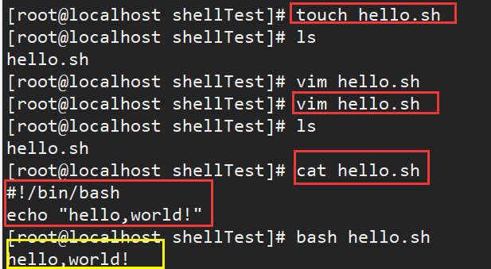


## 二：传入参数

```linux
$0:  	表示当前脚本文件名称
$1:		表示第一个参数位置进行传参
$2:		表示第二个参数位置进行传参
$#:		表示传入参数得数量
$@:		表示所有得参数名称    （将所有看作一个整体）
$*:		表示所有得参数名称	 （将每个参数区分对待）
```


创建  parameter.sh  文件

```linux
vim parameter.sh
```

写入脚本数据

```linux
#!/bin/bash
echo '=========$n=========='
echo script name : $0
echo 1st parameter : $1
echo 2st parameter : $2
echo '=========$#=========='
echo parameter number: $#
echo '=========$@=========='
echo $@
echo '=========$*=========='
echo $*
```

测试：

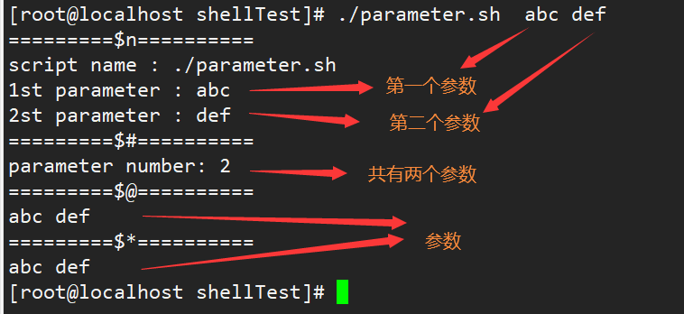

## 三：运算符。

1：基本格式

```linux
$((运算式))    或者   $[运算式]
```

 2：练习

```linux
一：简单
echo $[5 * 2]       在这个里面有没有空格是一样得
echo $((5+2))
二：稍微复杂
a=$[5+2]           =左右不能有空格
echo $a
```

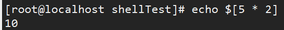


3：案例实操

计算（2+3）* 4 的值。

```linux
s=$[(2+3)*4]
echo $s
```


4：shell脚本中实操

传入两个参数，并且返回他们的和

（1）：创建add.sh

（2）：编辑add.sh

```linux
#!/bin/bash
sum=$[$1 + $2]
echo sum=$sum
```

（3）：保存并且退出

（4）：改变脚本权限

```linux
chmod +x add.sh
```

（5）：运行脚本

```linux
./add.sh 25 35
```


## 四：条件判断


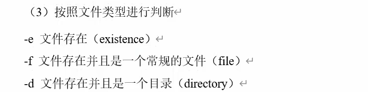

测试。

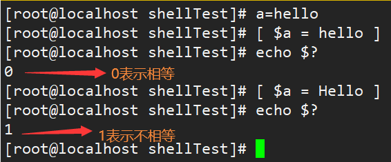

五：流程控制。


注意事项： 

- [ 条件判断式 ]，中括号和条件判断式之间必须有空格 
- if 后要有空格

### 1：if单分支

```linux
if [ 条件 ] ; then   ; fi
```


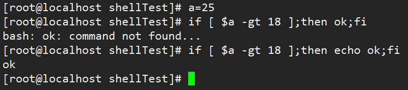

1：编写if_test.sh脚本(其中有x的话是确保输入空时不报错。)

```linux
#!/bin/bash

if [ "$1"x = "xiaoze"x ]
then
        echo "welcome,xiaoze"
fi
```

2：添加执行权限

```linux
chmod +x if_test.sh
```

3：测试脚本

```linux
./if_test.sh xiaoze
./if_test.sh xiaorui
```


多个参数判断

1：if_test.sh编写脚本。

```linux
vim if_test.sh
```

2：编写脚本

```linux
#!/bin/bash

if [ "$1"x = "xiaoze"x ]
then
        echo "welcome,xiaoze"
fi

#输入第二个参数表示年龄，判断属于那个阶段
if [ $2 -lt 18 ]
then
        echo "未成年人"
else
        echo "成年人"
fi

```

3：测试

```linux
./if_test xiaoze 25
./if_test xiaoze 17
```


### 2：if多分支。

1：改变if_test.sh脚本

```linux
vim if_test.sh
```

2：编写脚本

```linux
#!/bin/bash

if [ "$1"x = "xiaoze"x ]
then
        echo "welcome,xiaoze"
fi

#输入第二个参数表示年龄，判断属于那个阶段
if [ $2 -lt 18 ]
then
        echo "未成年人"
elif [ $2 -lt 35 ]
then
        echo "中年人"
else
        echo "成年人"
fi

```

3：测试。

```linux
./if_test xiaoze 34
./if_test xiaoze 36
./if_test xiaoze 17
```


### 3：case多分支

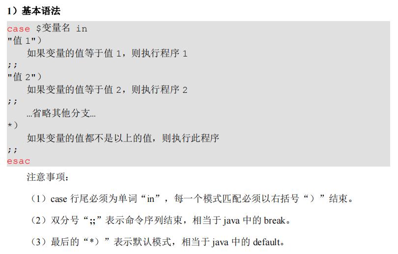

1：创建case.sh脚本文件

```linux
vim case.sh
```

2：编辑

```linux
#!/bin/bash
case $1 in
1)
        echo "one"
;;
2)
        echo "two"
;;
3)
        echo "three"
;;
*)
        echo "number else"
;;
esac

```

3：添加可执行权限

```linux
chmod +x case.sh
```

4：测试。

```linux
./case.sh 2
./case.sh 3
./case.sh 4
```

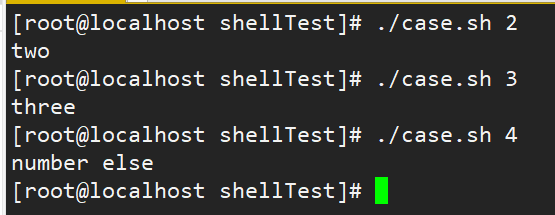

### 4：for循环

输入i，然后返回从1加到i的值。

1：创建sum_for.sh

```linux
vim sun_for.sh
```

2：编写脚本

```linux
#!/bin/bash

for (( i=1; i <= $1; i++ ))
do
        sum=$[ $sum + $i ]
done

echo $sum

```

3：添加运行权限

```linux
chmod +x sum_for.sh
```

4：测试

```linux
./sum_for.sh 100   //应该返回5050
```

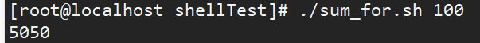

### 5：**while** **循环**

```linux
while [ 条件判断式 ] 
do 
	程序 
done
```

从 1 加到 100

```linux
[atguigu@hadoop101 shells]$ touch while.sh 
[atguigu@hadoop101 shells]$ vim while.sh 
#!/bin/bash 
sum=0 
i=1 
while [ $i -le 100 ] 
do 
	sum=$[$sum+$i] 
	i=$[$i+1] 
done 
echo $sum 
[atguigu@hadoop101 shells]$ chmod 777 while.sh 
[atguigu@hadoop101 shells]$ ./while.sh 5050
```

### 6：**read** **读取控制台输入**

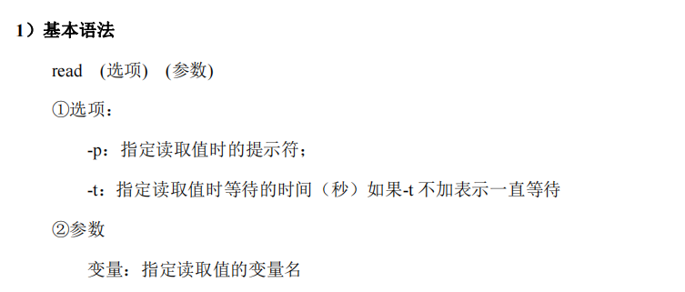

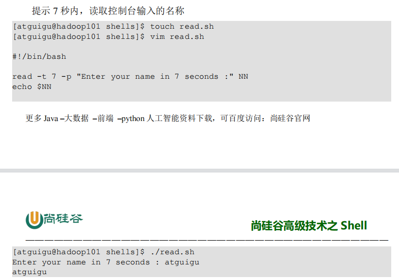