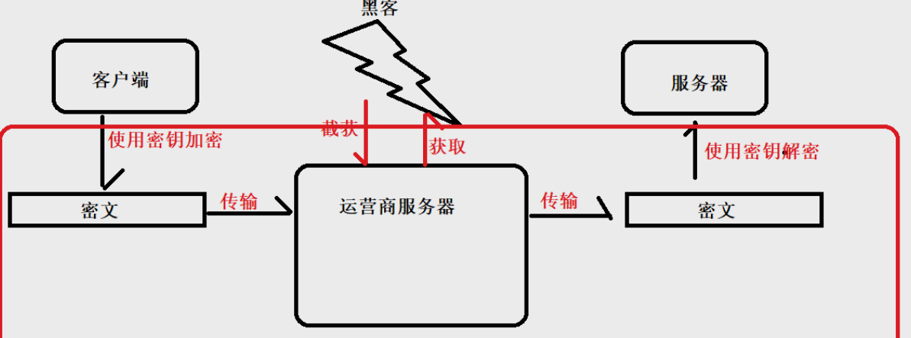
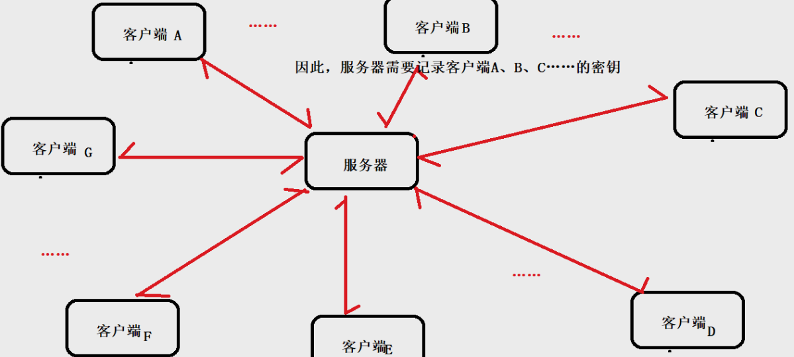
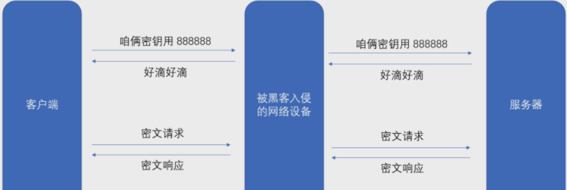

## 1：什么是HTTPS、加密

### 1.1：关于HTTPS

`HTTPS` 其实就是 `HTTP` 的 `plus` 版本、安全版本。这怎么说？

> HTTPS其实可以理解为HTTP+SSL。
> 对于HTTP，前边我们已经提过了，那么什么是SSL呢？
> SSL全称为Secure Sockets Layer，即安全套接层。SSL协议位于TCP/IP协议与各种应用层协议之间，为数据通讯提供安全支持。
> 目前就理解它是用于加密、帮助安全传输的协议即可，等之后能理解了，再看看这个文章。SSL

### 1.2：加密是什么&HTTP报文传输为什么要加密

前边，我们已经说了HTTPS其实就是HTTP加上加密，那么什么是加密呢？他又为什么要加密呢？

#### 加密

**加密**  
这里其实是一对概念，加密以及解密。

**加密** ：明文变换 --》密文  

**解密** ：密文变化 --》明文  

除此以外，在加密和解密的过程中，需要一到多个中间数据，辅助传输，这些数据称为密钥。【这里的密钥有很多读音，别大惊小怪】  

#### 运营商劫持

由于我们通过网络传输的任何的数据包都会经过运营商的网络设备(`路由器`, `交换机`等), **那么运营商的网络设备就可以解析出你传输的数据内容, 并进行篡改** 。

**点击 “下载按钮”, 其实就是在给服务器发送了一个 HTTP 请求, 获取到的 HTTP 响应其实就包含了该 APP的下载链接.**

> **运营商为什么要劫持呢？**  
> 有的运营商，把用户本身发的这个HTTP请求，改成另一个请求。  
> 因为一些公司（设为A）会和一些浏览器（设为B）进行合作，放置广告在浏览器上边（特定关键词）。一旦用户进行点击了，双方分别统计点击量，A公司的这部分的收成会分成给B，或者按照点击量进行特定计费。    
> 当然网络运营商，例如移动、联通、电信等，它们本身也是公司啊，也会有合作啊，那有时候或者说以前很多时候就会在HTTP请求报文传输过程中对ip进行修改，这个时候A公司收到的就会发现，这个用户是来源于网络运营商公司C，那么自然B公司就没这份钱了，C公司不劳而获了啊

可能有人会说，那个请求他想改就让他改啊？

没错，这个还真就是它想改就改的！这是因为HTTP是明文传输！！对，你没看错，它是以文本方式明文传输的。（回想之前的抓到的http请求和响应包，是以文本的形式传输的）

> 可能又有人会说，这种事情真令人可恨，能不能报案，告他们。回答当然是可以的，而且一定是会胜诉的。但是由于时间成本太高（具体可以了解一下一场官司的开庭到结案需要的流程，例如一审、二审等，这里由于个人认知有限所以不再班门弄斧了），所以这听起来并不是一个较优方案。
> 所以，这里引入了加密的机制，引入了 `SSL这个安全套层协议` ，跟HTTP 合起来就是HTTPS。
> 那么具体是怎么加密，SSL又是怎么在这个加密的过程中起作用的呢？我们就需要接着往下看。

但是在此之前，我们对这个内容进行小结：

> **什么是加密？**   
> 加密就是把一系列明文变成暗文。    
> **为什么需要加密？**   
> 因为http的内容是明文传输的，明文数据会经过 `中间代理服务器`、`路由器`、`wifi热点`、`通信服务运营商` 等多个物理节点，如果信息在传输过程中被劫持，传输的内容就完全暴露了。劫持者还可以篡改传输的信息且不被双方察觉，这就是中间人攻击。所以我们才需要对信息进行加密。

## 2：HTTPS的工作过程

> 加密的方式有很多种，但是整体可以分为两大类：`对称加密` 和 `非对称加密`。

> 所以这里我们这里只介绍这两种，但至于到底哪个使用频率高，什么时候使用这个，什么时候使用那个，说实话目前而言我没有经验……

> 还是先把理论掌握好，再说区分和应用的事儿吧

我们上边已经提到了，`加密` 和 `解密` 离不开一到多个中间数据——  **`密钥`**。这里我们谈论这两种加密都是基于这个展开的。

### 2.1 对称加密

对称加密就是基于同一个“密钥”，使 **发送方将 `明文` 转换成 `暗文`**，使 **接收方将 `暗文` 转换成 `明文` 。**

> 例如：一个简单的对称加密, `按位异或`  
> 假定发送方为A，接收方为B  
> A：假设 明文 a = 1234, 密钥 key = 8888  
> 则加密 a ^ key 得到的密文 b 为 9834 【传输过程存在的数值就是9834】  
> B：针对密文 9834 再次进行运算 b ^ key, 得到的就是原来的明文 1234.  

基本原理我们已经懂了，接下来，我们讨论它的可行性。

理论上来讲，这是就是一次比较完整的请求传输了，已经解决了明文传输的问题。但实际上，可能会有黑客试图截获（这也叫做中间人攻击)，即下边这种情况

上边只是一个客户端的情况，但实际情况是，一个服务器同时为多台客户端服务，那么情况将会变的更复杂，很显然倘若多台客户端都使用同一个密钥，那么被篡改更是易如反掌了，所以每个客户端与服务器进行通信时都需要一个密钥，与此同时，服务器也需要对这些密钥进行管理和记录即

显然这是个很麻烦的事儿，比较理想的做法就是：**在客户端和服务器建立连接的时候，双方就写上确定本次的密钥**

但是如果直接把 `密钥明文` 传输, 那么黑客也就能获得 `密钥` 了。此时后续的加密操作就形同虚设了.

**因此密钥的传输也必须加密传输!**

那密钥要是还采用这个对称加密，还得重复这个思考流程，这个问题就无解了……此时，我们就引入非对称加密。

> 在谈论非对称加密之前，我们先梳理下思路  
> 为了解决http明文传输问题，我们引入对称加密，有了密钥A  
> 为了解决 **中间人攻击问题** ，我们需要 **对密钥A进行加密，对称加密已经不可行，需要看看非对称加密了！**

### 2.2 非对称加密

> 非对称加密要用到两个密钥, 一个叫做 `“公钥”`, 一个叫做 `“私钥”` 。

这两个密钥都是 `服务器` 生成的。`客户端` 持有 `公钥`，`服务器` 持有 `私钥`。

此时，**客户端的公钥从服务器拿，黑客即使知道公钥也无济于事，因为黑客不知道私钥，私钥是服务器自己才有的，不会告诉别人。**

> 这可能有个疑问：**为什么有了非对称加密，还要继续保留对称加密**？  
> 因为对称加密快，非对称加密快，为了效率考虑，尽可能提高整体速度，就会使用对称加密和非对称加密结合的方式。

最后，我们再重新理下思路：**服务器和客户端之间安全传输其实可以分为两个部分：Part1：两者先进行密钥的安全传输 Part2:两者使用对称密钥进行交互**

`服务器` 首先生成一对 `公钥` 和 `私钥` ，`客户端` 先到服务器那里拿到 `公钥`，然后使用 `这个公钥` 对 `对称密钥（它对请求进行加密）` 再进行 `加密`，因为这里 `对称密钥` 要想获取真实值，必须使用 `私钥` 进行 `解密` ，服务器内心os:诶，你拿不到，只有我有hhh 所以呢，即使黑客获得公钥也没有关系。等到这个已经被加密的密钥运到了服务器那里，服务器知道了，两者就开始使用这个对称密钥进行请求与响应了，这是只属于他们两个的小秘密。

非对称加密的原理我们已经了解，那么我们这里来思考一个问题，这样是不是就完事儿了？是不是天衣无缝了？

> 答案是否定的。为什么呢？？？

试想，如果黑客入侵的中间服务器模仿终端服务器也生成一对公钥和私钥，当客户端尝试获取公钥时，黑客把自己的公钥发给它了，那么黑客有了自己的私钥，还有客户端的对称密钥，还有服务器的公钥，那么这个时候，它就是个“两面人”。

这里问题其实也叫做 `中间人攻击`

因此，接下来我们要解决这两个问题，加密流程就算大功告成了！

- 客户端如何获取到公钥?
- 客户端如何确定这个公钥不是黑客伪造的?

最终，这两个问题其实都可以通过 `证书的引入` 解决，所以接下来我们就证书进行讨论。
### 2.3 数字证书

解决中间人攻击的关键，在于客户端能够辨别，当前这个公钥就是服务器真实的公钥。因此这个证书引入，本质上就是引入第三方的公证机构。

> 这里就等同于，我们去网吧，去旅馆，都需要验证身份，都需要身份证。身份证就等同于这里的证书，这里的第三方公证机构就是公安局。

因此，在证书引入之后，`客户端获取公钥` 以及 `客户端如何确定这个公钥是不是黑客伪造` 这两个问题就可以解决，下边是模拟的解决校验思路：

> 服务器（网站）在设定之处，就需要去专门的认证机构，申请证书（有资质要求），审核通过，就会颁发证书  
> 客户端像服务器请求公钥时，此时就不是请求单独拿一个公钥，而是把整个证书都请求过了  
> 一旦没有证书，浏览器就会弹窗警告。或者对证书校验之后，发现不合格也不发送。  
> 那么客户端是怎么进行证书校验的呢？  
> 证书上边会有一个特定的字段，叫做 `证书的签名` 。  
> 假定证书长这个样：  
>   
> 那么客户端就可以使用 `认证机构提供的公钥进行解密` ，解密之后，得到的结果相当于是一个hash值，记作答案A。  
> 客户端使用相同的hash算法，针对其他字段再计算一次hash值B，倘若相同则验证成功，反之，验证失败。

> 这里黑客能不能再把证书篡改了呢？

不可以！！第一，换公钥不可行。客户端计算出来的A和B不同，就能察觉；第二，黑客不知道认证机构私钥，即使可以计算出hash值进行篡改了也没有包装加密生成签名的能力，这个只能认证机构做到。

所以，我们基本上可以认为，这样就算可以了。

因此，有了HTTPS之后，运营商劫持没有那么猖狂了，有所收敛。

## 3：总结

> 基于HTTPS一个比较安全的交互过程的流程

- 针对业务数据，进行对称加密
- 让目标服务器生成一对非对称密钥，公钥1和私钥1连同证书 一同发给客户端，自己持有私钥1
- 客户端拿到证书进行校验，需要计算两个结果进行比对，
  - 一是拿着颁发证书的认证机构提供的公钥2对于证书中的签名进行解密，
  - 二是自己根据相同的算法计算，两者比对并进行判断，相同则验证通过，反之，验证失败
- 客户端拿着服务器发来的公钥1，针对对称密钥进行加密，发给服务器。
